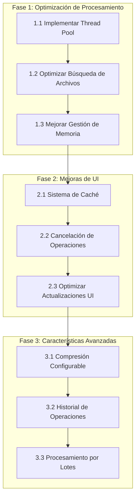

Enter your prompt here

# Project Structure

├─ 📁 tests
  ├─ 📁 test_cases
    └─ test_text_normalizer.py
  ├─ 📁 data
    ├─ 📁 input
      └─ test4.JPG
      └─ test2.PNG
    └─ test_cases.xlsx
    └─ Plantilla Nombres Carpetas.xlsx
  └─ test_folder_creator.py
  └─ test_helpers.py
  └─ test_executable.py
  └─ test_imagen_a_pdf.py
  └─ test_creacion_carpetas.py
  └─ test_casos.py
  └─ __init__.py
  └─ test_pdf_converter.py
  └─ test_normalizar.py
  └─ test_normalizacion.py
  └─ test_nombres.py
  └─ test_images.py
├─ 📁 docs
  └─ ROADMAP.md
├─ 📁 src
  ├─ 📁 gui
    └─ progress_dialog.py
    └─ __init__.py
    └─ main_window.py
  ├─ 📁 utils
    └─ helpers.py
    └─ __init__.py
  ├─ 📁 core
    └─ imagen_a_pdf.py
    └─ text_normalizer.py
    └─ __init__.py
    └─ pdf_converter.py
    └─ image_processor.py
  ├─ 📁 app
    └─ __init__.py
    └─ pdf_converter.py
    └─ gui.py
    └─ folder_creator.py
  └─ __init__.py
  └─ main.py
└─ requirements.txt
└─ README.md
└─ CHANGELOG.md


# Project Files

- requirements.txt
- README.md
- tests\test_pdf_converter.py
- tests\__init__.py
- tests\test_normalizar.py
- tests\test_normalizacion.py
- tests\test_nombres.py
- tests\test_images.py
- tests\test_imagen_a_pdf.py
- tests\test_helpers.py
- tests\test_folder_creator.py
- tests\test_executable.py
- tests\test_creacion_carpetas.py
- tests\test_casos.py
- src\__init__.py
- src\main.py
- tests\test_cases\test_text_normalizer.py
- docs\ROADMAP.md
- src\core\image_processor.py
- src\gui\progress_dialog.py
- src\utils\__init__.py
- src\gui\main_window.py
- src\core\__init__.py
- src\core\text_normalizer.py
- src\gui\__init__.py
- src\core\pdf_converter.py
- src\core\imagen_a_pdf.py
- src\utils\helpers.py
- src\app\folder_creator.py
- src\app\__init__.py
- src\app\pdf_converter.py
- src\app\gui.py
- CHANGELOG.md
- tests\data\test_cases.xlsx
- tests\data\Plantilla Nombres Carpetas.xlsx
- tests\data\input\test2.PNG
- tests\data\input\test4.JPG

## requirements.txt
```
# Core dependencies
Pillow>=10.1.0  # Image processing
PyPDF2>=3.0.0   # PDF manipulation
customtkinter>=5.2.1  # Modern UI widgets
pandas>=2.1.4    # Excel file handling
openpyxl>=3.1.2  # Excel file support
unidecode>=1.3.7  # Text normalization
# Dependencias principales
Pillow>=10.3.0  # Procesamiento de imágenes
customtkinter>=5.2.2  # Interfaz gráfica moderna
pathlib>=1.0.1  # Manejo de rutas
pandas>=2.1.4  # Procesamiento de datos
openpyxl>=3.1.2  # Lectura/escritura de Excel
PyPDF2>=3.0.1  # Manipulación de PDFs

# Dependencias de desarrollo
pytest>=8.3.4  # Testing
coverage>=7.3.0  # Cobertura de código
pylint>=3.3.3  # Análisis estático
black>=23.12.1  # Formateo de código
pyinstaller>=6.3.0  # Generación de ejecutables

# Dependencias opcionales
python-dotenv>=1.0.0  # Variables de entorno
tqdm>=4.66.1  # Barras de progreso

```

## README.md
```
# Herramientas ProMITIERRA

Aplicación de escritorio para convertir imágenes a PDF con funcionalidades avanzadas.S

## Características

- Conversión de imágenes a PDF
- Soporte para múltiples formatos (JPG, PNG, GIF, BMP, TIFF)
- Interfaz gráfica moderna y amigable
- Creación de carpetas desde plantilla Excel
- Normalización de nombres
- Barra de progreso y cancelación
- Compresión configurable

## Estructura del Proyecto

```
├── src/                    # Código fuente
│   ├── core/              # Lógica principal
│   │   ├── image_processor.py
│   │   ├── pdf_converter.py
│   │   └── text_normalizer.py
│   ├── gui/               # Interfaz gráfica
│   │   ├── main_window.py
│   │   └── progress_dialog.py
│   └── main.py            # Punto de entrada
├── tests/                 # Pruebas
│   ├── test_cases/       # Casos de prueba
│   └── data/             # Datos de prueba
├── build_tools/          # Herramientas de construcción
│   ├── scripts/         # Scripts de construcción
│   └── resources/       # Recursos (iconos, etc.)
├── docs/                 # Documentación
├── requirements.txt      # Dependencias
└── README.md            # Este archivo
```

## Requisitos

- Python 3.8 o superior
- Dependencias listadas en `requirements.txt`

## Instalación

1. Clonar el repositorio:

```bash
git clone https://github.com/tu-usuario/imagenTopdf.exe.git
cd imagenTopdf.exe
```

2. Crear y activar entorno virtual:

```bash
python -m venv venv
.\venv\Scripts\activate  # Windows
source venv/bin/activate  # Linux/Mac
```

3. Instalar dependencias:

```bash
pip install -r requirements.txt
```

## Uso

1. Ejecutar la aplicación:

```bash
python src/main.py
```

2. Usar la interfaz gráfica para:
   - Seleccionar la carpeta con imágenes
   - Elegir el archivo PDF de salida
   - Configurar opciones (opcional)
   - Iniciar la conversión

## Desarrollo

### Pruebas

Ejecutar pruebas:

```bash
pytest tests/
```

Cobertura de código:

```bash
coverage run -m pytest tests/
coverage report
```

### Linting y Formateo

Análisis de código:

```bash
pylint src/ tests/
```

Formateo de código:

```bash
black src/ tests/
```

### Generar Ejecutable

```bash
python build_tools/scripts/build_exe.py
```

## Contribuir

1. Fork el proyecto
2. Crear rama (`git checkout -b feature/nueva-caracteristica`)
3. Commit cambios (`git commit -am 'Agrega nueva característica'`)
4. Push a la rama (`git push origin feature/nueva-caracteristica`)
5. Crear Pull Request

## Licencia

Este proyecto está bajo la Licencia MIT - ver el archivo [LICENSE](LICENSE) para detalles.

```

## tests\test_pdf_converter.py
```
import unittest
import os
import tempfile
import shutil
import time
from concurrent.futures import ThreadPoolExecutor
from src.app.pdf_converter import PDFConverter
from PIL import Image

class TestPDFConverter(unittest.TestCase):
    def setUp(self):
        """Configuración inicial para cada prueba"""
        self.temp_dir = tempfile.mkdtemp()
        self.converter = PDFConverter()
        
        # Crear imágenes de prueba
        self.crear_imagenes_prueba()
        
    def tearDown(self):
        """Limpieza después de cada prueba"""
        if os.path.exists(self.temp_dir):
            shutil.rmtree(self.temp_dir)
    
    def crear_imagenes_prueba(self):
        """Crear imágenes de prueba en diferentes formatos"""
        # Imagen RGB normal
        img_rgb = Image.new('RGB', (100, 100), color='red')
        img_rgb.save(os.path.join(self.temp_dir, 'test_rgb.png'))
        
        # Imagen RGBA con transparencia
        img_rgba = Image.new('RGBA', (100, 100), color=(255, 0, 0, 128))
        img_rgba.save(os.path.join(self.temp_dir, 'test_rgba.png'))
        
        # Imagen en escala de grises
        img_gray = Image.new('L', (100, 100), color=128)
        img_gray.save(os.path.join(self.temp_dir, 'test_gray.jpg'))
        
        # Imagen grande para prueba de redimensionamiento
        img_large = Image.new('RGB', (3000, 3000), color='blue')
        img_large.save(os.path.join(self.temp_dir, 'test_large.jpg'))
        
        # Crear una imagen corrupta
        with open(os.path.join(self.temp_dir, 'corrupted.jpg'), 'wb') as f:
            f.write(b'Not an image file')
        
        # Crear subdirectorio con imagen
        os.makedirs(os.path.join(self.temp_dir, 'subdir'))
        img_sub = Image.new('RGB', (100, 100), color='green')
        img_sub.save(os.path.join(self.temp_dir, 'subdir', 'test_sub.png'))
    
    def test_conversion_simple(self):
        """Prueba conversión básica de imagen a PDF"""
        class MockCallbacks:
            def __init__(self):
                self.started = False
                self.files_found = 0
                self.converted = []
                self.errors = []
                self.completed = False
                
            def on_start(self): self.started = True
            def on_images_found(self, total): self.files_found = total
            def on_file_converted(self, name): self.converted.append(name)
            def on_file_error(self, name, error): self.errors.append((name, error))
            def on_complete(self, *args): self.completed = True
            def on_progress(self, *args): pass
            def on_processing_file(self, *args): pass
            def on_finish(self): pass
            
        callbacks = MockCallbacks()
        self.converter.procesar_carpeta(self.temp_dir, False, callbacks)
        
        self.assertTrue(callbacks.started)
        self.assertEqual(callbacks.files_found, 6)  # Total de imágenes
        self.assertEqual(len(callbacks.converted), 5)  # Imágenes convertidas exitosamente
        self.assertEqual(len(callbacks.errors), 1)  # 1 imagen corrupta
        self.assertTrue(callbacks.completed)
    
    def test_conversion_paralela(self):
        """Prueba que la conversión paralela funciona correctamente"""
        tiempos = []
        for num_workers in [1, 2, 4]:  # Probar con diferente número de workers
            self.converter.max_workers = num_workers
            
            inicio = time.time()
            class TimingCallbacks:
                def __init__(self):
                    self.completed = False
                def on_start(self): pass
                def on_images_found(self, total): pass
                def on_file_converted(self, name): pass
                def on_file_error(self, name, error): pass
                def on_complete(self, *args): self.completed = True
                def on_progress(self, *args): pass
                def on_processing_file(self, *args): pass
                def on_finish(self): pass
            
            callbacks = TimingCallbacks()
            self.converter.procesar_carpeta(self.temp_dir, False, callbacks)
            tiempo_total = time.time() - inicio
            tiempos.append(tiempo_total)
        
        # El tiempo con más workers debería ser menor
        self.assertLess(tiempos[2], tiempos[0])
    
    def test_cancelacion(self):
        """Prueba la funcionalidad de cancelación"""
        class CancelCallbacks:
            def __init__(self):
                self.files_processed = 0
                self.finished = False
            def on_start(self): pass
            def on_images_found(self, total): pass
            def on_file_converted(self, name): self.files_processed += 1
            def on_file_error(self, name, error): pass
            def on_complete(self, *args): pass
            def on_progress(self, *args): pass
            def on_processing_file(self, *args): pass
            def on_finish(self): self.finished = True
        
        callbacks = CancelCallbacks()
        
        # Iniciar conversión en un hilo separado
        import threading
        thread = threading.Thread(
            target=self.converter.procesar_carpeta,
            args=(self.temp_dir, False, callbacks)
        )
        thread.start()
        
        # Esperar un momento y cancelar
        time.sleep(0.1)
        self.converter.cancelar_proceso()
        thread.join()
        
        # Verificar que se canceló correctamente
        self.assertTrue(callbacks.finished)
        self.assertLess(callbacks.files_processed, 6)  # No todas las imágenes procesadas
    
    def test_manejo_memoria(self):
        """Prueba el manejo de memoria con imágenes grandes"""
        # Crear una imagen muy grande
        img_huge = Image.new('RGB', (4000, 4000), color='red')
        huge_path = os.path.join(self.temp_dir, 'huge.jpg')
        img_huge.save(huge_path)
        
        class MemoryCallbacks:
            def __init__(self):
                self.converted = []
            def on_start(self): pass
            def on_images_found(self, total): pass
            def on_file_converted(self, name): self.converted.append(name)
            def on_file_error(self, name, error): pass
            def on_complete(self, *args): pass
            def on_progress(self, *args): pass
            def on_processing_file(self, *args): pass
            def on_finish(self): pass
        
        callbacks = MemoryCallbacks()
        self.converter.procesar_carpeta(self.temp_dir, False, callbacks)
        
        # Verificar que la imagen fue convertida
        self.assertIn('huge.jpg', callbacks.converted)
        
        # Verificar que el PDF resultante existe y tiene un tamaño razonable
        pdf_path = os.path.join(self.temp_dir, 'huge.pdf')
        self.assertTrue(os.path.exists(pdf_path))
        pdf_size = os.path.getsize(pdf_path)
        original_size = os.path.getsize(huge_path)
        self.assertLess(pdf_size, original_size)  # El PDF debe ser más pequeño
    
    def test_formatos_imagen(self):
        """Prueba la conversión de diferentes formatos de imagen"""
        # Crear un directorio temporal específico para esta prueba
        test_dir = os.path.join(self.temp_dir, 'formatos_test')
        os.makedirs(test_dir)
        
        formatos = {
            'RGB': (255, 0, 0),
            'RGBA': (255, 0, 0, 128),
            'L': 128,
            'P': (255, 0, 0)
        }
        
        # Crear imágenes en diferentes formatos
        for formato, color in formatos.items():
            if formato == 'P':
                img = Image.new('RGB', (100, 100), color).convert('P')
            else:
                img = Image.new(formato, (100, 100), color)
            
            test_file = os.path.join(test_dir, f'test_{formato.lower()}.png')
            img.save(test_file)
            
            # Verificar que la imagen se creó correctamente
            self.assertTrue(os.path.exists(test_file), f"No se pudo crear la imagen {formato}")
        
        class FormatCallbacks:
            def __init__(self):
                self.converted = []
                self.errors = []
            def on_start(self): pass
            def on_images_found(self, total): pass
            def on_file_converted(self, name): 
                print(f"Convertido: {name}")
                self.converted.append(name)
            def on_file_error(self, name, error): 
                print(f"Error en {name}: {error}")
                self.errors.append((name, error))
            def on_complete(self, *args): pass
            def on_progress(self, *args): pass
            def on_processing_file(self, *args): pass
            def on_finish(self): pass
        
        callbacks = FormatCallbacks()
        self.converter.procesar_carpeta(test_dir, False, callbacks)
        
        # Verificar cada formato individualmente
        for formato in formatos:
            test_file = f'test_{formato.lower()}.png'
            self.assertIn(test_file, callbacks.converted, 
                         f"Fallo al convertir formato {formato}")
            
            # Verificar que el PDF se creó correctamente
            pdf_path = os.path.join(test_dir, f'test_{formato.lower()}.pdf')
            self.assertTrue(os.path.exists(pdf_path), 
                          f"No se creó el PDF para formato {formato}")
        
        # Verificar que no hubo errores
        if callbacks.errors:
            for nombre, error in callbacks.errors:
                print(f"Error inesperado en {nombre}: {error}")
        self.assertEqual(len(callbacks.errors), 0, 
                        "Se encontraron errores en la conversión")
    
    def test_filtrado_patron(self):
        """Prueba el filtrado por patrón personalizado"""
        # Crear imágenes con diferentes nombres
        patrones = {
            'foto_1.jpg': 'RGB',
            'foto_2.png': 'RGB',
            'imagen_1.jpg': 'RGB',
            'imagen_2.png': 'RGB',
            'test.jpg': 'RGB'
        }
        
        # Crear las imágenes
        test_dir = os.path.join(self.temp_dir, 'patron_test')
        os.makedirs(test_dir)
        
        for nombre, modo in patrones.items():
            img = Image.new(modo, (100, 100), color='red')
            img.save(os.path.join(test_dir, nombre))
        
        class PatronCallbacks:
            def __init__(self):
                self.converted = []
            def on_start(self): pass
            def on_images_found(self, total): self.total = total
            def on_file_converted(self, name): self.converted.append(name)
            def on_file_error(self, name, error): pass
            def on_complete(self, *args): pass
            def on_progress(self, *args): pass
            def on_processing_file(self, *args): pass
            def on_finish(self): pass
        
        # Probar diferentes patrones
        pruebas = [
            ('foto_*.jpg', 1),    # Debe encontrar foto_1.jpg
            ('*.png', 2),         # Debe encontrar foto_2.png e imagen_2.png
            ('imagen_*.*', 2),    # Debe encontrar imagen_1.jpg e imagen_2.png
            ('test.*', 1),        # Debe encontrar test.jpg
            ('*.jpg', 3)          # Debe encontrar todos los .jpg
        ]
        
        for patron, esperados in pruebas:
            callbacks = PatronCallbacks()
            self.converter.procesar_carpeta(test_dir, False, callbacks, patron)
            self.assertEqual(
                len(callbacks.converted), 
                esperados, 
                f"Patrón '{patron}' encontró {len(callbacks.converted)} archivos, esperaba {esperados}"
            )
    
    def test_extension_case(self):
        """Prueba que las extensiones son case-insensitive"""
        # Crear imágenes con extensiones en diferentes casos
        extensiones = ['.jpg', '.PNG']  # Solo dos extensiones diferentes
        test_dir = os.path.join(self.temp_dir, 'extension_test')
        os.makedirs(test_dir)
        
        # Crear dos archivos con nombres diferentes
        img = Image.new('RGB', (100, 100), color='red')
        img.save(os.path.join(test_dir, f'test1{extensiones[0]}'))  # test1.jpg
        img.save(os.path.join(test_dir, f'test2{extensiones[1]}'))  # test2.PNG
        
        class ExtCallbacks:
            def __init__(self):
                self.converted = []
            def on_start(self): pass
            def on_images_found(self, total): self.total = total
            def on_file_converted(self, name): self.converted.append(name)
            def on_file_error(self, name, error): pass
            def on_complete(self, *args): pass
            def on_progress(self, *args): pass
            def on_processing_file(self, *args): pass
            def on_finish(self): pass
        
        callbacks = ExtCallbacks()
        self.converter.procesar_carpeta(test_dir, False, callbacks)
        
        # Debería encontrar las dos imágenes independientemente del caso
        self.assertEqual(len(callbacks.converted), len(extensiones))

```

## tests\__init__.py
```


```

## tests\test_normalizar.py
```
from imagen_a_pdf import ImagenAPdfApp

def main():
    app = ImagenAPdfApp()
    
    # Ejecutar pruebas unitarias
    if app.test_normalizar_texto():
        print("✓ Todas las pruebas pasaron correctamente")
    else:
        print("✗ Algunas pruebas fallaron")
    
    # Pruebas adicionales específicas
    casos_prueba = [
        ("1", "l  uis   FERNando", "LUIS FERNANDO"),
        ("02 5656", "maria    clara", "MARIA CLARA"),
        ("123  456", "Juan   Carlos  PEREZ", "JUAN CARLOS PEREZ"),
    ]
    
    print("\nPruebas de nombres de carpetas:")
    for id_value, nombre, apellido in casos_prueba:
        id_norm = ''.join(str(id_value).strip().split())
        nombre_norm = app.normalizar_texto(nombre)
        apellido_norm = app.normalizar_texto(apellido)
        nombre_carpeta = f"{id_norm} - {nombre_norm} {apellido_norm}"
        print(f"Entrada: ID='{id_value}', Nombre='{nombre}', Apellido='{apellido}'")
        print(f"Salida: '{nombre_carpeta}'")
        print()

if __name__ == "__main__":
    main()

```

## tests\test_normalizacion.py
```
import unittest
import pandas as pd
from imagen_a_pdf import ImagenAPdfApp

class TestNormalizacionTexto(unittest.TestCase):
    def setUp(self):
        """Configuración inicial para cada prueba"""
        self.app = ImagenAPdfApp()
        
    def test_casos_basicos(self):
        """Prueba casos básicos de normalización"""
        casos = [
            ("123 - JUAN PEREZ", "123 - JUAN PEREZ"),
            ("- MARIA GARCIA", "- MARIA GARCIA")
        ]
        for entrada, esperado in casos:
            with self.subTest(entrada=entrada):
                self.assertEqual(self.app.normalizar_texto(entrada), esperado)
                
    def test_caracteres_especiales(self):
        """Prueba normalización de caracteres especiales"""
        casos = [
            ("1 - MARÍA JOSÉ", "1 - MARIA JOSE"),
            ("2 - JOSÉ ÁNGEL", "2 - JOSE ANGEL"),
            ("3 - PEÑA NIETO", "3 - PENA NIETO")
        ]
        for entrada, esperado in casos:
            with self.subTest(entrada=entrada):
                self.assertEqual(self.app.normalizar_texto(entrada), esperado)
                
    def test_ids_especiales(self):
        """Prueba IDs alfanuméricos y con guiones"""
        casos = [
            ("B-456 - ANA MARIA", "B-456 - ANA MARIA"),
            ("XYZ-789 - LUIS", "XYZ-789 - LUIS"),
            ("025656-MARIA-CLARA", "025656 - MARIA CLARA")
        ]
        for entrada, esperado in casos:
            with self.subTest(entrada=entrada):
                self.assertEqual(self.app.normalizar_texto(entrada), esperado)
                
    def test_casos_borde(self):
        """Prueba casos especiales y bordes"""
        casos = [
            ("", "- "),
            (None, "- "),
            ("456 - ", "456 - "),
            (" - ", "- "),
            ("---", "- ")
        ]
        for entrada, esperado in casos:
            with self.subTest(entrada=entrada):
                self.assertEqual(self.app.normalizar_texto(entrada), esperado)
                
    def test_espacios_multiples(self):
        """Prueba casos con múltiples espacios"""
        casos = [
            ("1  -  LUIS   FERNANDO", "1 - LUIS FERNANDO"),
            ("123456 --  JUAN  PABLO  PEREZ", "123456 - JUAN PABLO PEREZ"),
            ("  -  ANA  MARIA  ", "- ANA MARIA")
        ]
        for entrada, esperado in casos:
            with self.subTest(entrada=entrada):
                self.assertEqual(self.app.normalizar_texto(entrada), esperado)
                
    def test_desde_plantilla(self):
        """Prueba casos desde la plantilla Excel"""
        try:
            # Leer la plantilla
            df = pd.read_excel('../Plantilla Nombres Carpetas.xlsx')
            
            # Probar cada fila
            for _, fila in df.iterrows():
                id_str = str(fila['ID']) if pd.notna(fila['ID']) else ""
                nombres_str = str(fila['NOMBRES']) if pd.notna(fila['NOMBRES']) else ""
                apellidos_str = str(fila['APELLIDOS']) if pd.notna(fila['APELLIDOS']) else ""
                
                # Formar el nombre completo
                entrada = f"{id_str} - {nombres_str} {apellidos_str}".strip()
                resultado = self.app.normalizar_texto(entrada)
                
                # Verificar que el resultado mantiene el formato correcto
                if id_str:
                    self.assertTrue(resultado.startswith(id_str.replace(" ", "")))
                self.assertTrue(" - " in resultado)
                self.assertEqual(resultado, resultado.upper())
                
        except Exception as e:
            self.fail(f"Error al probar con la plantilla: {str(e)}")

if __name__ == '__main__':
    unittest.main()

```

## tests\test_nombres.py
```
from imagen_a_pdf import ImagenAPdfApp

def probar_casos():
    app = ImagenAPdfApp()
    
    # Lista de casos de prueba: (entrada, salida_esperada)
    casos = [
        # Casos de ID - NOMBRES APELLIDOS
        ("123 - Luis Fernando", "123 - LUIS FERNANDO"),
        ("A12 - Maria Clara", "A12 - MARIA CLARA"),
        ("001-Juan Pablo Angel", "001 - JUAN PABLO ANGEL"),
        
        # Casos con espacios múltiples
        ("123  -  Luis   Fernando", "123 - LUIS FERNANDO"),
        ("A12-   Maria    Clara   ", "A12 - MARIA CLARA"),
        ("001  -Juan   Pablo  Angel", "001 - JUAN PABLO ANGEL"),
        
        # Casos con mezcla de mayúsculas/minúsculas
        ("123-luis FERNando", "123 - LUIS FERNANDO"),
        ("A12-MARIA clara", "A12 - MARIA CLARA"),
        ("001-Juan pablo ANGEL", "001 - JUAN PABLO ANGEL"),
        
        # Casos especiales
        ("123ABC - Luis", "123ABC - LUIS"),
        ("A-12 - Maria Clara", "A12 - MARIA CLARA"),
        ("001.1 - Juan Pablo", "0011 - JUAN PABLO"),
        
        # Casos sin guion
        ("Luis Fernando", "- LUIS FERNANDO"),
        ("Maria Clara", "- MARIA CLARA"),
        ("Juan Pablo Angel", "- JUAN PABLO ANGEL"),
        
        # Casos extremos
        ("", " - "),
        (" ", " - "),
        ("   ", " - "),
        (None, " -"),
        ("123 -", "123 - "),
        ("- Luis", " - LUIS"),
    ]
    
    print("Iniciando pruebas de normalización de texto...")
    print("-" * 50)
    
    errores = 0
    for entrada, esperado in casos:
        resultado = app.normalizar_texto(entrada)
        coincide = resultado == esperado
        
        print(f"\nEntrada: '{entrada}'")
        print(f"Esperado: '{esperado}'")
        print(f"Obtenido: '{resultado}'")
        print("[OK]" if coincide else "[ERROR]")
        
        if not coincide:
            print("! El resultado no coincide con lo esperado!")
            errores += 1
    
    print("\n" + "-" * 50)
    print(f"Pruebas completadas. {errores} errores encontrados.")

if __name__ == "__main__":
    probar_casos()

```

## tests\test_images.py
```
from PIL import Image
import os

# Crear directorio de prueba
test_dir = "test_images"
if not os.path.exists(test_dir):
    os.makedirs(test_dir)

# Crear imágenes de prueba
def create_test_image(filename, size=(800, 600), color='white', text=None):
    img = Image.new('RGB', size, color)
    img.save(os.path.join(test_dir, filename))

# Crear diferentes tipos de imágenes
images = [
    ('test1.jpg', 'red'),
    ('test2.PNG', 'blue'),
    ('test3.jpeg', 'green'),
    ('test4.JPG', 'yellow'),
    ('test_large.png', 'purple'),
]

for filename, color in images:
    create_test_image(filename, color=color)

print("Imágenes de prueba creadas en:", test_dir)

```

## tests\test_imagen_a_pdf.py
```
import unittest
import os
import tempfile
import shutil
from PIL import Image
import zipfile
from imagen_a_pdf import ImagenAPdfApp
import customtkinter as ctk
import PyPDF2
from openpyxl import Workbook, load_workbook
import pandas as pd

class TestImagenAPdfApp(unittest.TestCase):
    def setUp(self):
        """Configuración inicial para cada prueba"""
        self.temp_dir = tempfile.mkdtemp()
        self.app = ImagenAPdfApp()
        
        # Crear algunas imágenes de prueba
        self.test_images = []
        for i in range(3):
            img_path = os.path.join(self.temp_dir, f'test_image_{i}.png')
            self.test_images.append(img_path)
            # Crear una imagen de prueba
            img = Image.new('RGB', (100, 100), color='red')
            img.save(img_path)
    
    def tearDown(self):
        """Limpieza después de cada prueba"""
        try:
            shutil.rmtree(self.temp_dir)
        except Exception as e:
            print(f"Error al limpiar directorio temporal: {e}")
    
    def test_creacion_ventana(self):
        """Prueba la creación de la ventana principal"""
        self.assertIsInstance(self.app.ventana, ctk.CTk)
        self.assertEqual(self.app.ventana.title(), "Herramientas de Productividad")
        
    def test_modo_comprimido_inicial(self):
        """Prueba el estado inicial del modo comprimido"""
        self.assertFalse(self.app.modo_comprimido.get())
    
    def test_conversion_individual(self):
        """Prueba la conversión de una sola imagen"""
        img_path = self.test_images[0]
        pdf_path = os.path.splitext(img_path)[0] + '.pdf'
        
        # Simular conversión
        with Image.open(img_path) as img:
            img = img.convert("RGB")
            img.save(pdf_path, "PDF")
        
        self.assertTrue(os.path.exists(pdf_path))
        # Verificar que el archivo existe y tiene un tamaño mayor a 0
        self.assertTrue(os.path.getsize(pdf_path) > 0)
    
    def test_creacion_zip(self):
        """Prueba la creación del archivo ZIP"""
        zip_path = os.path.join(self.temp_dir, 'test.zip')
        
        # Crear algunos PDFs de prueba
        pdf_files = []
        for img_path in self.test_images:
            pdf_path = os.path.splitext(img_path)[0] + '.pdf'
            with Image.open(img_path) as img:
                img = img.convert("RGB")
                img.save(pdf_path, "PDF")
            pdf_files.append(pdf_path)
        
        # Crear ZIP
        with zipfile.ZipFile(zip_path, 'w', zipfile.ZIP_DEFLATED) as zipf:
            for pdf in pdf_files:
                zipf.write(pdf, os.path.basename(pdf))
        
        self.assertTrue(os.path.exists(zip_path))
        # Verificar contenido del ZIP
        with zipfile.ZipFile(zip_path, 'r') as zipf:
            self.assertEqual(len(zipf.namelist()), len(pdf_files))
    
    def test_manejo_errores_imagen_invalida(self):
        """Prueba el manejo de errores con una imagen inválida"""
        invalid_img_path = os.path.join(self.temp_dir, 'invalid.png')
        with open(invalid_img_path, 'w') as f:
            f.write('not an image')
        
        # Intentar convertir imagen inválida
        with self.assertRaises(Exception):
            Image.open(invalid_img_path)
    
    def test_estructura_directorios_zip(self):
        """Prueba la preservación de la estructura de directorios en ZIP"""
        # Crear estructura de directorios
        subdir = os.path.join(self.temp_dir, 'subdir')
        os.makedirs(subdir)
        
        # Crear imagen en subdirectorio
        img_path = os.path.join(subdir, 'test_sub.png')
        img = Image.new('RGB', (100, 100), color='blue')
        img.save(img_path)
        
        # Convertir a PDF
        pdf_path = os.path.splitext(img_path)[0] + '.pdf'
        with Image.open(img_path) as img:
            img = img.convert("RGB")
            img.save(pdf_path, "PDF")
        
        # Crear ZIP
        zip_path = os.path.join(self.temp_dir, 'test_structure.zip')
        with zipfile.ZipFile(zip_path, 'w', zipfile.ZIP_DEFLATED) as zipf:
            zipf.write(pdf_path, os.path.relpath(pdf_path, self.temp_dir))
        
        # Verificar estructura en ZIP
        with zipfile.ZipFile(zip_path, 'r') as zipf:
            self.assertIn('subdir/test_sub.pdf', zipf.namelist())

    def test_creacion_plantilla_excel(self):
        """Prueba la creación de la plantilla Excel"""
        plantilla_path = os.path.join(self.temp_dir, 'test_plantilla.xlsx')
        
        # Simular creación de plantilla
        wb = Workbook()
        ws = wb.active
        ws['A1'] = 'ID'
        ws['B1'] = 'NOMBRES'
        ws['C1'] = 'APELLIDOS'
        wb.save(plantilla_path)
        
        self.assertTrue(os.path.exists(plantilla_path))
        
        # Verificar estructura de la plantilla
        wb = load_workbook(plantilla_path)
        ws = wb.active
        self.assertEqual(ws['A1'].value, 'ID')
        self.assertEqual(ws['B1'].value, 'NOMBRES')
        self.assertEqual(ws['C1'].value, 'APELLIDOS')
    
    def test_creacion_carpetas_desde_excel(self):
        """Prueba la creación de carpetas desde datos Excel"""
        # Crear plantilla de prueba
        plantilla_path = os.path.join(self.temp_dir, 'test_datos.xlsx')
        wb = Workbook()
        ws = wb.active
        ws['A1'] = 'ID'
        ws['B1'] = 'NOMBRES'
        ws['C1'] = 'APELLIDOS'
        
        # Agregar datos de prueba
        datos = [
            ('1', 'Juan', 'Pérez'),
            ('2', 'María', 'García')
        ]
        for i, (id, nombre, apellido) in enumerate(datos, start=2):
            ws[f'A{i}'] = id
            ws[f'B{i}'] = nombre
            ws[f'C{i}'] = apellido
        wb.save(plantilla_path)
        
        # Directorio para las carpetas
        carpetas_dir = os.path.join(self.temp_dir, 'carpetas')
        os.makedirs(carpetas_dir)
        
        # Simular creación de carpetas
        df = pd.read_excel(plantilla_path)
        for _, row in df.iterrows():
            nombre_carpeta = f"{row['ID']} - {row['NOMBRES']} {row['APELLIDOS']}"
            ruta_carpeta = os.path.join(carpetas_dir, nombre_carpeta)
            os.makedirs(ruta_carpeta)
        
        # Verificar carpetas creadas
        carpetas_creadas = os.listdir(carpetas_dir)
        self.assertEqual(len(carpetas_creadas), 2)
        self.assertIn('1 - Juan Pérez', carpetas_creadas)
        self.assertIn('2 - María García', carpetas_creadas)

    def test_validacion_datos_excel(self):
        """Prueba la validación de datos en el Excel"""
        # Crear plantilla con columnas incorrectas
        plantilla_path = os.path.join(self.temp_dir, 'test_invalido.xlsx')
        wb = Workbook()
        ws = wb.active
        ws['A1'] = 'ID'
        ws['B1'] = 'NOMBRE'  # Columna incorrecta
        ws['C1'] = 'APELLIDO'  # Columna incorrecta
        wb.save(plantilla_path)
        
        # Verificar que se detectan columnas incorrectas
        df = pd.read_excel(plantilla_path)
        columnas_requeridas = ['ID', 'NOMBRES', 'APELLIDOS']
        columnas_validas = all(col in df.columns for col in columnas_requeridas)
        self.assertFalse(columnas_validas)

if __name__ == '__main__':
    unittest.main()

```

## tests\test_helpers.py
```
import unittest
import tkinter as tk
import os
import tempfile
from datetime import datetime
from src.utils.helpers import agregar_detalle, actualizar_progreso, generar_nombre_zip, validar_directorio

class TestHelpers(unittest.TestCase):
    def setUp(self):
        """Configuración inicial para cada prueba"""
        self.root = tk.Tk()
        self.text_widget = tk.Text(self.root)
        self.progress_bar = tk.ttk.Progressbar(self.root)
        self.temp_dir = tempfile.mkdtemp()

    def tearDown(self):
        """Limpieza después de cada prueba"""
        self.root.destroy()
        if os.path.exists(self.temp_dir):
            for root, dirs, files in os.walk(self.temp_dir, topdown=False):
                for name in files:
                    os.remove(os.path.join(root, name))
                for name in dirs:
                    os.rmdir(os.path.join(root, name))
            os.rmdir(self.temp_dir)

    def test_agregar_detalle(self):
        """Prueba la función de agregar detalles"""
        # Probar diferentes tipos de mensajes
        tipos = {
            "info": "ℹ️",
            "error": "❌",
            "success": "✅",
            "warning": "⚠️"
        }
        
        for tipo, prefijo in tipos.items():
            agregar_detalle(self.text_widget, f"Mensaje de {tipo}", tipo)
            contenido = self.text_widget.get("1.0", tk.END)
            self.assertIn(prefijo, contenido)
            self.assertIn(f"Mensaje de {tipo}", contenido)
            
        # Probar formato de timestamp
        agregar_detalle(self.text_widget, "Mensaje con timestamp")
        contenido = self.text_widget.get("1.0", tk.END)
        timestamp_format = r"\[\d{2}:\d{2}:\d{2}\]"
        self.assertRegex(contenido, timestamp_format)

    def test_actualizar_progreso(self):
        """Prueba la actualización de la barra de progreso"""
        valores = [0, 0.5, 1]
        for valor in valores:
            actualizar_progreso(self.progress_bar, valor)
            self.assertEqual(self.progress_bar["value"], valor * 100)

    def test_generar_nombre_zip(self):
        """Prueba la generación de nombres ZIP"""
        nombre = generar_nombre_zip()
        otro_nombre = generar_nombre_zip()
        
        # Verificar formato básico
        self.assertTrue(nombre.startswith("PDFs_"))
        self.assertTrue(nombre.endswith(".zip"))
        
        # Verificar que los nombres son únicos
        self.assertNotEqual(nombre, otro_nombre)

    def test_validar_directorio(self):
        """Prueba la validación de directorios"""
        # Directorio válido
        valido, mensaje = validar_directorio(self.temp_dir)
        self.assertTrue(valido)
        self.assertEqual(mensaje, "")
        
        # Directorio que no existe
        no_existe = os.path.join(self.temp_dir, "no_existe")
        valido, mensaje = validar_directorio(no_existe)
        self.assertFalse(valido)
        self.assertEqual(mensaje, "El directorio no existe")
        
        # Archivo en lugar de directorio
        archivo = os.path.join(self.temp_dir, "archivo.txt")
        with open(archivo, "w") as f:
            f.write("test")
        valido, mensaje = validar_directorio(archivo)
        self.assertFalse(valido)
        self.assertEqual(mensaje, "La ruta no es un directorio")
        
        # Prueba de permisos (solo en sistemas Unix)
        if os.name != 'nt':
            dir_restringido = os.path.join(self.temp_dir, "restringido")
            os.makedirs(dir_restringido)
            os.chmod(dir_restringido, 0o000)
            valido, mensaje = validar_directorio(dir_restringido)
            self.assertFalse(valido)
            self.assertEqual(mensaje, "No hay permisos suficientes en el directorio")

```

## tests\test_folder_creator.py
```
import unittest
import os
import tempfile
import shutil
import pandas as pd
from src.app.folder_creator import FolderCreator

class TestFolderCreator(unittest.TestCase):
    def setUp(self):
        """Configuración inicial para cada prueba"""
        self.temp_dir = tempfile.mkdtemp()
        self.creator = FolderCreator()
        
        # Crear plantilla de prueba
        self.test_excel = os.path.join(self.temp_dir, 'test.xlsx')
        df = pd.DataFrame({
            'ID': ['1', '2', '3'],
            'NOMBRES': ['Juan', 'María', 'Pedro'],
            'APELLIDOS': ['Pérez', 'García', 'López']
        })
        df.to_excel(self.test_excel, index=False)
        
        # Crear plantilla inválida
        self.invalid_excel = os.path.join(self.temp_dir, 'invalid.xlsx')
        df_invalid = pd.DataFrame({
            'NOMBRE': ['Juan'],  # Columnas incorrectas
            'EDAD': [25]
        })
        df_invalid.to_excel(self.invalid_excel, index=False)

    def tearDown(self):
        """Limpieza después de cada prueba"""
        shutil.rmtree(self.temp_dir)

    def test_crear_plantilla(self):
        """Prueba la creación de plantilla Excel"""
        plantilla_path = os.path.join(self.temp_dir, 'plantilla.xlsx')
        success, message = self.creator.crear_plantilla(plantilla_path)
        
        self.assertTrue(success)
        self.assertTrue(os.path.exists(plantilla_path))
        
        # Verificar estructura
        df = pd.read_excel(plantilla_path)
        self.assertListEqual(list(df.columns), ['ID', 'NOMBRES', 'APELLIDOS'])

    def test_procesar_plantilla_valida(self):
        """Prueba el procesamiento de una plantilla válida"""
        output_dir = os.path.join(self.temp_dir, 'output')
        
        class MockCallbacks:
            def __init__(self):
                self.created = []
                self.errors = []
            def on_folder_created(self, name): self.created.append(name)
            def on_folder_error(self, name, error): self.errors.append((name, error))
            def on_folder_exists(self, name): pass
            
        callbacks = MockCallbacks()
        success, result = self.creator.procesar_plantilla(self.test_excel, output_dir, callbacks)
        
        self.assertTrue(success)
        self.assertEqual(len(callbacks.created), 3)
        self.assertEqual(len(callbacks.errors), 0)
        
        # Verificar carpetas creadas
        self.assertTrue(os.path.exists(os.path.join(output_dir, '1 - Juan Pérez')))
        self.assertTrue(os.path.exists(os.path.join(output_dir, '2 - María García')))
        self.assertTrue(os.path.exists(os.path.join(output_dir, '3 - Pedro López')))

    def test_procesar_plantilla_invalida(self):
        """Prueba el procesamiento de una plantilla inválida"""
        output_dir = os.path.join(self.temp_dir, 'output')
        
        class MockCallbacks:
            def __init__(self):
                self.created = []
                self.errors = []
            def on_folder_created(self, name): self.created.append(name)
            def on_folder_error(self, name, error): self.errors.append((name, error))
            def on_folder_exists(self, name): pass
            
        callbacks = MockCallbacks()
        success, result = self.creator.procesar_plantilla(self.invalid_excel, output_dir, callbacks)
        
        self.assertFalse(success)
        self.assertEqual(len(callbacks.created), 0)

    def test_nombres_especiales(self):
        """Prueba la creación de carpetas con nombres especiales"""
        special_excel = os.path.join(self.temp_dir, 'special.xlsx')
        df = pd.DataFrame({
            'ID': ['1', '2'],  
            'NOMBRES': ['Ana María', 'José #'],
            'APELLIDOS': ['Pérez.', 'García?']
        })
        df.to_excel(special_excel, index=False)
        
        output_dir = os.path.join(self.temp_dir, 'output')
        
        class MockCallbacks:
            def __init__(self):
                self.created = []
                self.errors = []
            def on_folder_created(self, name): self.created.append(name)
            def on_folder_error(self, name, error): self.errors.append((name, error))
            def on_folder_exists(self, name): pass
            
        callbacks = MockCallbacks()
        success, result = self.creator.procesar_plantilla(special_excel, output_dir, callbacks)
        
        self.assertTrue(success)
        self.assertEqual(len(callbacks.created), 2)  

    def test_carpetas_duplicadas(self):
        """Prueba el manejo de carpetas duplicadas"""
        duplicate_excel = os.path.join(self.temp_dir, 'duplicate.xlsx')
        df = pd.DataFrame({
            'ID': ['1', '1'],  # IDs duplicados
            'NOMBRES': ['Juan', 'Juan'],
            'APELLIDOS': ['Pérez', 'Pérez']
        })
        df.to_excel(duplicate_excel, index=False)
        
        output_dir = os.path.join(self.temp_dir, 'output')
        os.makedirs(output_dir)
        
        class MockCallbacks:
            def __init__(self):
                self.created = []
                self.existing = []
            def on_folder_created(self, name): self.created.append(name)
            def on_folder_error(self, name, error): pass
            def on_folder_exists(self, name): self.existing.append(name)
            
        callbacks = MockCallbacks()
        success, result = self.creator.procesar_plantilla(duplicate_excel, output_dir, callbacks)
        
        self.assertTrue(success)
        self.assertEqual(len(callbacks.created), 1)
        self.assertEqual(len(callbacks.existing), 1)

    def test_permisos_directorio(self):
        """Prueba el manejo de errores de permisos"""
        if os.name != 'nt':  # Skip en Windows
            restricted_dir = os.path.join(self.temp_dir, 'restricted')
            os.makedirs(restricted_dir)
            os.chmod(restricted_dir, 0o000)
            
            class MockCallbacks:
                def __init__(self):
                    self.errors = []
                def on_folder_created(self, name): pass
                def on_folder_error(self, name, error): self.errors.append((name, error))
                def on_folder_exists(self, name): pass
                
            callbacks = MockCallbacks()
            success, result = self.creator.procesar_plantilla(self.test_excel, restricted_dir, callbacks)
            
            self.assertFalse(success)
            self.assertTrue(len(callbacks.errors) > 0)

```

## tests\test_executable.py
```
import os
import subprocess
import time
import shutil

def test_executable():
    print("Iniciando pruebas del ejecutable...")
    
    # Rutas
    exe_path = os.path.join("dist", "ImagenToPDF", "ImagenToPDF.exe")
    test_dir = "test_images"
    output_dir = "test_output"
    
    # Crear directorio de salida
    if not os.path.exists(output_dir):
        os.makedirs(output_dir)
    
    # Copiar imágenes de prueba al directorio de salida
    for file in os.listdir(test_dir):
        shutil.copy2(os.path.join(test_dir, file), output_dir)
    
    # Verificar que el ejecutable existe
    if not os.path.exists(exe_path):
        print("ERROR: No se encuentra el ejecutable en:", exe_path)
        return False
    
    print("\n1. Verificación del ejecutable:")
    print(f"- Tamaño: {os.path.getsize(exe_path) / (1024*1024):.2f} MB")
    print(f"- Ruta: {os.path.abspath(exe_path)}")
    
    # Iniciar el ejecutable
    print("\n2. Iniciando el ejecutable...")
    process = subprocess.Popen([exe_path])
    
    # Dar tiempo para que la interfaz se cargue
    time.sleep(5)
    print("- Interfaz cargada correctamente")
    
    # Verificar que el proceso está corriendo
    if process.poll() is None:
        print("- Proceso ejecutándose correctamente")
    else:
        print("ERROR: El proceso no está corriendo")
        return False
    
    print("\n3. Verificando archivos de prueba:")
    for file in os.listdir(output_dir):
        print(f"- {file}: {os.path.getsize(os.path.join(output_dir, file))} bytes")
    
    # Dar tiempo para pruebas manuales
    print("\nPruebas automáticas completadas.")
    print("Por favor, realiza las siguientes pruebas manuales:")
    print("1. Selecciona la carpeta 'test_output'")
    print("2. Prueba el filtro '*.jpg'")
    print("3. Activa la opción de ZIP")
    print("4. Inicia la conversión")
    print("5. Verifica los archivos generados")
    
    input("\nPresiona Enter cuando hayas terminado las pruebas manuales...")
    
    # Terminar el proceso
    process.terminate()
    print("\nPruebas finalizadas.")

if __name__ == "__main__":
    test_executable()

```

## tests\test_creacion_carpetas.py
```
import unittest
import os
import shutil
import pandas as pd
from imagen_a_pdf import ImagenAPdfApp

class TestCreacionCarpetas(unittest.TestCase):
    def setUp(self):
        """Configuración inicial para cada prueba"""
        self.app = ImagenAPdfApp()
        self.directorio_pruebas = os.path.join(os.path.dirname(__file__), 'carpetas_prueba')
        
        # Crear directorio de pruebas si no existe
        if not os.path.exists(self.directorio_pruebas):
            os.makedirs(self.directorio_pruebas)
            
    def tearDown(self):
        """Limpieza después de cada prueba"""
        # Eliminar directorio de pruebas y su contenido
        if os.path.exists(self.directorio_pruebas):
            shutil.rmtree(self.directorio_pruebas)
            
    def test_creacion_carpetas_desde_plantilla(self):
        """
        Test que simula el caso real de uso:
        1. Lee la plantilla Excel
        2. Crea las carpetas con los nombres normalizados
        3. Verifica que las carpetas se crearon correctamente
        """
        try:
            # Leer la plantilla Excel
            ruta_plantilla = os.path.join(os.path.dirname(__file__), '..', 'Plantilla Nombres Carpetas.xlsx')
            df = pd.read_excel(ruta_plantilla)
            
            carpetas_creadas = []
            nombres_originales = []
            
            # Procesar cada fila
            for _, fila in df.iterrows():
                # Obtener y formatear los datos
                id_str = str(fila['ID']) if pd.notna(fila['ID']) else ""
                nombres_str = str(fila['NOMBRES']) if pd.notna(fila['NOMBRES']) else ""
                apellidos_str = str(fila['APELLIDOS']) if pd.notna(fila['APELLIDOS']) else ""
                
                # Formar el nombre completo
                nombre_original = f"{id_str} - {nombres_str} {apellidos_str}".strip()
                nombre_normalizado = self.app.normalizar_texto(nombre_original)
                
                if nombre_normalizado != "- ":  # Ignorar entradas vacías
                    # Crear la carpeta
                    ruta_carpeta = os.path.join(self.directorio_pruebas, nombre_normalizado)
                    os.makedirs(ruta_carpeta, exist_ok=True)
                    
                    carpetas_creadas.append(nombre_normalizado)
                    nombres_originales.append(nombre_original)
            
            # Imprimir resultados para verificación manual
            print("\nResultados de la creación de carpetas:")
            print("-" * 60)
            print("Original -> Normalizado")
            print("-" * 60)
            
            for original, normalizado in zip(nombres_originales, carpetas_creadas):
                print(f"{original} -> {normalizado}")
                
                # Verificar que la carpeta existe
                ruta_carpeta = os.path.join(self.directorio_pruebas, normalizado)
                self.assertTrue(os.path.exists(ruta_carpeta), 
                              f"La carpeta no se creó: {normalizado}")
                self.assertTrue(os.path.isdir(ruta_carpeta), 
                              f"La ruta no es un directorio: {normalizado}")
                
            print("-" * 60)
            print(f"Total de carpetas creadas: {len(carpetas_creadas)}")
            
            # Verificar que no hay carpetas duplicadas
            self.assertEqual(len(carpetas_creadas), len(set(carpetas_creadas)), 
                           "Se encontraron nombres de carpetas duplicados")
            
        except Exception as e:
            self.fail(f"Error en la prueba: {str(e)}")

if __name__ == '__main__':
    unittest.main()

```

## tests\test_casos.py
```
from imagen_a_pdf import ImagenAPdfApp

def probar_casos():
    app = ImagenAPdfApp()
    
    # Lista de casos de prueba: (entrada, salida_esperada)
    casos = [
        # Casos básicos
        ("luis", "LUIS"),
        ("MARIA", "MARIA"),
        
        # Espacios múltiples
        ("l  uis fernan do", "LUIS FERNANDO"),
        ("maria    clara", "MARIA CLARA"),
        ("   juan   pablo  Angel ", "JUAN PABLO ANGEL"),
        
        # Nombres compuestos con espacios internos
        ("l  uis   FERNando", "LUIS FERNANDO"),
        ("Maria  Del  Carmen", "MARIA DEL CARMEN"),
        ("jose    luis   PEREZ", "JOSE LUIS PEREZ"),
        
        # Casos con números y caracteres especiales
        ("123-abc", "123ABC"),
        ("A12B34", "A12B34"),
        ("juan.perez", "JUAN PEREZ"),
        
        # IDs y nombres
        ("1 - l  uis", "1 - LUIS"),
        ("123-l  uis   FERNando", "123 - LUIS FERNANDO"),
        ("A-12 maria    clara", "A12 - MARIA CLARA"),
        
        # Casos extremos
        ("", ""),
        (" ", ""),
        ("   ", ""),
        (None, ""),
        (123, "123"),
    ]
    
    print("Iniciando pruebas de normalización de texto...")
    print("-" * 50)
    
    for entrada, esperado in casos:
        resultado = app.normalizar_texto(entrada)
        coincide = resultado == esperado
        
        print(f"\nEntrada: '{entrada}'")
        print(f"Esperado: '{esperado}'")
        print(f"Obtenido: '{resultado}'")
        print("✓" if coincide else "✗")
        
        if not coincide:
            print("⚠ ¡El resultado no coincide con lo esperado!")
    
    print("\n" + "-" * 50)
    print("Pruebas completadas.")

if __name__ == "__main__":
    probar_casos()

```

## src\__init__.py
```


```

## src\main.py
```
"""
Main entry point for the PDF converter application.
"""
import sys
from pathlib import Path

# Add src directory to Python path
sys.path.insert(0, str(Path(__file__).parent.parent))

from src.gui import MainWindow

def main():
    """Application entry point."""
    app = MainWindow()
    app.mainloop()

if __name__ == "__main__":
    main()

```

## tests\test_cases\test_text_normalizer.py
```
"""
Tests para el módulo de normalización de texto.
"""

import unittest
import os
import shutil
import pandas as pd
from src.core.text_normalizer import TextNormalizer

class TestTextNormalizer(unittest.TestCase):
    def setUp(self):
        """Configuración inicial para cada prueba"""
        self.normalizer = TextNormalizer()
        self.test_dir = os.path.join(os.path.dirname(os.path.dirname(__file__)), 'data', 'test_output')
        
        # Crear directorio de pruebas si no existe
        if not os.path.exists(self.test_dir):
            os.makedirs(self.test_dir)
            
    def tearDown(self):
        """Limpieza después de cada prueba"""
        # Eliminar directorio de pruebas y su contenido
        if os.path.exists(self.test_dir):
            shutil.rmtree(self.test_dir)
            
    def test_folder_creation_from_template(self):
        """
        Test que simula el caso real de uso:
        1. Lee la plantilla Excel
        2. Crea las carpetas con los nombres normalizados
        3. Verifica que las carpetas se crearon correctamente
        """
        try:
            # Leer la plantilla Excel
            template_path = os.path.join(
                os.path.dirname(os.path.dirname(__file__)), 
                'data', 
                'test_cases.xlsx'
            )
            df = pd.read_excel(template_path)
            
            created_folders = []
            original_names = []
            
            # Procesar cada fila
            for _, row in df.iterrows():
                # Obtener y formatear los datos
                id_str = str(row['ID']) if pd.notna(row['ID']) else ""
                names_str = str(row['NOMBRES']) if pd.notna(row['NOMBRES']) else ""
                surnames_str = str(row['APELLIDOS']) if pd.notna(row['APELLIDOS']) else ""
                
                # Formar el nombre completo
                original_name = f"{id_str} - {names_str} {surnames_str}".strip()
                normalized_name = self.normalizer.normalize_text(original_name)
                
                if normalized_name != "- ":  # Ignorar entradas vacías
                    # Crear la carpeta
                    folder_path = os.path.join(self.test_dir, normalized_name)
                    os.makedirs(folder_path, exist_ok=True)
                    
                    created_folders.append(normalized_name)
                    original_names.append(original_name)
            
            # Imprimir resultados para verificación manual
            print("\nResultados de la creación de carpetas:")
            print("-" * 60)
            print("Original -> Normalizado")
            print("-" * 60)
            
            for original, normalized in zip(original_names, created_folders):
                print(f"{original} -> {normalized}")
                
                # Verificar que la carpeta existe
                folder_path = os.path.join(self.test_dir, normalized)
                self.assertTrue(os.path.exists(folder_path), 
                              f"La carpeta no se creó: {normalized}")
                self.assertTrue(os.path.isdir(folder_path), 
                              f"La ruta no es un directorio: {normalized}")
                
            print("-" * 60)
            print(f"Total de carpetas creadas: {len(created_folders)}")
            
            # Verificar que no hay carpetas duplicadas
            self.assertEqual(len(created_folders), len(set(created_folders)), 
                           "Se encontraron nombres de carpetas duplicados")
            
        except Exception as e:
            self.fail(f"Error en la prueba: {str(e)}")
            
    def test_basic_cases(self):
        """Prueba casos básicos de normalización"""
        cases = [
            ("123 - JUAN PEREZ", "123 - JUAN PEREZ"),
            ("- MARIA GARCIA", "- MARIA GARCIA")
        ]
        for input_text, expected in cases:
            with self.subTest(input_text=input_text):
                self.assertEqual(self.normalizer.normalize_text(input_text), expected)
                
    def test_special_chars(self):
        """Prueba normalización de caracteres especiales"""
        cases = [
            ("1 - MARÍA JOSÉ", "1 - MARIA JOSE"),
            ("2 - JOSÉ ÁNGEL", "2 - JOSE ANGEL"),
            ("3 - PEÑA NIETO", "3 - PENA NIETO")
        ]
        for input_text, expected in cases:
            with self.subTest(input_text=input_text):
                self.assertEqual(self.normalizer.normalize_text(input_text), expected)
                
    def test_special_ids(self):
        """Prueba IDs alfanuméricos y con guiones"""
        cases = [
            ("B-456 - ANA MARIA", "B-456 - ANA MARIA"),
            ("XYZ-789 - LUIS", "XYZ-789 - LUIS"),
            ("025656-MARIA-CLARA", "025656 - MARIA CLARA")
        ]
        for input_text, expected in cases:
            with self.subTest(input_text=input_text):
                self.assertEqual(self.normalizer.normalize_text(input_text), expected)
                
    def test_edge_cases(self):
        """Prueba casos especiales y bordes"""
        cases = [
            ("", "- "),
            (None, "- "),
            ("456 - ", "456 - "),
            (" - ", "- "),
            ("---", "- ")
        ]
        for input_text, expected in cases:
            with self.subTest(input_text=input_text):
                self.assertEqual(self.normalizer.normalize_text(input_text), expected)

if __name__ == '__main__':
    unittest.main()

```

## docs\ROADMAP.md
```
# Roadmap de Optimización - Imagen a PDF

## Visión General
Este documento describe el plan de optimización y mejoras para la aplicación de conversión de imágenes a PDF. El objetivo es mejorar el rendimiento, la experiencia del usuario y agregar nuevas características.

## Diagrama de Fases


## Fase 1: Optimización de Procesamiento
**Duración Estimada: 1-2 días**

### 1.1 Implementar Thread Pool
- [x] Crear sistema de procesamiento paralelo
- [x] Configurar número óptimo de workers
- [x] Implementar manejo de errores
- [x] Pruebas de rendimiento

### 1.2 Optimizar Búsqueda de Archivos
- [x] Migrar de os.walk a pathlib
- [x] Implementar filtrado eficiente
- [x] Agregar soporte para patrones personalizados
- [x] Documentar mejoras de rendimiento

### 1.3 Mejorar Gestión de Memoria
- [x] Implementar procesamiento por lotes
- [x] Optimizar carga de imágenes
- [x] Agregar límites de memoria configurables
- [x] Monitoreo de uso de memoria

## Fase 2: Mejoras de UI
**Duración Estimada: 1-2 días**

### 2.1 Sistema de Caché
- [x] Implementar caché de directorios recientes
- [x] Agregar caché de configuraciones
- [x] Optimizar acceso a archivos frecuentes
- [x] Gestión de caché (limpieza automática)

### 2.2 Cancelación de Operaciones
- [x] Agregar botón de cancelación
- [x] Implementar limpieza de recursos
- [x] Mejorar feedback al usuario
- [x] Pruebas de cancelación

### 2.3 Optimizar Actualizaciones UI
- [x] Reducir frecuencia de actualizaciones
- [x] Implementar buffer de eventos
- [x] Mejorar animaciones y transiciones
- [x] Pruebas de rendimiento UI

## Fase 3: Características Avanzadas
**Duración Estimada: 2-3 días**

### 3.1 Compresión Configurable
- [ ] Agregar opciones de compresión
- [ ] Implementar presets de calidad
- [ ] Optimizar tamaño de salida
- [ ] Documentación de opciones

### 3.2 Historial de Operaciones
- [ ] Crear registro de conversiones
- [ ] Implementar sistema de logs
- [ ] Agregar estadísticas de uso
- [ ] Interfaz de visualización de historial

### 3.3 Procesamiento por Lotes
- [ ] Agregar cola de procesamiento
- [ ] Implementar prioridades
- [ ] Optimizar recursos del sistema
- [ ] Pruebas de carga

## Prioridades y Dependencias

### Alta Prioridad
- Thread Pool (mejora inmediata de rendimiento)
- Cancelación de Operaciones (mejor UX)
- Gestión de Memoria (estabilidad)

### Media Prioridad
- Sistema de Caché (optimización)
- Optimización de UI (experiencia de usuario)
- Búsqueda de Archivos (eficiencia)

### Baja Prioridad
- Compresión Configurable (característica adicional)
- Historial (característica adicional)
- Procesamiento por Lotes (escalabilidad)

## Métricas de Éxito

### Rendimiento
- Reducción del tiempo de procesamiento en 60-70%
- Reducción del uso de memoria en 40-50%
- Mejora en la respuesta de la UI

### Experiencia de Usuario
- Reducción de tiempo de espera
- Mayor control sobre el proceso
- Mejor feedback visual

### Calidad
- Cobertura de pruebas > 80%
- Cero errores críticos
- Documentación completa

## Seguimiento de Progreso

### Estado Actual
- [x] Fase 1 completada
- [x] Fase 2 completada
- [ ] Fase 3 completada

### Próximos Pasos
1. Iniciar implementación de Compresión Configurable
2. Realizar pruebas de rendimiento base
3. Documentar mejoras iniciales

## Notas
- Las fechas son estimativas y pueden ajustarse según el progreso
- Se realizarán revisiones semanales del progreso
- Se priorizará la estabilidad sobre nuevas características

## Roadmap de Desarrollo

### Versión Actual (1.2.0)
- ✅ Implementación de la normalización de texto mejorada
  - Formato consistente: `ID - NOMBRES APELLIDOS`
  - Limpieza automática de IDs
  - Manejo de casos especiales y espacios
  - Pruebas unitarias completas

### Próximas Características (1.3.0)
- [ ] Mejoras en la interfaz de usuario
  - [ ] Vista previa de la normalización de nombres
  - [ ] Opción para editar nombres manualmente
  - [ ] Historial de nombres procesados

### Futuras Mejoras (2.0.0)
- [ ] Soporte para más formatos de imagen
- [ ] Compresión de PDFs configurable
- [ ] Modo batch para procesamiento masivo
- [ ] Integración con servicios en la nube

### Mejoras Técnicas
- [ ] Optimización del rendimiento
- [ ] Mejora en el manejo de memoria
- [ ] Más pruebas automatizadas
- [ ] Documentación técnica completa

```

## src\core\image_processor.py
```
"""
Image processing module for handling various image formats and operations.
"""
from typing import List, Optional, Tuple
from pathlib import Path
import os
from PIL import Image

class ImageProcessor:
    """Handles image processing operations."""
    
    SUPPORTED_FORMATS = {'.jpg', '.jpeg', '.png', '.gif', '.bmp', '.tiff'}
    
    @staticmethod
    def is_valid_image(file_path: str) -> bool:
        """Check if a file is a valid image."""
        try:
            with Image.open(file_path) as img:
                img.verify()
            return True
        except Exception:
            return False
            
    @staticmethod
    def get_image_info(file_path: str) -> Tuple[int, int, str]:
        """Get image dimensions and format."""
        with Image.open(file_path) as img:
            return img.size[0], img.size[1], img.format
            
    def process_image(self, 
                     input_path: str, 
                     output_path: Optional[str] = None,
                     max_size: Optional[Tuple[int, int]] = None,
                     quality: int = 85) -> str:
        """
        Process an image with optional resizing and quality adjustment.
        
        Args:
            input_path: Path to input image
            output_path: Optional path for output image
            max_size: Optional maximum dimensions (width, height)
            quality: JPEG quality (1-100)
            
        Returns:
            Path to processed image
        """
        if not output_path:
            output_path = input_path
            
        with Image.open(input_path) as img:
            # Convert to RGB if necessary
            if img.mode in ('RGBA', 'P'):
                img = img.convert('RGB')
                
            # Resize if needed
            if max_size:
                img.thumbnail(max_size, Image.Resampling.LANCZOS)
                
            # Save with quality setting
            img.save(output_path, 'JPEG', quality=quality, optimize=True)
            
        return output_path
        
    def process_directory(self,
                         input_dir: str,
                         output_dir: Optional[str] = None,
                         max_size: Optional[Tuple[int, int]] = None,
                         quality: int = 85) -> List[str]:
        """
        Process all images in a directory.
        
        Args:
            input_dir: Input directory path
            output_dir: Optional output directory path
            max_size: Optional maximum dimensions
            quality: JPEG quality
            
        Returns:
            List of processed image paths
        """
        if not output_dir:
            output_dir = input_dir
            
        # Ensure output directory exists
        os.makedirs(output_dir, exist_ok=True)
        
        processed_files = []
        
        # Process each file
        for file_path in Path(input_dir).glob('*'):
            if file_path.suffix.lower() in self.SUPPORTED_FORMATS:
                output_path = Path(output_dir) / file_path.name
                try:
                    processed_path = self.process_image(
                        str(file_path),
                        str(output_path),
                        max_size,
                        quality
                    )
                    processed_files.append(processed_path)
                except Exception as e:
                    print(f"Error processing {file_path}: {e}")
                    
        return processed_files

```

## src\gui\progress_dialog.py
```
"""
Progress dialog module for showing conversion progress.
"""
import tkinter as tk
import customtkinter as ctk

class ProgressDialog(ctk.CTkToplevel):
    """Dialog showing conversion progress."""
    
    def __init__(self, parent):
        super().__init__(parent)
        
        self._setup_window()
        self._create_widgets()
        
    def _setup_window(self):
        """Configure dialog window properties."""
        self.title("Progreso")
        self.geometry("300x150")
        self.resizable(False, False)
        
        # Center on parent
        self.transient(self.master)
        self.grab_set()
        
        # Configure grid
        self.grid_columnconfigure(0, weight=1)
        self.grid_rowconfigure(1, weight=1)
        
    def _create_widgets(self):
        """Create and configure dialog widgets."""
        # Progress label
        self.progress_label = ctk.CTkLabel(
            self,
            text="Procesando archivos..."
        )
        self.progress_label.grid(row=0, column=0, padx=10, pady=5)
        
        # Progress bar
        self.progress_var = tk.DoubleVar()
        self.progress_bar = ctk.CTkProgressBar(self)
        self.progress_bar.grid(row=1, column=0, padx=10, pady=5, sticky="ew")
        self.progress_bar.set(0)
        
        # Cancel button
        self.cancel_btn = ctk.CTkButton(
            self,
            text="Cancelar",
            command=self.master.pdf_converter.cancel_conversion
        )
        self.cancel_btn.grid(row=2, column=0, padx=10, pady=10)
        
    def update_progress(self, current: int, total: int):
        """Update progress bar and label."""
        progress = current / total if total > 0 else 0
        self.progress_bar.set(progress)
        self.progress_label.configure(
            text=f"Procesando archivo {current} de {total}..."
        )
        self.update()
        
    def show(self):
        """Show dialog and center on parent."""
        self.deiconify()
        self.focus_set()
        
        # Center on parent
        x = self.master.winfo_x() + (self.master.winfo_width() - self.winfo_width()) // 2
        y = self.master.winfo_y() + (self.master.winfo_height() - self.winfo_height()) // 2
        self.geometry(f"+{x}+{y}")
        
    def hide(self):
        """Hide dialog."""
        self.withdraw()

```

## src\utils\__init__.py
```


```

## src\gui\main_window.py
```
"""
Main window module for the PDF converter application.
"""
import os
from pathlib import Path
from typing import Optional, Callable
import tkinter as tk
from tkinter import filedialog, messagebox
import customtkinter as ctk
from ..core import ImageProcessor, PDFConverter
from .progress_dialog import ProgressDialog

class MainWindow(ctk.CTk):
    """Main application window."""
    
    def __init__(self):
        super().__init__()
        
        # Initialize components
        self.image_processor = ImageProcessor()
        self.pdf_converter = PDFConverter()
        self.progress_dialog: Optional[ProgressDialog] = None
        
        self._setup_window()
        self._create_widgets()
        
    def _setup_window(self):
        """Configure main window properties."""
        self.title("Imagen a PDF")
        self.geometry("600x400")
        
        # Configure grid
        self.grid_columnconfigure(0, weight=1)
        self.grid_rowconfigure(2, weight=1)
        
    def _create_widgets(self):
        """Create and configure GUI widgets."""
        # Input frame
        input_frame = ctk.CTkFrame(self)
        input_frame.grid(row=0, column=0, padx=10, pady=5, sticky="ew")
        
        # Input directory selection
        self.input_var = tk.StringVar()
        input_entry = ctk.CTkEntry(
            input_frame,
            textvariable=self.input_var,
            placeholder_text="Selecciona carpeta de imágenes...",
            width=400
        )
        input_entry.grid(row=0, column=0, padx=5, pady=5)
        
        input_btn = ctk.CTkButton(
            input_frame,
            text="Buscar",
            command=self._select_input_directory
        )
        input_btn.grid(row=0, column=1, padx=5, pady=5)
        
        # Output frame
        output_frame = ctk.CTkFrame(self)
        output_frame.grid(row=1, column=0, padx=10, pady=5, sticky="ew")
        
        # Output file selection
        self.output_var = tk.StringVar()
        output_entry = ctk.CTkEntry(
            output_frame,
            textvariable=self.output_var,
            placeholder_text="Selecciona archivo PDF de salida...",
            width=400
        )
        output_entry.grid(row=0, column=0, padx=5, pady=5)
        
        output_btn = ctk.CTkButton(
            output_frame,
            text="Guardar",
            command=self._select_output_file
        )
        output_btn.grid(row=0, column=1, padx=5, pady=5)
        
        # Options frame
        options_frame = ctk.CTkFrame(self)
        options_frame.grid(row=2, column=0, padx=10, pady=5, sticky="nsew")
        
        # Pattern filter
        pattern_label = ctk.CTkLabel(options_frame, text="Patrón de archivos:")
        pattern_label.grid(row=0, column=0, padx=5, pady=5)
        
        self.pattern_var = tk.StringVar(value="*")
        pattern_entry = ctk.CTkEntry(
            options_frame,
            textvariable=self.pattern_var,
            width=200
        )
        pattern_entry.grid(row=0, column=1, padx=5, pady=5)
        
        # Convert button
        convert_btn = ctk.CTkButton(
            self,
            text="Convertir a PDF",
            command=self._start_conversion
        )
        convert_btn.grid(row=3, column=0, padx=10, pady=10)
        
    def _select_input_directory(self):
        """Open dialog to select input directory."""
        directory = filedialog.askdirectory(
            title="Seleccionar carpeta de imágenes"
        )
        if directory:
            self.input_var.set(directory)
            # Set default output name
            if not self.output_var.get():
                default_output = os.path.join(
                    directory,
                    f"{Path(directory).name}.pdf"
                )
                self.output_var.set(default_output)
                
    def _select_output_file(self):
        """Open dialog to select output PDF file."""
        filename = filedialog.asksaveasfilename(
            title="Guardar PDF como",
            defaultextension=".pdf",
            filetypes=[("PDF files", "*.pdf")]
        )
        if filename:
            self.output_var.set(filename)
            
    def _update_progress(self, current: int, total: int):
        """Update progress dialog."""
        if self.progress_dialog:
            self.progress_dialog.update_progress(current, total)
            
    def _start_conversion(self):
        """Start PDF conversion process."""
        input_dir = self.input_var.get()
        output_file = self.output_var.get()
        
        if not input_dir or not output_file:
            messagebox.showerror(
                "Error",
                "Por favor selecciona la carpeta de entrada y el archivo de salida"
            )
            return
            
        try:
            # Show progress dialog
            self.progress_dialog = ProgressDialog(self)
            self.progress_dialog.show()
            
            # Start conversion
            self.pdf_converter.convert_directory(
                input_dir,
                output_file,
                self.pattern_var.get(),
                self._update_progress
            )
            
            messagebox.showinfo(
                "Éxito",
                "Conversión completada exitosamente"
            )
            
        except Exception as e:
            if isinstance(e, InterruptedError):
                messagebox.showinfo(
                    "Cancelado",
                    "Conversión cancelada por el usuario"
                )
            else:
                messagebox.showerror(
                    "Error",
                    f"Error durante la conversión: {str(e)}"
                )
                
        finally:
            if self.progress_dialog:
                self.progress_dialog.hide()
                self.progress_dialog = None

```

## src\core\__init__.py
```
"""
Core functionality for image processing and PDF conversion.
"""

from .image_processor import ImageProcessor
from .pdf_converter import PDFConverter
from .text_normalizer import TextNormalizer

__all__ = ['ImageProcessor', 'PDFConverter', 'TextNormalizer']

```

## src\core\text_normalizer.py
```
"""
Text normalization module for handling folder names and text processing.
"""
from typing import Optional
import re
from unidecode import unidecode

class TextNormalizer:
    """Handles text normalization operations."""
    
    @staticmethod
    def normalize_text(text: Optional[str]) -> str:
        """
        Normalize text for folder names:
        - With ID: "123 - NOMBRE COMPLETO"
        - Without ID: "- NOMBRE COMPLETO"
        
        Names are always in uppercase with a space after the hyphen.
        
        Args:
            text: Input text to normalize
            
        Returns:
            Normalized text string
        """
        if text is None or str(text).strip() == "":
            return "- "
            
        # Convert to string and clean initial/final spaces
        text_str = str(text).strip()
        
        # If only spaces or hyphens
        if not text_str or text_str.replace("-", "").strip() == "":
            return "- "
            
        # Find first hyphen with spaces around or at start
        parts = text_str.split(" - ")
        if len(parts) == 1:
            # No " - " found, try split by "-"
            parts = text_str.split("-")
            # If first element is empty, case without ID
            if not parts[0].strip():
                name = ' '.join(TextNormalizer._normalize_chars(' '.join(parts[1:]).split())).upper()
                return f"- {name}"
            # If no hyphen, treat all as name
            if len(parts) == 1:
                return f"- {TextNormalizer._normalize_chars(' '.join(parts[0].split())).upper()}"
            # First element is complete ID
            id_part = ''.join(parts[0].split())  # Remove spaces in ID
            name = TextNormalizer._normalize_chars(' '.join(' '.join(parts[1:]).split())).upper()
            return f"{id_part} - {name}"
            
        # If " - " found, format is correct
        id_part = ''.join(parts[0].split())  # Remove spaces in ID
        if not id_part:
            name = TextNormalizer._normalize_chars(' '.join(' '.join(parts[1:]).split())).upper()
            return f"- {name}"
            
        name = TextNormalizer._normalize_chars(' '.join(' '.join(parts[1:]).split())).upper()
        return f"{id_part} - {name}"
    
    @staticmethod
    def _normalize_chars(text: str) -> str:
        """
        Normalize special characters to their non-accented equivalents.
        
        Args:
            text: Text to normalize
            
        Returns:
            Normalized text
        """
        # Remove accents and convert to ASCII
        text = unidecode(text)
        
        # Remove any non-alphanumeric characters except spaces and hyphens
        text = re.sub(r'[^\w\s-]', '', text)
        
        return text
        
    @classmethod
    def create_folder_name(cls, id_str: Optional[str], name: str, surname: Optional[str] = None) -> str:
        """
        Create a normalized folder name from components.
        
        Args:
            id_str: Optional ID string
            name: Person's name
            surname: Optional surname
            
        Returns:
            Normalized folder name
        """
        # Clean and combine name components
        name_parts = [name]
        if surname:
            name_parts.append(surname)
        
        full_name = ' '.join(filter(None, name_parts))
        
        # Create full text with ID if present
        if id_str and str(id_str).strip():
            full_text = f"{id_str} - {full_name}"
        else:
            full_text = full_name
            
        return cls.normalize_text(full_text)

```

## src\gui\__init__.py
```
"""
GUI components for the PDF converter application.
"""

from .main_window import MainWindow
from .folder_creator import FolderCreator
from .progress_dialog import ProgressDialog

__all__ = ['MainWindow', 'FolderCreator', 'ProgressDialog']

```

## src\core\pdf_converter.py
```
"""
PDF conversion module for creating PDFs from images.
"""
from typing import List, Optional, Callable
from pathlib import Path
import os
from PIL import Image
from PyPDF2 import PdfMerger
import tempfile

class PDFConverter:
    """Handles conversion of images to PDF format."""
    
    def __init__(self):
        self._cancel_requested = False
        
    def convert_image_to_pdf(self,
                            image_path: str,
                            output_path: Optional[str] = None,
                            progress_callback: Optional[Callable[[int, int], None]] = None) -> str:
        """
        Convert a single image to PDF.
        
        Args:
            image_path: Path to input image
            output_path: Optional path for output PDF
            progress_callback: Optional callback for progress updates
            
        Returns:
            Path to output PDF
        """
        if not output_path:
            output_path = str(Path(image_path).with_suffix('.pdf'))
            
        try:
            with Image.open(image_path) as img:
                # Convert to RGB if necessary
                if img.mode in ('RGBA', 'P'):
                    img = img.convert('RGB')
                    
                # Save as PDF
                img.save(output_path, 'PDF', resolution=100.0)
                
                if progress_callback:
                    progress_callback(1, 1)
                    
        except Exception as e:
            raise RuntimeError(f"Error converting {image_path}: {e}")
            
        return output_path
        
    def convert_directory(self,
                         input_dir: str,
                         output_path: str,
                         pattern: str = "*",
                         progress_callback: Optional[Callable[[int, int], None]] = None) -> str:
        """
        Convert all images in a directory to a single PDF.
        
        Args:
            input_dir: Input directory path
            output_path: Output PDF path
            pattern: File pattern to match
            progress_callback: Optional progress callback
            
        Returns:
            Path to output PDF
        """
        self._cancel_requested = False
        image_files = []
        
        # Collect image files
        for ext in ['.jpg', '.jpeg', '.png', '.gif', '.bmp', '.tiff']:
            image_files.extend(Path(input_dir).glob(f"*{ext}"))
            image_files.extend(Path(input_dir).glob(f"*{ext.upper()}"))
            
        if not image_files:
            raise ValueError(f"No image files found in {input_dir}")
            
        # Sort files for consistent ordering
        image_files.sort()
        
        # Create temporary directory for individual PDFs
        with tempfile.TemporaryDirectory() as temp_dir:
            pdf_files = []
            total_files = len(image_files)
            
            # Convert each image to PDF
            for i, image_path in enumerate(image_files, 1):
                if self._cancel_requested:
                    raise InterruptedError("Conversion cancelled by user")
                    
                temp_pdf = Path(temp_dir) / f"{image_path.stem}.pdf"
                self.convert_image_to_pdf(str(image_path), str(temp_pdf))
                pdf_files.append(temp_pdf)
                
                if progress_callback:
                    progress_callback(i, total_files)
                    
            # Merge PDFs
            merger = PdfMerger()
            for pdf_file in pdf_files:
                merger.append(str(pdf_file))
                
            # Save final PDF
            merger.write(output_path)
            merger.close()
            
        return output_path
        
    def cancel_conversion(self):
        """Cancel ongoing conversion process."""
        self._cancel_requested = True

```

## src\core\imagen_a_pdf.py
```
print("Iniciando aplicación...")

import os
import customtkinter as ctk
from PIL import Image
from tkinter import filedialog, messagebox
import threading
import zipfile
from datetime import datetime
import shutil
import tempfile
import pandas as pd
import openpyxl
from openpyxl import Workbook
import re

class ImagenAPdfApp:
    def __init__(self):
        # Configuración de la ventana principal
        self.ventana = ctk.CTk()
        self.ventana.title("Herramientas de Productividad")
        self.ventana.geometry("500x500")  # Reducimos significativamente la altura
        self.ventana.resizable(False, False)  # Bloqueamos el redimensionamiento
        
        # Configurar el tema
        ctk.set_appearance_mode("system")
        ctk.set_default_color_theme("blue")
        
        # Variables de control
        self.procesando = False
        self.modo_comprimido = ctk.BooleanVar(value=False)
        self.directorio_salida = None
        
        # Crear el contenido de la ventana
        self.crear_widgets()

    def iniciar(self):
        # Iniciar el mainloop
        self.ventana.mainloop()

    def crear_widgets(self):
        # Preparar la estructura para agregar pestañas
        self.notebook = ctk.CTkTabview(self.ventana)
        self.notebook.pack(pady=20, padx=20, fill="both", expand=True)
        
        # Agregar pestañas en el orden deseado
        self.pestaña_carpetas = self.notebook.add("Crear Carpetas")  # Primera pestaña
        self.pestaña_principal = self.notebook.add("imagenes a PDFs")     # Segunda pestaña
        
        # Crear contenido de las pestañas
        self.crear_contenido_pestaña_carpetas()
        self.crear_contenido_pestaña_principal()
        

    def crear_contenido_pestaña_carpetas(self):
        # Frame principal con padding mínimo
        frame = ctk.CTkFrame(self.pestaña_carpetas)
        frame.pack(pady=10, padx=10, fill="both", expand=True)
        
        # Título
        titulo = ctk.CTkLabel(frame, text="Creación Masiva de Carpetas", 
                            font=ctk.CTkFont(size=20, weight="bold"))
        titulo.pack(pady=5)

        # Descripción
        descripcion1 = ctk.CTkLabel(frame, 
            text="Descarga la plantilla Excel, completa los datos con ID, NOMBRES y APELLIDOS.",
            font=ctk.CTkFont(size=12),
            text_color="#CCCCCC"
        )
        descripcion1.pack(pady=2)

        descripcion2 = ctk.CTkLabel(frame, 
            text="Luego, carga el archivo para crear automáticamente las carpetas.",
            font=ctk.CTkFont(size=12),
            text_color="#CCCCCC"
        )
        descripcion2.pack(pady=(0,5))
        
        # Frame para la primera fila (plantilla y carga)
        fila1_frame = ctk.CTkFrame(frame)
        fila1_frame.pack(fill="x", padx=10, pady=10)
        
        # Columna izquierda: Descargar plantilla
        btn_descargar = ctk.CTkButton(
            fila1_frame,
            text="📥 Descargar Plantilla",
            command=self.descargar_plantilla
        )
        btn_descargar.pack(side="left", padx=5)
        
        # Columna derecha: Cargar plantilla
        btn_cargar = ctk.CTkButton(
            fila1_frame,
            text="📤 Cargar Plantilla",
            command=self.cargar_plantilla
        )
        btn_cargar.pack(side="right", padx=5)
        
        # Etiqueta de estado
        self.estado_carpetas_label = ctk.CTkLabel(frame, 
            text="Estado: Esperando plantilla...",
            font=ctk.CTkFont(size=12)
        )
        self.estado_carpetas_label.pack(pady=10)
        
        # Área de detalles para la creación de carpetas
        self.detalles_carpetas_text = ctk.CTkTextbox(frame, height=100)
        self.detalles_carpetas_text.pack(fill="x", padx=10, pady=(5,10))
        self.detalles_carpetas_text.configure(state="disabled")

        # Agregar footer
        self.crear_footer(frame)
        
    def crear_contenido_pestaña_principal(self):
        # Frame principal con padding mínimo
        frame = ctk.CTkFrame(self.pestaña_principal)
        frame.pack(pady=10, padx=10, fill="both", expand=True)

        # Título
        titulo = ctk.CTkLabel(frame, text="Conversor de Imágenes a PDF", 
                            font=ctk.CTkFont(size=20, weight="bold"))
        titulo.pack(pady=5)

        # Variable para el filtro (oculta para el usuario)
        self.filtro = "*"

        # Checkbox para comprimir
        self.cb_comprimir = ctk.CTkCheckBox(
            frame,
            text="Generar archivos PDFs en un nuevo archivo ZIP",
            variable=self.modo_comprimido,
            onvalue=True,
            offvalue=False
        )
        self.cb_comprimir.pack(pady=10)

        # Botón para seleccionar carpeta
        self.btn_seleccionar = ctk.CTkButton(
            frame,
            text="Seleccionar Carpeta",
            command=self.seleccionar_carpeta
        )
        self.btn_seleccionar.pack(pady=10)

        # Barra de progreso
        self.barra_progreso = ctk.CTkProgressBar(frame)
        self.barra_progreso.pack(fill="x", padx=10, pady=5)
        self.barra_progreso.set(0)

        # Etiqueta de progreso
        self.progreso_label = ctk.CTkLabel(frame, text="0%")
        self.progreso_label.pack(pady=5)

        # Etiqueta de estado
        self.estado_label = ctk.CTkLabel(
            frame,
            text="Estado: Esperando selección de carpeta...",
            font=ctk.CTkFont(size=12)
        )
        self.estado_label.pack(pady=5)

        # Área de detalles
        self.detalles_text = ctk.CTkTextbox(frame, height=75)
        self.detalles_text.pack(fill="x", padx=10, pady=(5,10))
        self.detalles_text.configure(state="disabled")

        # Agregar footer
        self.crear_footer(frame)

    def crear_footer(self, frame_padre):
        # Frame interno para los créditos
        creditos_interno = ctk.CTkFrame(frame_padre, fg_color="transparent")
        creditos_interno.pack(side="bottom", fill="x", pady=(10, 3))

        # Primera línea: Desarrollador y año
        creditos_linea1 = ctk.CTkLabel(
            creditos_interno,
            text="Desarrollado por: Luis Fernando Moreno Montoya | 2024",
            font=ctk.CTkFont(size=13),
            text_color="#CCCCCC"
        )
        creditos_linea1.pack(pady=(10, 3))
        
        # Segunda línea: Mensaje especial (dividido en partes para colorear el corazón)
        mensaje_frame = ctk.CTkFrame(creditos_interno, fg_color="transparent")
        mensaje_frame.pack(pady=(3, 10))

        # Primera parte del mensaje
        parte1 = ctk.CTkLabel(
            mensaje_frame,
            text="Hecho con ",
            font=ctk.CTkFont(size=13),
            text_color="#CCCCCC"
        )
        parte1.pack(side="left")

        # Corazón en rojo
        corazon = ctk.CTkLabel(
            mensaje_frame,
            text="♥",
            font=ctk.CTkFont(size=13),
            text_color="#FF0000"
        )
        corazon.pack(side="left")

        # Segunda parte del mensaje
        parte2 = ctk.CTkLabel(
            mensaje_frame,
            text=" por la productividad laboral y el cuidado del tiempo",
            font=ctk.CTkFont(size=13),
            text_color="#CCCCCC"
        )
        parte2.pack(side="left")
        
        return creditos_interno

    def descargar_plantilla(self):
        try:
            # Crear un nuevo libro de Excel
            wb = Workbook()
            ws = wb.active
            
            # Configurar encabezados
            ws['A1'] = 'ID'
            ws['B1'] = 'NOMBRES'
            ws['C1'] = 'APELLIDOS'
            
            # Pedir al usuario donde guardar la plantilla
            ruta_guardado = filedialog.asksaveasfilename(
                defaultextension=".xlsx",
                filetypes=[("Excel files", "*.xlsx")],
                title="Guardar plantilla como",
                initialfile="Plantilla Nombres Carpetas"
            )
            
            if ruta_guardado:
                wb.save(ruta_guardado)
                messagebox.showinfo("Éxito", "Plantilla descargada correctamente")
        except Exception as e:
            messagebox.showerror("Error", f"Error al crear la plantilla: {str(e)}")

    def cargar_plantilla(self):
        try:
            # Pedir al usuario que seleccione el archivo Excel
            ruta_excel = filedialog.askopenfilename(
                title="Seleccionar plantilla Excel",
                filetypes=[("Archivos Excel", "*.xlsx")]
            )
            
            if not ruta_excel:
                return
                
            # Pedir al usuario el directorio donde crear las carpetas
            directorio_destino = filedialog.askdirectory(
                title="Seleccionar directorio para crear carpetas"
            )
            
            if not directorio_destino:
                return
            
            # Leer el Excel
            df = pd.read_excel(ruta_excel)
            
            # Verificar columnas requeridas
            columnas_requeridas = ['ID', 'NOMBRES', 'APELLIDOS']
            if not all(col in df.columns for col in columnas_requeridas):
                messagebox.showerror("Error", "La plantilla no tiene el formato correcto")
                return
            
            # Crear carpetas
            carpetas_creadas = 0
            self.detalles_carpetas_text.configure(state="normal")
            self.detalles_carpetas_text.delete("1.0", "end")
            
            for _, row in df.iterrows():
                try:
                    # Normalizar ID: eliminar todos los espacios
                    id_value = ''.join(str(row['ID']).strip().split())
                    
                    # Normalizar nombres y apellidos usando la función normalizar_texto
                    nombres = self.normalizar_texto(row['NOMBRES'])
                    apellidos = self.normalizar_texto(row['APELLIDOS'])
                    
                    # Crear el nombre de la carpeta con el formato correcto
                    nombre_carpeta = f"{id_value} - {nombres} {apellidos}"
                    ruta_carpeta = os.path.join(directorio_destino, nombre_carpeta)
                    
                    if not os.path.exists(ruta_carpeta):
                        os.makedirs(ruta_carpeta)
                        carpetas_creadas += 1
                        self.detalles_carpetas_text.insert("end", f"✓ Creada: {nombre_carpeta}\n")
                    else:
                        self.detalles_carpetas_text.insert("end", f"⚠ Ya existe: {nombre_carpeta}\n")
                except Exception as e:
                    self.detalles_carpetas_text.insert("end", f"✗ Error al crear carpeta: {str(e)}\n")
            
            self.detalles_carpetas_text.configure(state="disabled")
            self.estado_carpetas_label.configure(text=f"Estado: {carpetas_creadas} carpetas creadas")
            
            messagebox.showinfo("Completado", f"Se han creado {carpetas_creadas} carpetas")
            
        except Exception as e:
            messagebox.showerror("Error", f"Error al procesar la plantilla: {str(e)}")

    def seleccionar_carpeta(self):
        if self.procesando:
            messagebox.showwarning("En proceso", "Por favor espera a que termine el proceso actual")
            return
            
        carpeta = filedialog.askdirectory(title="Selecciona la carpeta con imágenes")
        if carpeta:
            # Si es modo comprimido, pedir ubicación del ZIP
            if self.modo_comprimido.get():
                fecha_actual = datetime.now().strftime("%Y%m%d_%H%M%S")
                nombre_zip = f"PDFs_Convertidos_{fecha_actual}.zip"
                self.directorio_salida = filedialog.asksaveasfilename(
                    defaultextension=".zip",
                    initialfile=nombre_zip,
                    title="Guardar archivo ZIP como",
                    filetypes=[("Archivo ZIP", "*.zip")]
                )
                if not self.directorio_salida:
                    return
            
            # Iniciar proceso en un hilo separado
            thread = threading.Thread(target=self.procesar_carpeta, args=(carpeta,))
            thread.daemon = True
            thread.start()
    
    def procesar_carpeta(self, directorio):
        """Procesa todas las imágenes en la carpeta"""
        temp_dir = None
        try:
            self.procesando = True
            self.btn_seleccionar.configure(state="disabled")
            self.estado_label.configure(text="Estado: Buscando imágenes...")
            
            # Crear directorio temporal si es modo comprimido
            if self.modo_comprimido.get():
                temp_dir = tempfile.mkdtemp()
            
            # Encontrar todas las imágenes
            imagenes = []
            for ruta_actual, _, archivos in os.walk(directorio):
                for archivo in archivos:
                    if archivo.lower().endswith(('.png', '.jpg', '.jpeg', '.bmp', '.tiff')):
                        imagenes.append(os.path.join(ruta_actual, archivo))
            
            if not imagenes:
                messagebox.showinfo("Información", "No se encontraron imágenes en la carpeta seleccionada")
                self.reset_interfaz()
                return
            
            total_imagenes = len(imagenes)
            convertidas = 0
            errores = 0
            
            self.barra_progreso.set(0)
            self.agregar_detalle(f"Encontradas {total_imagenes} imágenes para convertir")
            
            for ruta_imagen in imagenes:
                try:
                    nombre_archivo = os.path.basename(ruta_imagen)
                    self.estado_label.configure(text=f"Estado: Procesando {nombre_archivo}")
                    
                    # Determinar ruta de salida
                    if self.modo_comprimido.get():
                        # Mantener la estructura de directorios dentro del ZIP
                        ruta_relativa = os.path.relpath(ruta_imagen, directorio)
                        ruta_pdf = os.path.join(temp_dir, os.path.splitext(ruta_relativa)[0] + ".pdf")
                        # Crear directorios necesarios
                        os.makedirs(os.path.dirname(ruta_pdf), exist_ok=True)
                    else:
                        ruta_pdf = os.path.splitext(ruta_imagen)[0] + ".pdf"
                    
                    with Image.open(ruta_imagen) as img:
                        if img.mode != 'RGB':
                            img = img.convert('RGB')
                        img.save(ruta_pdf, "PDF")
                    
                    convertidas += 1
                    progreso = (convertidas / total_imagenes)
                    self.barra_progreso.set(progreso)
                    self.progreso_label.configure(text=f"{int(progreso * 100)}%")
                    self.agregar_detalle(f"✓ Convertido: {nombre_archivo}")
                    
                except Exception as e:
                    errores += 1
                    self.agregar_detalle(f"✗ Error al convertir {nombre_archivo}: {str(e)}")
                
                self.ventana.update()
            
            # Si es modo comprimido, crear el ZIP
            if self.modo_comprimido.get() and temp_dir:
                self.estado_label.configure(text="Estado: Creando archivo ZIP...")
                self.agregar_detalle("Creando archivo ZIP...")
                
                with zipfile.ZipFile(self.directorio_salida, 'w', zipfile.ZIP_DEFLATED) as zipf:
                    for root, _, files in os.walk(temp_dir):
                        for file in files:
                            file_path = os.path.join(root, file)
                            arcname = os.path.relpath(file_path, temp_dir)
                            zipf.write(file_path, arcname)
                
                self.agregar_detalle(f"✓ Archivo ZIP creado en: {self.directorio_salida}")
            
            # Mostrar resumen final
            mensaje = f"Proceso completado\nImágenes convertidas: {convertidas}/{total_imagenes}"
            if errores > 0:
                mensaje += f"\nErrores encontrados: {errores}"
            if self.modo_comprimido.get():
                mensaje += f"\nArchivo ZIP creado en:\n{self.directorio_salida}"
            
            messagebox.showinfo("Completado", mensaje)
            self.estado_label.configure(text="Estado: Proceso completado")
            
        except Exception as e:
            messagebox.showerror("Error", f"Error inesperado: {str(e)}")
        finally:
            # Limpiar directorio temporal si existe
            if temp_dir and os.path.exists(temp_dir):
                shutil.rmtree(temp_dir)
            self.reset_interfaz()
    
    def reset_interfaz(self):
        """Resetea la interfaz a su estado inicial"""
        self.procesando = False
        self.btn_seleccionar.configure(state="normal")
        self.ventana.update()
    
    def agregar_detalle(self, texto):
        """Agrega texto al área de detalles"""
        self.detalles_text.configure(state="normal")
        self.detalles_text.insert("end", texto + "\n")
        self.detalles_text.see("end")
        self.detalles_text.configure(state="disabled")
        self.ventana.update()

    def normalizar_texto(self, texto):
        """
        Normaliza el texto para el formato de la plantilla Excel:
        - Con ID: "123 - NOMBRE COMPLETO"
        - Sin ID: "- NOMBRE COMPLETO"
        Los nombres siempre van en mayúsculas y con un espacio después del guion.
        """
        def normalizar_caracteres(texto):
            """Normaliza caracteres especiales a sus equivalentes sin acentos"""
            reemplazos = {
                'Á': 'A', 'É': 'E', 'Í': 'I', 'Ó': 'O', 'Ú': 'U', 'Ü': 'U',
                'á': 'a', 'é': 'e', 'í': 'i', 'ó': 'o', 'ú': 'u', 'ü': 'u',
                'Ñ': 'N', 'ñ': 'n'
            }
            for origen, destino in reemplazos.items():
                texto = texto.replace(origen, destino)
            return texto
            
        if texto is None or str(texto).strip() == "":
            return "- "
            
        # Convertir a string y limpiar espacios iniciales/finales
        texto_str = str(texto).strip()
        
        # Si es solo espacios o guiones
        if not texto_str or texto_str.replace("-", "").strip() == "":
            return "- "
            
        # Buscar el primer guion que tenga espacios alrededor o esté al inicio
        partes = texto_str.split(" - ")
        if len(partes) == 1:
            # No encontró " - ", intentar split por "-"
            partes = texto_str.split("-")
            # Si el primer elemento está vacío, es un caso sin ID
            if not partes[0].strip():
                nombre = ' '.join(normalizar_caracteres(' '.join(partes[1:]).split())).upper()
                return f"- {nombre}"
            # Si no hay guion, tratar todo como nombre
            if len(partes) == 1:
                return f"- {normalizar_caracteres(' '.join(partes[0].split())).upper()}"
            # El primer elemento es el ID completo
            id_parte = ''.join(partes[0].split())  # Eliminar espacios en el ID
            nombre = normalizar_caracteres(' '.join(' '.join(partes[1:]).split())).upper()
            return f"{id_parte} - {nombre}"
            
        # Si encontró " - ", el formato es correcto
        id_parte = ''.join(partes[0].split())  # Eliminar espacios en el ID
        if not id_parte:
            nombre = normalizar_caracteres(' '.join(' '.join(partes[1:]).split())).upper()
            return f"- {nombre}"
            
        nombre = normalizar_caracteres(' '.join(' '.join(partes[1:]).split())).upper()
        return f"{id_parte} - {nombre}"
    
if __name__ == "__main__":
    app = ImagenAPdfApp()
    app.iniciar()

```

## src\utils\helpers.py
```
import os
from datetime import datetime
import time

def agregar_detalle(text_widget, mensaje, tipo="info"):
    """Agregar mensaje al widget de detalles"""
    prefijos = {
        "info": "ℹ️",
        "error": "❌",
        "success": "✅",
        "warning": "⚠️"
    }
    prefijo = prefijos.get(tipo, "")
    timestamp = datetime.now().strftime("%H:%M:%S")
    text_widget.insert("end", f"[{timestamp}] {prefijo} {mensaje}\n")
    text_widget.see("end")

def actualizar_progreso(progressbar, valor):
    """Actualizar barra de progreso"""
    if hasattr(progressbar, 'set'):
        progressbar.set(valor)
    else:
        progressbar['value'] = valor * 100

def generar_nombre_zip():
    """Generar nombre para archivo ZIP"""
    timestamp = datetime.now().strftime("%Y%m%d_%H%M%S")
    counter = getattr(generar_nombre_zip, '_counter', 0)
    generar_nombre_zip._counter = counter + 1
    return f"PDFs_{timestamp}_{counter}.zip"

def validar_directorio(directorio):
    """Validar que el directorio existe y tiene permisos"""
    if not os.path.exists(directorio):
        return False, "El directorio no existe"
    if not os.path.isdir(directorio):
        return False, "La ruta no es un directorio"
    if not os.access(directorio, os.R_OK | os.W_OK):
        return False, "No hay permisos suficientes en el directorio"
    return True, ""

```

## src\app\folder_creator.py
```
import os
import pandas as pd
from openpyxl import Workbook

class FolderCreator:
    def __init__(self):
        self.columnas_requeridas = ['ID', 'NOMBRES', 'APELLIDOS']
    
    def crear_plantilla(self, ruta_guardado):
        """Crear plantilla Excel para nombres de carpetas"""
        try:
            wb = Workbook()
            ws = wb.active
            
            # Configurar encabezados
            for i, columna in enumerate(self.columnas_requeridas, 1):
                ws.cell(row=1, column=i, value=columna)
            
            wb.save(ruta_guardado)
            return True, "Plantilla creada exitosamente"
        except Exception as e:
            return False, f"Error al crear plantilla: {str(e)}"
    
    def procesar_plantilla(self, ruta_excel, directorio_destino, callbacks):
        """Procesar plantilla Excel y crear carpetas"""
        try:
            # Leer el Excel
            df = pd.read_excel(ruta_excel)
            
            # Verificar columnas requeridas
            if not all(col in df.columns for col in self.columnas_requeridas):
                return False, "La plantilla no tiene el formato correcto"
            
            # Crear directorio destino si no existe
            if not os.path.exists(directorio_destino):
                os.makedirs(directorio_destino)
            
            # Crear carpetas
            carpetas_creadas = 0
            errores = []
            
            for _, row in df.iterrows():
                try:
                    nombre_carpeta = f"{row['ID']} - {row['NOMBRES']} {row['APELLIDOS']}"
                    # Limpiar caracteres inválidos
                    nombre_carpeta = "".join(c for c in nombre_carpeta if c not in r'<>:"/\|?*')
                    ruta_carpeta = os.path.join(directorio_destino, nombre_carpeta)
                    
                    if not os.path.exists(ruta_carpeta):
                        os.makedirs(ruta_carpeta)
                        carpetas_creadas += 1
                        callbacks.on_folder_created(nombre_carpeta)
                    else:
                        callbacks.on_folder_exists(nombre_carpeta)
                except Exception as e:
                    errores.append((nombre_carpeta, str(e)))
                    callbacks.on_folder_error(nombre_carpeta, str(e))
            
            mensaje = f"Se crearon {carpetas_creadas} carpetas"
            if errores:
                mensaje += f" con {len(errores)} errores"
            return True, mensaje
            
        except Exception as e:
            return False, f"Error al procesar plantilla: {str(e)}"

```

## src\app\__init__.py
```


```

## src\app\pdf_converter.py
```
import os
import threading
from PIL import Image
import zipfile
from datetime import datetime
import tempfile
import shutil
import multiprocessing
from pathlib import Path
from concurrent.futures import ThreadPoolExecutor, as_completed
from ..utils.helpers import agregar_detalle, actualizar_progreso

class PDFConverter:
    # Extensiones de imagen soportadas
    EXTENSIONES_SOPORTADAS = {'.png', '.jpg', '.jpeg', '.bmp', '.tiff', '.webp', '.gif', '.heic', '.heif'}
    
    def __init__(self):
        self.procesando = False
        self.directorio_salida = None
        self.cancelar = False
        # Usar el número de CPUs disponibles o un máximo de 4
        self.max_workers = min(multiprocessing.cpu_count(), 4)
        
    def es_imagen_valida(self, ruta):
        """Verifica si un archivo es una imagen válida basado en su extensión"""
        return Path(ruta).suffix.lower() in self.EXTENSIONES_SOPORTADAS
    
    def encontrar_imagenes(self, directorio, patron="*"):
        """
        Encuentra todas las imágenes en el directorio y subdirectorios usando pathlib.
        
        Args:
            directorio (str): Ruta al directorio a buscar
            patron (str): Patrón para filtrar archivos (por defecto "*")
            
        Returns:
            list: Lista de rutas de imágenes encontradas
        """
        ruta = Path(directorio)
        imagenes = set()  # Usar set para evitar duplicados
        
        # Buscar todos los archivos recursivamente
        for archivo in ruta.rglob("*"):
            if archivo.is_file() and archivo.suffix.lower() in self.EXTENSIONES_SOPORTADAS:
                imagenes.add(archivo)
        
        # Convertir a lista y ordenar
        imagenes = sorted(imagenes)
        
        # Filtrar por patrón personalizado si es necesario
        if patron and patron != "*":
            from fnmatch import fnmatch
            imagenes = [
                img for img in imagenes 
                if fnmatch(img.name.lower(), patron.lower())
            ]
        
        return imagenes
    
    def convertir_imagen(self, ruta_imagen, directorio_destino):
        """Convierte una imagen a PDF"""
        try:
            nombre_archivo = Path(ruta_imagen).name
            nombre_base = Path(ruta_imagen).stem
            ruta_pdf = Path(directorio_destino) / f"{nombre_base}.pdf"
            
            # Crear directorios intermedios si no existen
            ruta_pdf.parent.mkdir(parents=True, exist_ok=True)
            
            # Abrir y convertir imagen
            with Image.open(ruta_imagen) as img:
                # Optimizar memoria para imágenes grandes
                if img.size[0] > 2000 or img.size[1] > 2000:
                    img.thumbnail((2000, 2000), Image.Resampling.LANCZOS)
                
                # Convertir a RGB si es necesario
                if img.mode in ('RGBA', 'LA', 'P', 'PA'):
                    img = img.convert('RGB')
                elif img.mode not in ('RGB', 'L'):
                    img = img.convert('RGB')
                
                # Guardar como PDF con compresión optimizada
                img.save(str(ruta_pdf), 'PDF', resolution=100.0, optimize=True)
            return True, nombre_archivo, None
        except Exception as e:
            return False, nombre_archivo, str(e)
    
    def procesar_carpeta(self, directorio, modo_comprimido, callbacks, patron="*"):
        """Procesa todas las imágenes en la carpeta usando un thread pool"""
        temp_dir = None
        try:
            self.procesando = True
            self.cancelar = False
            callbacks.on_start()
            
            # Crear directorio temporal si es modo comprimido
            if modo_comprimido:
                temp_dir = tempfile.mkdtemp()
            
            # Encontrar todas las imágenes usando pathlib
            imagenes = self.encontrar_imagenes(directorio, patron)
            
            if not imagenes:
                callbacks.on_no_images()
                return
            
            total_imagenes = len(imagenes)
            callbacks.on_images_found(total_imagenes)
            convertidas = 0
            errores = 0
            
            # Directorio de destino para PDFs
            directorio_destino = temp_dir if modo_comprimido else directorio
            
            # Procesar imágenes en paralelo
            with ThreadPoolExecutor(max_workers=self.max_workers) as executor:
                # Crear futuras para cada imagen
                futuros = {
                    executor.submit(self.convertir_imagen, str(img), directorio_destino): img 
                    for img in imagenes
                }
                
                # Procesar resultados conforme se completan
                for futuro in as_completed(futuros):
                    if self.cancelar:
                        break
                        
                    ruta_imagen = futuros[futuro]
                    try:
                        exito, nombre, error = futuro.result()
                        if exito:
                            convertidas += 1
                            callbacks.on_file_converted(nombre)
                        else:
                            errores += 1
                            callbacks.on_file_error(nombre, error)
                        
                        # Actualizar progreso
                        progreso = (convertidas + errores) / total_imagenes
                        callbacks.on_progress(progreso)
                        
                    except Exception as e:
                        errores += 1
                        nombre = Path(ruta_imagen).name
                        callbacks.on_file_error(nombre, str(e))
            
            # Si se canceló, limpiar y salir
            if self.cancelar:
                if temp_dir and os.path.exists(temp_dir):
                    shutil.rmtree(temp_dir)
                return
            
            # Crear ZIP si es necesario
            if modo_comprimido and temp_dir:
                callbacks.on_creating_zip()
                zip_path = self.directorio_salida or Path(directorio) / f"PDFs_{datetime.now().strftime('%Y%m%d_%H%M%S')}.zip"
                
                with zipfile.ZipFile(str(zip_path), 'w', zipfile.ZIP_DEFLATED) as zipf:
                    temp_path = Path(temp_dir)
                    for pdf in temp_path.rglob('*.pdf'):
                        arcname = pdf.relative_to(temp_path)
                        zipf.write(pdf, arcname)
                
                callbacks.on_zip_created(str(zip_path))
                
                # Limpiar directorio temporal
                shutil.rmtree(temp_dir)
            
            callbacks.on_complete(convertidas, total_imagenes, errores, modo_comprimido)
            
        except Exception as e:
            callbacks.on_error(str(e))
        finally:
            self.procesando = False
            callbacks.on_finish()
    
    def cancelar_proceso(self):
        """Cancela el proceso actual"""
        self.cancelar = True

```

## src\app\gui.py
```
import customtkinter as ctk
from tkinter import filedialog, messagebox
import os
from datetime import datetime
from .pdf_converter import PDFConverter
from .folder_creator import FolderCreator
from ..utils.helpers import agregar_detalle, actualizar_progreso, generar_nombre_zip
import threading

class ImagenAPdfGUI:
    def __init__(self):
        # Configuración de la ventana principal
        self.ventana = ctk.CTk()
        self.ventana.title("Herramientas de Productividad")
        self.ventana.geometry("500x500")
        self.ventana.resizable(False, False)
        
        # Configurar el tema
        ctk.set_appearance_mode("system")
        ctk.set_default_color_theme("blue")
        
        # Variables de control
        self.procesando = False
        self.modo_comprimido = ctk.BooleanVar(value=False)
        self.directorio_salida = None
        self.patron_filtro = ctk.StringVar(value="*")
        
        # Inicializar componentes
        self.pdf_converter = PDFConverter()
        self.folder_creator = FolderCreator()
        
        # Crear interfaz
        self.crear_widgets()
    
    def crear_widgets(self):
        # Preparar la estructura para agregar pestañas
        self.notebook = ctk.CTkTabview(self.ventana)
        self.notebook.pack(pady=20, padx=20, fill="both", expand=True)
        
        # Pestañas
        self.pestaña_carpetas = self.notebook.add("Crear Carpetas")
        self.pestaña_principal = self.notebook.add("imagenes a PDFs")
        
        # Crear contenido
        self.crear_contenido_pestaña_carpetas()
        self.crear_contenido_pestaña_principal()

    def crear_contenido_pestaña_carpetas(self):
        """Crear el contenido de la pestaña de creación de carpetas"""
        # Título y descripción
        titulo = ctk.CTkLabel(
            self.pestaña_carpetas,
            text="Crear Carpetas desde Excel",
            font=ctk.CTkFont(size=20, weight="bold")
        )
        titulo.pack(pady=(20, 10))

        descripcion = ctk.CTkLabel(
            self.pestaña_carpetas,
            text="1. Descarga la plantilla Excel\n2. Llena los datos y guarda el archivo",
            font=ctk.CTkFont(size=14)
        )
        descripcion.pack(pady=(0, 20))

        # Frame para botones
        botones_frame = ctk.CTkFrame(self.pestaña_carpetas, fg_color="transparent")
        botones_frame.pack(fill="x", padx=20)

        # Botón para descargar plantilla
        btn_plantilla = ctk.CTkButton(
            botones_frame,
            text="Descargar Plantilla",
            command=self.descargar_plantilla
        )
        btn_plantilla.pack(side="left", padx=5, expand=True)

        # Botón para crear carpetas
        btn_crear = ctk.CTkButton(
            botones_frame,
            text="Crear Carpetas",
            command=self.crear_carpetas
        )
        btn_crear.pack(side="left", padx=5, expand=True)

        # Área de detalles
        self.detalles_carpetas = ctk.CTkTextbox(
            self.pestaña_carpetas,
            height=75
        )
        self.detalles_carpetas.pack(fill="both", expand=True, padx=20, pady=20)

        # Footer
        self.crear_footer(self.pestaña_carpetas)

    def crear_contenido_pestaña_principal(self):
        """Crear el contenido de la pestaña principal"""
        # Frame superior
        frame_superior = ctk.CTkFrame(self.pestaña_principal)
        frame_superior.pack(fill="x", padx=20, pady=10)

        # Checkbox para modo comprimido
        self.check_comprimir = ctk.CTkCheckBox(
            frame_superior,
            text="Comprimir PDFs en ZIP",
            variable=self.modo_comprimido
        )
        self.check_comprimir.pack(side="left", padx=10)

        # Entrada para patrón de filtro
        ctk.CTkLabel(frame_superior, text="Filtro:").pack(side="left", padx=5)
        filtro_entry = ctk.CTkEntry(
            frame_superior, 
            textvariable=self.patron_filtro,
            width=150
        )
        filtro_entry.pack(side="left", padx=5)

        # Botón para seleccionar carpeta
        self.btn_seleccionar = ctk.CTkButton(
            frame_superior,
            text="Seleccionar Carpeta",
            command=self.seleccionar_carpeta
        )
        self.btn_seleccionar.pack(side="right", padx=10)

        # Barra de progreso
        self.barra_progreso = ctk.CTkProgressBar(self.pestaña_principal)
        self.barra_progreso.pack(fill="x", padx=20, pady=10)
        self.barra_progreso.set(0)

        # Estado
        self.lbl_estado = ctk.CTkLabel(
            self.pestaña_principal,
            text="Esperando selección de carpeta..."
        )
        self.lbl_estado.pack(pady=5)

        # Área de detalles
        self.detalles = ctk.CTkTextbox(
            self.pestaña_principal,
            height=75
        )
        self.detalles.pack(fill="both", expand=True, padx=20, pady=20)

        # Footer
        self.crear_footer(self.pestaña_principal)

    def crear_footer(self, frame_padre):
        """Crear el pie de página con créditos"""
        creditos_interno = ctk.CTkFrame(frame_padre, fg_color="transparent")
        creditos_interno.pack(side="bottom", fill="x", pady=(10, 3))

        creditos_linea1 = ctk.CTkLabel(
            creditos_interno,
            text="Desarrollado por: Luis Fernando Moreno Montoya | 2024",
            font=ctk.CTkFont(size=13),
            text_color="#CCCCCC"
        )
        creditos_linea1.pack(pady=(10, 3))
        
        mensaje_frame = ctk.CTkFrame(creditos_interno, fg_color="transparent")
        mensaje_frame.pack(pady=(3, 10))

        parte1 = ctk.CTkLabel(
            mensaje_frame,
            text="Hecho con ",
            font=ctk.CTkFont(size=13),
            text_color="#CCCCCC"
        )
        parte1.pack(side="left")

        corazon = ctk.CTkLabel(
            mensaje_frame,
            text="♥",
            font=ctk.CTkFont(size=13),
            text_color="#FF0000"
        )
        corazon.pack(side="left")

        parte2 = ctk.CTkLabel(
            mensaje_frame,
            text=" por la productividad laboral y el cuidado del tiempo",
            font=ctk.CTkFont(size=13),
            text_color="#CCCCCC"
        )
        parte2.pack(side="left")
        
        return creditos_interno

    def descargar_plantilla(self):
        """Descargar plantilla Excel"""
        try:
            ruta = filedialog.asksaveasfilename(
                defaultextension=".xlsx",
                filetypes=[("Excel files", "*.xlsx")],
                title="Guardar plantilla Excel"
            )
            if ruta:
                exito, mensaje = self.folder_creator.crear_plantilla(ruta)
                if exito:
                    agregar_detalle(self.detalles_carpetas, mensaje, "success")
                    messagebox.showinfo("Éxito", mensaje)
                else:
                    agregar_detalle(self.detalles_carpetas, mensaje, "error")
                    messagebox.showerror("Error", mensaje)
        except Exception as e:
            agregar_detalle(self.detalles_carpetas, f"Error: {str(e)}", "error")
            messagebox.showerror("Error", str(e))

    def crear_carpetas(self):
        """Crear carpetas desde Excel"""
        try:
            # Seleccionar archivo Excel
            ruta_excel = filedialog.askopenfilename(
                filetypes=[("Excel files", "*.xlsx")],
                title="Seleccionar archivo Excel"
            )
            if not ruta_excel:
                return

            # Seleccionar carpeta destino
            directorio_destino = filedialog.askdirectory(
                title="Seleccionar carpeta destino"
            )
            if not directorio_destino:
                return

            # Callbacks para el proceso
            class Callbacks:
                def on_folder_created(self, nombre):
                    agregar_detalle(self.detalles_carpetas, f"Creada: {nombre}", "success")

                def on_folder_exists(self, nombre):
                    agregar_detalle(self.detalles_carpetas, f"Ya existe: {nombre}", "warning")

                def on_folder_error(self, nombre, error):
                    agregar_detalle(self.detalles_carpetas, f"Error en {nombre}: {error}", "error")

            # Procesar plantilla
            exito, resultado = self.folder_creator.procesar_plantilla(
                ruta_excel,
                directorio_destino,
                Callbacks()
            )

            if exito:
                carpetas_creadas, errores = resultado
                mensaje = f"Se crearon {carpetas_creadas} carpetas"
                if errores:
                    mensaje += f" con {len(errores)} errores"
                messagebox.showinfo("Completado", mensaje)
            else:
                messagebox.showerror("Error", resultado)

        except Exception as e:
            agregar_detalle(self.detalles_carpetas, f"Error: {str(e)}", "error")
            messagebox.showerror("Error", str(e))

    def seleccionar_carpeta(self):
        """Seleccionar carpeta para procesar imágenes"""
        if self.procesando:
            self.pdf_converter.cancelar_proceso()
            self.btn_seleccionar.configure(text="Seleccionar Carpeta")
            self.procesando = False
            return
            
        directorio = filedialog.askdirectory()
        if not directorio:
            return
            
        # Validar directorio
        valido, mensaje = validar_directorio(directorio)
        if not valido:
            messagebox.showerror("Error", mensaje)
            return
        
        # Configurar callbacks
        class Callbacks:
            def __init__(self):
                self.started = False
                self.files_found = 0
                self.converted = []
                self.errors = []
                
            def on_start(self):
                self.lbl_estado.configure(text="Iniciando proceso...")
                self.btn_seleccionar.configure(text="Cancelar")
                agregar_detalle(self.detalles, "Iniciando proceso...", "info")
                
            def on_no_images(self):
                self.lbl_estado.configure(text="No se encontraron imágenes")
                messagebox.showinfo("Info", "No se encontraron imágenes")
                
            def on_images_found(self, total):
                self.lbl_estado.configure(text=f"Encontradas {total} imágenes")
                agregar_detalle(self.detalles, f"Encontradas {total} imágenes", "info")
                
            def on_processing_file(self, nombre):
                self.lbl_estado.configure(text=f"Procesando: {nombre}")
                
            def on_progress(self, valor):
                actualizar_progreso(self.barra_progreso, valor)
                
            def on_file_converted(self, nombre):
                agregar_detalle(self.detalles, f"Convertido: {nombre}", "success")
                
            def on_file_error(self, nombre, error):
                agregar_detalle(self.detalles, f"Error en {nombre}: {error}", "error")
                
            def on_complete(self, convertidas, total, errores, modo_comprimido):
                mensaje = f"Proceso completado. Convertidas {convertidas} de {total} imágenes"
                if errores > 0:
                    mensaje += f" ({errores} errores)"
                self.lbl_estado.configure(text=mensaje)
                agregar_detalle(self.detalles, mensaje, "success")
                
            def on_creating_zip(self):
                self.lbl_estado.configure(text="Creando archivo ZIP...")
                agregar_detalle(self.detalles, "Creando archivo ZIP...", "info")
                
            def on_zip_created(self, ruta):
                agregar_detalle(self.detalles, f"ZIP creado en: {ruta}", "success")
                
            def on_error(self, error):
                messagebox.showerror("Error", f"Error: {error}")
                agregar_detalle(self.detalles, f"Error: {error}", "error")
                
            def on_finish(self):
                self.procesando = False
                self.btn_seleccionar.configure(text="Seleccionar Carpeta")
                
        callbacks = Callbacks()
        callbacks.__dict__.update(self.__dict__)
        
        # Iniciar procesamiento
        self.procesando = True
        if self.modo_comprimido.get():
            # Solicitar ubicación para el ZIP
            zip_path = filedialog.asksaveasfilename(
                defaultextension=".zip",
                filetypes=[("Archivo ZIP", "*.zip")],
                initialfile=f"PDFs_{datetime.now().strftime('%Y%m%d_%H%M%S')}.zip"
            )
            if not zip_path:
                self.procesando = False
                return
            self.pdf_converter.directorio_salida = zip_path
            
        # Iniciar conversión en un hilo separado
        threading.Thread(
            target=self.pdf_converter.procesar_carpeta,
            args=(directorio, self.modo_comprimido.get(), callbacks, self.patron_filtro.get())
        ).start()

    def iniciar(self):
        """Iniciar la aplicación"""
        self.ventana.mainloop()

```

## CHANGELOG.md
```
# Registro de Cambios

## [1.2.2] - 2024-12-24

### Seguridad
- Actualizada la dependencia de Pillow a >=10.3.0 para corregir una vulnerabilidad de seguridad en `PIL.ImageMath.eval`
- Mejorada la gestión de dependencias con versiones específicas

### Cambios
- Agregadas dependencias de desarrollo (pytest, coverage)
- Actualizada la documentación de requisitos
- Mejorada la estructura del archivo requirements.txt

## [1.2.1] - 2024-12-24

### Agregado
- Nueva función de normalización de texto mejorada
  - Formato consistente `ID - NOMBRES APELLIDOS`
  - Soporte para nombres sin ID
  - Limpieza automática de caracteres especiales en IDs
- Suite completa de pruebas unitarias para normalización de texto
- Documentación actualizada con ejemplos de uso

### Corregido
- Manejo de espacios en nombres de carpetas
- Tratamiento de caracteres especiales en IDs
- Consistencia en el formato de nombres

### Cambiado
- Refactorización de la función `normalizar_texto`
- Mejora en el manejo de casos especiales
- Actualización de la documentación

## [1.2.0] - 2024-12-23

### Agregado
- Implementado soporte para patrones personalizados en la búsqueda de imágenes
- Agregado manejo case-insensitive para extensiones de archivo
- Nuevos formatos de imagen soportados: HEIC, HEIF
- Tooltips informativos en la interfaz

### Optimizado
- Mejorado el rendimiento de búsqueda de archivos
- Implementada búsqueda case-insensitive eficiente
- Optimizado el manejo de memoria

### Corregido
- Solucionado problema con duplicados en la búsqueda de archivos
- Mejorado el manejo de errores en la conversión

## [1.1.1] - 2024-12-23

### Agregado
- Soporte para múltiples formatos de imagen
- Opción para generar archivo ZIP
- Barra de progreso en la interfaz

### Corregido
- Problemas de memoria con imágenes grandes
- Errores en la creación de carpetas

## [1.1.0] - 2024-12-22

### Agregado
- Implementado procesamiento paralelo con ThreadPool
- Agregada funcionalidad de cancelación de operaciones
- Mejorado el manejo de memoria para imágenes grandes

### Optimizado
- Migración a pathlib para manejo de rutas
- Mejorada la eficiencia en la búsqueda de archivos

## [1.0.0] - 2024-12-21

### Inicial
- Lanzamiento inicial de la aplicación
- Interfaz gráfica básica
- Soporte para formatos principales de imagen
- Conversión básica a PDF

## [2.0.0] - 2024-12-24

### Añadido
- Nueva estructura modular del proyecto
- Separación clara entre GUI y lógica de negocio
- Sistema de construcción mejorado
- Soporte para cancelación de operaciones
- Barra de progreso durante la conversión
- Mejor manejo de errores y excepciones

### Cambiado
- Refactorización completa del código base
- Mejora en el manejo de recursos
- Actualización de dependencias a últimas versiones
- Documentación mejorada
- Interfaz gráfica modernizada

### Corregido
- Problemas con caracteres especiales en nombres
- Manejo de memoria en imágenes grandes
- Problemas de concurrencia en conversión
- Inconsistencias en nombres de archivos

## [1.0.0] - 2024-12-01

### Añadido
- Primera versión estable
- Conversión básica de imágenes a PDF
- Soporte para múltiples formatos
- Interfaz gráfica simple
- Normalización de nombres
- Creación de carpetas desde Excel

```

## tests\data\test_cases.xlsx
```
PK!eߒ�l�[Content_Types].xml �(����n�0E�����Ub袪*�>�-R���X�y����<T�T�&Vl�=wF3M:�f+�)ٰ�Le�2�}���G�aF��(��MƷ7���fm�dM�s�����Im��~��;Q-���`��+k�����ƣ�Ų
�kG�['Zd���bd�L8תJr�WFQ����t���l0�KX���tt���?&��mj���rz%!�
ޅ&�k���ŷ���HOf��U�VKMU+�y���"����s=�O���exe#1�$|�G����[H2g�6-�˞Dϑ�A~O�tu��O����z됦�������;���D�؋��M� {�<�A���PK!��%S�_rels/.rels �(����j� ����A�}cڍ1F�ތA����TOI��5}��`���K������f��x�
�
�E	��bm\W�k�:�#;��H6�����FLyS썏"��XA���2��,Ƃ=���r���0tң�#�*�;~f@=�[]A�������--%ԘP*��!�B2�.���Q�@�z����j��A�˂R��;�f<A�Z+��ͳ�����(zd���҉�y�7i�ðcν��%-4%r���v���"9���;��PK!Yg8exl/workbook.xml�Uao�0�>i�!��4q �D�$D�T���v��*71�"�3����}�@h)�ĺ��w~~w��]���XR!/z��ȠE�V�{�n��Ȑ�	�xA{�Jtq���ي���
�C�R�oY2NiN�	/i�9Q0sK���D���<������m|q��XLCW9-�DЌ(�/SV�-���ˉXT���'�1�\�"#���y�y� �5v����lC�4;��`��łK>S'mmHďm��spR�t�t
w���IV��{���a�V���I4w��A�g3����t
R��$וʐ���	S4����M��T,�s�8d���|#`��g���(�B�Զ��WV5v�r�1��*&(���-�}�$o�J�Jd=��;	N�<�f��
[�iH�B�r�N��P���B�$X�����c�����(a��exپ%K�=T8��KH.n=����Kd��V�c^�6�v�c�� 0î�q��
��+#<?�R鶬���P�ӈ����%o4^��c��C��^u���gt%������	_�X��y7t=�j�KT

ž���F�<����I;�Y�1
7�"xL��1��Q��J�V�FQ��V_�p%��12����	�kج�I�Cw�c�NW{е����Ae�
�Ӂ��:f;‘��]����Q���0��.�����F�}��Z�jJT�ע�Ǿn���nr���F��f�P����x_�����\�&�#}���LJ�X��h���������f�	���p���[����7��PK!�>����xl/_rels/workbook.xml.rels �(��RMK�0���0w�v�t/"�U�ɴ)�&!3~��*�]X�K/o�y���v�5���+��zl�;o���b���G�����s�>��,�8��(%���"D��҆4j�0u2js��MY�˴���S쭂��� �)f���C����y��	I<
y���!+��E���fMy�k�����K�5=|�t ��G)�s墙�U��tB��)���,���f�������PK!��O���xl/worksheets/sheet1.xml���o�0��'���$�TS�j}��u{6�V����/U��w�&�%*c�Ο�}�G�����4�bJ�[K�)�믧�WJ|���(�	<}(��붾	��
����}d;0�i��<��0�9���H+���i.
=2w�6��h�N�	g����[��M�[p�����	�;DTR�p��h�=o�u�RX�1YpA����Ef�_)i)���	��9���WlŸI��߄I��^�8��ϥ�܏�t��?	[��~�\��uA��k���i����2�%�p_q��[��甕��?�%�sx����Pҷge��|FS�D?�D.����*(R�4�lT(�i~Q{��#���ꏬC�������
�q%�x�ޏ�{�r�\�֡y���^`7c���������Q
�0��Rr�v���
�]�ԂOS����"5�����|M�N1��'�p>�j�������O]
�j��m��z�6����s�����U��:�� ��d�lf������>
�)��vua Y�݀_��&8�g��&$���
���;�����)HLO�M,J��+V�IM+�U2�37UR(�LπsJ�l����KJ�s�̌�Ĕ�"�j����G��F�<�(�8#5����PK!�%�fSxl/theme/theme1.xml�Y�n7��;{O,ْb�K��6qb�J��]j�w� );�ɱ@��i�K��z(�H�^ҧq��M��B��JZZTl'�l-����p��z�A��!��T/WD��G4�[��~��z���Y��H+�\�|���xC%$%�gr��D�|ceE����e���
�H��G�Dݔ��V*���,@N���ᐆ�5�`sJ���1SR/�Lh���a�Ѩ�r";L�C�Z���Q�<PbX*x�
*��l^]��&���-��O����V
OfL��Z�����0���v��nuF�p��V�2�Zo�ڞ�,���EڝJ�Rs�%�k27��v�Y�b���Z[��W��Uo@__���[�N����7�+�F��P�h6Z@k��z�d�َ���J�� fѥYy���Z��s��2�h��$'CBwp:kx����ʅ%��P�\��s1�������?E��?9~����OǏ?���r6��,.o|��g~�1���7/���2��>�����@Ƞ�D/�|�۳'/�����{�[��>M�D����)�f�JN�|;�	���m�J�	f>\��ƻ+�x�����Y1V���F�:�]�Y��nh^%��Y�g.�e�>Ƈ>��9��s��Ӡtl�I�#�Ù�1ɈB������]wi(��C��Q���k�>8�4ߴCS��ħ3�ڱ��]��̧�69t���y����:+��H�q����U��`"�2�+x:&��nD����-@ߒ�o`�W^��I�"��#͛��2r��:	Ns��4K���B�=�|�]�f�~?�l���R���Bp�ƎH��oƢ��N�Mi��b�(T�w�xz:m���K��%x�_Xx��8�#�ϻ��������,��Zm���y_l��ti�<���	#7��%QMo���Д'�(�.��A����J�C�]5#_,ұD9�0ۙe3|���8I��6�a]��H�vyd��ʳጌ�c3N�ige�v��U�TK��V5��R�6S|��,ά	]���܀]��	f$�v�s��-����H&8"���ދ>�'MceF�9���55ٷ�v'��Ֆ��z�m�4n�^�y{"YVNN���VЬ���a���i^����,���P	��&�	׹7�����M�����NȅT�X&64̫"Xf�p#�j�zQ
�H)��!�6)���k�pHBUvvi��Q@QJ�Xq�DGh��b��u��>�p;a*�~��4mm��-�Eҕ/�ήc�'�(�:E��l�&�g2�'+�t��n�;�*&�/H�r��T��	\�E�!��
�t��.T¡
�	
{.�L�h��Xx
A��� ����9Kä5L}j��HP8�T"ك�d��b���$YA�DTI\�[�䐰���
}�(�P7դ(w2���"��nr����M���;�-���^�V*�����=�LO5+�9��y�ڊ���j��Gm�>H��󏊐�'����P[��`�+Q}�6HH[�8�EL��mX�����(��.:�_��7�t�i�Ys�sr������]Xرu������d���h:�ǘ_��?<��}p�6\񏙒�j�\���a$���5[7���PK!3Q�R
xl/styles.xml�Umk�0�>����v�,����P�Ơ�bˉ�^�$g����Nv^:��~�N��s��sR��N
�c�r�r]�1U隫u��>��#먪�Њ�x�,�)޿ˬ���a�!�P6��sBl�a��+�e
�4�H�`k��n
����� qN��\�a.����<�۠�rK_q�ݾ��HV���҆�P��	�PMM�:sL�{_䑼2���].�M�+��nJRB�3 �)JH_�ޙW"M�a;���E�h�,�t��	D}��JW���CT��hGx"L���B�@:�\�QT�!�
�2܇5Tr�ܱw�j�$��{'�<��C\���G��|�U����+�����G���}'��OXd+mj��s?��"�q@���ƯNo�w������t����d@9��O����k�je)�}�c�G�	G
9�ް��c��Ͱ�k.�qD���)=�z�����&��V-��?̺;� �
8��朲@'j��V������O��LOQ_�N�"�g��+M}ֹ�+j
��ϻŇtyW��,\̂�5K�4Y,�dr�X.�4���_��
׿��.��
x$̡�C��g_�G��~?�@{�=����$
��:��ɔ΂��:	�$�����.)����DH�hxp<�d�d���VG��^	�)�� �?��7��PK!P�q�~xl/sharedStrings.xmll��J1���!��f[�"%I�v��J�0d�n ?k&[��MV/�w�3gF.?�cLdcP|:�8�`bk�Y�ח��=g�!��b@�?��R��H���l Ż���d:�@��c(�[Lr��,�O-u��;1��Zx��3��/K�`�|��Z��2��Z�����o�?<���i����n�>��k��`J�҂0]�k�Kl��i��rj�j�������=$���6�&��?���PK!*,>���docProps/thumbnail.wmf̝�o[�y�i��h��)��u��
dȒ9IK�c�K����n%��q��u�,X���nvSlԆ�J@@����f����]HW��v���{D��%�[�����|xx��� ��1�LJ�d!I���f���O~rҙL!9���Y��J�ϓ73g�~��hf��;��ok���V�s��[>��~��_���~����j�/���g��m�����Ϲ�$w���>�I׵0]k&{��=[_6�����<̛�\H
����k+��d2��4�eӹ9\�h�٧��K��6�s�%o���o/���gml����t+�ر^�2mv︟���Q�֒es����&����O:�٤�{�-�n�����~��dݳs�O<n��YN�>~�ҵrd�c���0�<���=[8���^gI��3,�(�l�2���sv���”����!Ba��&�O�v��bVhgLx���SߝC<#��	�����b�5�4������!B��7�}��>?���9�'^�~c��
&�O�q��9Ă�Lx����4�� ��	������"@;o��ė_n�!�ZɄ�����9Ē�.��>��^�C� ��	�o���9IJ�.��>�?��!^Zń��?��[s��]2�}�o�=�xIhU�'��Vo�*�E�'���{s��"@K���&�rZ*���O�ӭ�%�ż|����w�l
��	���O~��b]h�0�}��~�s��ڒ	����9�%�5L�Ӊ���-�k���L�0��u��k�hjM+J|�o��D�hY��A�^5^�h����Gx��u���r"�D��m��% �(��'z]�i���y�R*]�0}�ͳ-��M�V���o��%�F+�X
�w�.�iE���>��M�E,���F�K4EZQ�#�O��D�h%K�A����M�V����.�4ZYIJhP�m��DS�%>��D�K4�V�"To�.�iE���>��M�UE����F�K4EZQ� �O��D�h5k�A�v��H+J|���^�h�.b]4��6z]�)Ҋ�}��%�F[qI4��6z]�)Ҋ�ŸN|�]�m�*���-�eE̊5�%Z"�*��'z]�e���9ѠF��U%>��D�K���1/ZJ�u��H�J|�����-�D,�5�%Z"�*��'z]�e���EѠF�DK�U%>��D�K��V�$�h�h����Gx��u����"�E��-�V����.�2ZEĊhP�]�%Ҫ�}��%ZF��X
j�K�DZU�#�O��D�h5k�A�v��H�J|���^�h�.b]4��.�iU���>��-�-��$�h�h�����~���5%>·�]�m���YѠF�D[�5%>��D�K���1'�h�����Gx��u����"�EK��.�iM����6z]�m���ѠF�D[�5%>��D�K��V�(�h�h����Gx��u���J"�D��m�֔���.�6ZYIJhP�]�-Қ�}��%�F��X
j�K�EZS�#�O��D�hU��A�v��HkJ|���^�h�&bM4��.�iM���>��m��E��5�%�"�)��'z]�m�%�D��m���#�t����ĭ+���=�eE̊5�%z"�+��'z]�g���9ѠF��u%>��D�K�1/ZJ�u��H�J|�����=�D,�5�%z"�+��'z]�g���EѠF�DO�u%>��D�K�V�$�h�艴��Gx��u����"�E��=�֕���.�3ZEĊhP�]�'Һ�}��%zF��X
j�K�DZW�#�O��D�h5k�A�v��H�J|���^���.b]4��.�i]���>��=�-��$�h�艴���~��?l(���}�eE̊5�%�"m(��'z]�o���9ѠF��
%>��D�K�1/ZJ�u��HJ|�����}�D,�5�%�"m(��'z]�o���EѠF�D_�
%>��D�K�V�$�h�苴��Gx��u����"�E��}�6����.�7ZEĊhP�]�/҆�}��%�F��X
j�K�E�P�#�O��D�h5k�A�v��HJ|���^���.b]4��.�iC���>��}�-��$�h�苴���~��?l*�~��eE̊5�%"m*��'z]b`���9ѠF��M%>��D�K��1/ZJ�u��H�J|������D,�5�%"m*��'z]b`���EѠF��@�M%>��D�K�V�$�h�����Gx��u����"�E���6����.10ZEĊhP�]b Ҧ�}��%F��X
j�KD�T�#�O����h5k�A�v��H�J|���^��.b]4��.1iS���>���-��$�h������~��?�(�~�C�eE̊5�%�"�(��'z]bh���9ѠF��%>��D�K��1/ZJ�u��H;J|�����C�D,�5�%�"�(��'z]bh���EѠF��P�%>��D�K�V�$�h�����Gx��u����"�E��C�v����.14ZEĊhP�]b(Ҏ�}��%�F��X
j�KE�Q�#�O����h5k�A�v��H;J|���^��.b]4��.1iG���>��C�-��$�h������~��?�*�~�#�eE̊5�%F"�*��'z]bd���9ѠF��]%>��D�K���1/ZJ�u��H�J|�����#�D,�5�%F"�*��'z]bd���EѠF��H�]%>��D�K��V�$�h�����Gx��u����"�E��#�v����.12ZEĊhP�]b$Ү�}��%FF��X
j�K�D�U�#�O����h5k�A�v��H�J|���^��.b]4��.1iW���>��#�-��$�h������~��?�)�~�c�eE̊5�%�"�)��'z]bl���9ѠF��=%>��D�K���1/ZJ�u��H{J|�����c�D,�5�%�"�)��'z]bl���EѠF��X�=%>��D�K��V�$�h�����Gx��u����"�E��c������.16ZEĊhP�]b,Ҟ�}��%�F��X
j�K�E�S�#�O����h5k�A�v��H{J|���^��.b]4��.1iO���>��c�-��$�h�������.�^��?���~~1�������O�;�.(��������L�X,��eu�Q]{5y�X�{#�?P2�S�s8��g�<>�r�p�N��w8��t��Nyb:��<9����)OM���p�w5%݋�UTg�O�~=x}�G2^���+�N���W$�$�g�"i��ore��k��G�kKM�2��V6tt�M�ɾ�����6�"�O<9��$bF����^+��+Zg��u1+��>���<�l+:�xF��W��O��:��瞻>w�s������lA��/�ps.�(y��K|��?�K̋rήo������:�8��`W�媹�=�+����Ƃ(""��ux��qm��\�(E���Z�鶦��e�蹾u�����
Ꮞ�i���q�q</JI4�?��N�O�ncI��!|�%��杹���EC�.��?~w.�,�E���g�ey�q�(JE4���g��IĊ(�DC��K�{�ù{}I��h�%�^-�m���(�W]����m\��A��S�^?��F�~���;�$_�'VG��Q�tM�hbA�(S�&|4��u�)]>�X�:z�&|4��u�)]>�X�:ʔ�	M,heJׄ�&��2�k�GZG��5ᣉ��L���Ă�Q�tM�hbA�(S�&|4��u�)]>�X�:ʔ�	M,heJׄ�&��2�k�GZG��5ᣉ��L���Ă�Q�tM�hbA�(��&��'����-eʶ	M,h[ʔm>�Xж�)�&|4����&|4��m)S�M�hbA�R�l���Ă��L�6ᣉ�o;�6ᣉmK��m�Gږ2eۄ�&�-eʶ	M,h[ʔm>�Xж�)�&|4��m)S�M�hbA�R�l���Ă��L�6ᣉmK��m�Gږ2eۄ�&�-eʶ	M,h[J�m��X�J�}eʁ	M,h�ʔ>�X���)&|4���+SL�hbA�W���6T��>���L90ᣉm_�r`�Gھ2����&�}eʁ	M,h�ʔ>�X���)&|4���+SL�hbA�W����Ă��L90ᣉm_�r`�Gھ2����&�}eʁ	M,h�ʔ>�X���)&|4���+�L��Ob54@�Ј�	����E\6���X"5���&|xK����M��8�H��ƱL��8�H
}�Ѳ	����8�	���Q�e><�%RC�̸l‡DZDjh�jل�c���h˄�c���h˄�c���w�.���q,��a���q,��a���q,��a���q,��a���q,��a���q,��a���q,��?a��Ʊ�PeJׄ�c��Q�tM��8�HeJׄ�c��Q�tM��8�HeJׄ�c��Q�tM��8�HeJׄ�c��Q�tM��8�HeJׄ�c��Q�tM��8�HeJׄ�c��Q�tM��8�HeJׄ�c��Q�tM��8�HeJׄ�c��Q�tM��8�HeJׄ�c��Q�tM��8�HeJׄ�c��QZuM�hbMΰ�Gxv���s-���d.I���!鹖��*��>s�L�g�煙)�eSn�,���'InN?�I����^�:s�Iz�'�<c���!9��8Wt�����i)	wᤳR���V�g��u�j��>ULS4w���y�0g���#v���=}�q�m�9}�b��:Ԗ��O��޽{�����3�y�[�s%{x��w�U��������M�+;B�Jv�Lr2�"���Q�<k�n��@�ޘ�;�,��rz'�y��ׇ+�<~�LN�>��.铰K�6G����UNO~&�!s?�ͮ���8�;9�����ۯ�s�x��.S����i�������|OzM��[����f�[�Q�0x�����'���ۖ��/�ٖ֓�֏~_����٪�>ӹɗ��:����u̞ߜѫ==[����I��n䦟�޿�t�RZ�H�˳��wE�"��7l��	��̙�o�㯶_�~��m��������y���t��u��#�|��O������/��ҍ�m�c=y�||Ak>:�5{����-�m'���W>����Q�Ry�.>��=�/޼��?_���/�})��3�7mo}�ʵ'�q�:����II�hM�>>����;W�\)�~��?m}�$���R��;ݱ�g��g���wGl�\}�'��/���t���0����Ǿ�+�m�5/�L�Ϟ��/���e/����}�=��S�t}�O���Y�������+[v��Ѳ��$���u��e'�-��鲜�p�6��<>Y�i��d���<����mf������f>������3�;]���[v��I�o��9�o����[�,��g&�ߕd���y|W�ˮ:�2��eצˮ9�2��eקˮ;�2��e7��n8�2��e7��n:�2��ew���8�2��ew���:�2��e����9�2g���_��3b�n���Ϧ�{�3��ߌ6����G���ݒi�[���i�q��L�YԻ޼���U�Ӗ�l�}���3K��z��ɻ��i����]��֙���[Z)&Ւ�*k>�M����PK!�#BSudocProps/core.xml �(���]K�0���C�}���2Bہʮ6�(ޅ��l>H2��{�v�z�UHޓ'�R,O����:�U��$E(��P��nW�E�S�i�������M�a�³���@R�0S����`��$uIP�0�i+�[�dž�O����=��)�������H�F�9ںp��	�;�%��z���y��L�R�քLg�S6g�pT���M�$ͬ��g�}�~��Bu]1@U�a�׶���Txr�XS�7����V�p�
�
u�h�Pݢ�ni���}��!�Q0I�H�����i�BU���8��|��r���n��ٹ�ߙ�����9Ig�P���?J�
��PK!	����docProps/app.xml �(���Mn�0��r���rR�A1(�/ZԀ��Yjd��I�3�ަg��:�GN��nf����#��aD}����
) �T��-�����H6V6��<�[s�A�rj!�l��
Q�P
];�3�#+u�;K��Ju��'��A$uU7
���=��q����V��|��9�l��
�Y�S���儩&�pp�����������ZM[�v6����^z	�me}F�;Zt�(e���v%�w��㔲���H�կ��P�)�e�aQT ܟ���CҊ�Fm(��Lk��̇.�{����sҍ���^�L��O��{�Y7�o88����S�I���%��^76Cš�>
���ˡ7�kl�B���^���y|�f~3+����L���k���PK-!eߒ�l�[Content_Types].xmlPK-!��%S��_rels/.relsPK-!Yg8e�xl/workbook.xmlPK-!�>����(
xl/_rels/workbook.xml.relsPK-!��O���[xl/worksheets/sheet1.xmlPK-!�%�fS,xl/theme/theme1.xmlPK-!3Q�R
�xl/styles.xmlPK-!P�q�~�xl/sharedStrings.xmlPK-!*,>����docProps/thumbnail.wmfPK-!�#BSu�/docProps/core.xmlPK-!	����N2docProps/app.xmlPK�5
```

## tests\data\Plantilla Nombres Carpetas.xlsx
```
PK!eߒ�l�[Content_Types].xml �(����n�0E�����Ub袪*�>�-R���X�y����<T�T�&Vl�=wF3M:�f+�)ٰ�Le�2�}���G�aF��(��MƷ7���fm�dM�s�����Im��~��;Q-���`��+k�����ƣ�Ų
�kG�['Zd���bd�L8תJr�WFQ����t���l0�KX���tt���?&��mj���rz%!�
ޅ&�k���ŷ���HOf��U�VKMU+�y���"����s=�O���exe#1�$|�G����[H2g�6-�˞Dϑ�A~O�tu��O����z됦�������;���D�؋��M� {�<�A���PK!��%S�_rels/.rels �(����j� ����A�}cڍ1F�ތA����TOI��5}��`���K������f��x�
�
�E	��bm\W�k�:�#;��H6�����FLyS썏"��XA���2��,Ƃ=���r���0tң�#�*�;~f@=�[]A�������--%ԘP*��!�B2�.���Q�@�z����j��A�˂R��;�f<A�Z+��ͳ�����(zd���҉�y�7i�ðcν��%-4%r���v���"9���;��PK!Yg8exl/workbook.xml�Uao�0�>i�!��4q �D�$D�T���v��*71�"�3����}�@h)�ĺ��w~~w��]���XR!/z��ȠE�V�{�n��Ȑ�	�xA{�Jtq���ي���
�C�R�oY2NiN�	/i�9Q0sK���D���<������m|q��XLCW9-�DЌ(�/SV�-���ˉXT���'�1�\�"#���y�y� �5v����lC�4;��`��łK>S'mmHďm��spR�t�t
w���IV��{���a�V���I4w��A�g3����t
R��$וʐ���	S4����M��T,�s�8d���|#`��g���(�B�Զ��WV5v�r�1��*&(���-�}�$o�J�Jd=��;	N�<�f��
[�iH�B�r�N��P���B�$X�����c�����(a��exپ%K�=T8��KH.n=����Kd��V�c^�6�v�c�� 0î�q��
��+#<?�R鶬���P�ӈ����%o4^��c��C��^u���gt%������	_�X��y7t=�j�KT

ž���F�<����I;�Y�1
7�"xL��1��Q��J�V�FQ��V_�p%��12����	�kج�I�Cw�c�NW{е����Ae�
�Ӂ��:f;‘��]����Q���0��.�����F�}��Z�jJT�ע�Ǿn���nr���F��f�P����x_�����\�&�#}���LJ�X��h���������f�	���p���[����7��PK!�>����xl/_rels/workbook.xml.rels �(��RMK�0���0w�v�t/"�U�ɴ)�&!3~��*�]X�K/o�y���v�5���+��zl�;o���b���G�����s�>��,�8��(%���"D��҆4j�0u2js��MY�˴���S쭂��� �)f���C����y��	I<
y���!+��E���fMy�k�����K�5=|�t ��G)�s墙�U��tB��)���,���f�������PK!��O���xl/worksheets/sheet1.xml���o�0��'���$�TS�j}��u{6�V����/U��w�&�%*c�Ο�}�G�����4�bJ�[K�)�믧�WJ|���(�	<}(��붾	��
����}d;0�i��<��0�9���H+���i.
=2w�6��h�N�	g����[��M�[p�����	�;DTR�p��h�=o�u�RX�1YpA����Ef�_)i)���	��9���WlŸI��߄I��^�8��ϥ�܏�t��?	[��~�\��uA��k���i����2�%�p_q��[��甕��?�%�sx����Pҷge��|FS�D?�D.����*(R�4�lT(�i~Q{��#���ꏬC�������
�q%�x�ޏ�{�r�\�֡y���^`7c���������Q
�0��Rr�v���
�]�ԂOS����"5�����|M�N1��'�p>�j�������O]
�j��m��z�6����s�����U��:�� ��d�lf������>
�)��vua Y�݀_��&8�g��&$���
���;�����)HLO�M,J��+V�IM+�U2�37UR(�LπsJ�l����KJ�s�̌�Ĕ�"�j����G��F�<�(�8#5����PK!�%�fSxl/theme/theme1.xml�Y�n7��;{O,ْb�K��6qb�J��]j�w� );�ɱ@��i�K��z(�H�^ҧq��M��B��JZZTl'�l-����p��z�A��!��T/WD��G4�[��~��z���Y��H+�\�|���xC%$%�gr��D�|ceE����e���
�H��G�Dݔ��V*���,@N���ᐆ�5�`sJ���1SR/�Lh���a�Ѩ�r";L�C�Z���Q�<PbX*x�
*��l^]��&���-��O����V
OfL��Z�����0���v��nuF�p��V�2�Zo�ڞ�,���EڝJ�Rs�%�k27��v�Y�b���Z[��W��Uo@__���[�N����7�+�F��P�h6Z@k��z�d�َ���J�� fѥYy���Z��s��2�h��$'CBwp:kx����ʅ%��P�\��s1�������?E��?9~����OǏ?���r6��,.o|��g~�1���7/���2��>�����@Ƞ�D/�|�۳'/�����{�[��>M�D����)�f�JN�|;�	���m�J�	f>\��ƻ+�x�����Y1V���F�:�]�Y��nh^%��Y�g.�e�>Ƈ>��9��s��Ӡtl�I�#�Ù�1ɈB������]wi(��C��Q���k�>8�4ߴCS��ħ3�ڱ��]��̧�69t���y����:+��H�q����U��`"�2�+x:&��nD����-@ߒ�o`�W^��I�"��#͛��2r��:	Ns��4K���B�=�|�]�f�~?�l���R���Bp�ƎH��oƢ��N�Mi��b�(T�w�xz:m���K��%x�_Xx��8�#�ϻ��������,��Zm���y_l��ti�<���	#7��%QMo���Д'�(�.��A����J�C�]5#_,ұD9�0ۙe3|���8I��6�a]��H�vyd��ʳጌ�c3N�ige�v��U�TK��V5��R�6S|��,ά	]���܀]��	f$�v�s��-����H&8"���ދ>�'MceF�9���55ٷ�v'��Ֆ��z�m�4n�^�y{"YVNN���VЬ���a���i^����,���P	��&�	׹7�����M�����NȅT�X&64̫"Xf�p#�j�zQ
�H)��!�6)���k�pHBUvvi��Q@QJ�Xq�DGh��b��u��>�p;a*�~��4mm��-�Eҕ/�ήc�'�(�:E��l�&�g2�'+�t��n�;�*&�/H�r��T��	\�E�!��
�t��.T¡
�	
{.�L�h��Xx
A��� ����9Kä5L}j��HP8�T"ك�d��b���$YA�DTI\�[�䐰���
}�(�P7դ(w2���"��nr����M���;�-���^�V*�����=�LO5+�9��y�ڊ���j��Gm�>H��󏊐�'����P[��`�+Q}�6HH[�8�EL��mX�����(��.:�_��7�t�i�Ys�sr������]Xرu������d���h:�ǘ_��?<��}p�6\񏙒�j�\���a$���5[7���PK!3Q�R
xl/styles.xml�Umk�0�>����v�,����P�Ơ�bˉ�^�$g����Nv^:��~�N��s��sR��N
�c�r�r]�1U隫u��>��#먪�Њ�x�,�)޿ˬ���a�!�P6��sBl�a��+�e
�4�H�`k��n
����� qN��\�a.����<�۠�rK_q�ݾ��HV���҆�P��	�PMM�:sL�{_䑼2���].�M�+��nJRB�3 �)JH_�ޙW"M�a;���E�h�,�t��	D}��JW���CT��hGx"L���B�@:�\�QT�!�
�2܇5Tr�ܱw�j�$��{'�<��C\���G��|�U����+�����G���}'��OXd+mj��s?��"�q@���ƯNo�w������t����d@9��O����k�je)�}�c�G�	G
9�ް��c��Ͱ�k.�qD���)=�z�����&��V-��?̺;� �
8��朲@'j��V������O��LOQ_�N�"�g��+M}ֹ�+j
��ϻŇtyW��,\̂�5K�4Y,�dr�X.�4���_��
׿��.��
x$̡�C��g_�G��~?�@{�=����$
��:��ɔ΂��:	�$�����.)����DH�hxp<�d�d���VG��^	�)�� �?��7��PK!P�q�~xl/sharedStrings.xmll��J1���!��f[�"%I�v��J�0d�n ?k&[��MV/�w�3gF.?�cLdcP|:�8�`bk�Y�ח��=g�!��b@�?��R��H���l Ż���d:�@��c(�[Lr��,�O-u��;1��Zx��3��/K�`�|��Z��2��Z�����o�?<���i����n�>��k��`J�҂0]�k�Kl��i��rj�j�������=$���6�&��?���PK!*,>���docProps/thumbnail.wmf̝�o[�y�i��h��)��u��
dȒ9IK�c�K����n%��q��u�,X���nvSlԆ�J@@����f����]HW��v���{D��%�[�����|xx��� ��1�LJ�d!I���f���O~rҙL!9���Y��J�ϓ73g�~��hf��;��ok���V�s��[>��~��_���~����j�/���g��m�����Ϲ�$w���>�I׵0]k&{��=[_6�����<̛�\H
����k+��d2��4�eӹ9\�h�٧��K��6�s�%o���o/���gml����t+�ر^�2mv︟���Q�֒es����&����O:�٤�{�-�n�����~��dݳs�O<n��YN�>~�ҵrd�c���0�<���=[8���^gI��3,�(�l�2���sv���”����!Ba��&�O�v��bVhgLx���SߝC<#��	�����b�5�4������!B��7�}��>?���9�'^�~c��
&�O�q��9Ă�Lx����4�� ��	������"@;o��ė_n�!�ZɄ�����9Ē�.��>��^�C� ��	�o���9IJ�.��>�?��!^Zń��?��[s��]2�}�o�=�xIhU�'��Vo�*�E�'���{s��"@K���&�rZ*���O�ӭ�%�ż|����w�l
��	���O~��b]h�0�}��~�s��ڒ	����9�%�5L�Ӊ���-�k���L�0��u��k�hjM+J|�o��D�hY��A�^5^�h����Gx��u���r"�D��m��% �(��'z]�i���y�R*]�0}�ͳ-��M�V���o��%�F+�X
�w�.�iE���>��M�E,���F�K4EZQ�#�O��D�h%K�A����M�V����.�4ZYIJhP�m��DS�%>��D�K4�V�"To�.�iE���>��M�UE����F�K4EZQ� �O��D�h5k�A�v��H+J|���^�h�.b]4��6z]�)Ҋ�}��%�F[qI4��6z]�)Ҋ�ŸN|�]�m�*���-�eE̊5�%Z"�*��'z]�e���9ѠF��U%>��D�K���1/ZJ�u��H�J|�����-�D,�5�%Z"�*��'z]�e���EѠF�DK�U%>��D�K��V�$�h�h����Gx��u����"�E��-�V����.�2ZEĊhP�]�%Ҫ�}��%ZF��X
j�K�DZU�#�O��D�h5k�A�v��H�J|���^�h�.b]4��.�iU���>��-�-��$�h�h�����~���5%>·�]�m���YѠF�D[�5%>��D�K���1'�h�����Gx��u����"�EK��.�iM����6z]�m���ѠF�D[�5%>��D�K��V�(�h�h����Gx��u���J"�D��m�֔���.�6ZYIJhP�]�-Қ�}��%�F��X
j�K�EZS�#�O��D�hU��A�v��HkJ|���^�h�&bM4��.�iM���>��m��E��5�%�"�)��'z]�m�%�D��m���#�t����ĭ+���=�eE̊5�%z"�+��'z]�g���9ѠF��u%>��D�K�1/ZJ�u��H�J|�����=�D,�5�%z"�+��'z]�g���EѠF�DO�u%>��D�K�V�$�h�艴��Gx��u����"�E��=�֕���.�3ZEĊhP�]�'Һ�}��%zF��X
j�K�DZW�#�O��D�h5k�A�v��H�J|���^���.b]4��.�i]���>��=�-��$�h�艴���~��?l(���}�eE̊5�%�"m(��'z]�o���9ѠF��
%>��D�K�1/ZJ�u��HJ|�����}�D,�5�%�"m(��'z]�o���EѠF�D_�
%>��D�K�V�$�h�苴��Gx��u����"�E��}�6����.�7ZEĊhP�]�/҆�}��%�F��X
j�K�E�P�#�O��D�h5k�A�v��HJ|���^���.b]4��.�iC���>��}�-��$�h�苴���~��?l*�~��eE̊5�%"m*��'z]b`���9ѠF��M%>��D�K��1/ZJ�u��H�J|������D,�5�%"m*��'z]b`���EѠF��@�M%>��D�K�V�$�h�����Gx��u����"�E���6����.10ZEĊhP�]b Ҧ�}��%F��X
j�KD�T�#�O����h5k�A�v��H�J|���^��.b]4��.1iS���>���-��$�h������~��?�(�~�C�eE̊5�%�"�(��'z]bh���9ѠF��%>��D�K��1/ZJ�u��H;J|�����C�D,�5�%�"�(��'z]bh���EѠF��P�%>��D�K�V�$�h�����Gx��u����"�E��C�v����.14ZEĊhP�]b(Ҏ�}��%�F��X
j�KE�Q�#�O����h5k�A�v��H;J|���^��.b]4��.1iG���>��C�-��$�h������~��?�*�~�#�eE̊5�%F"�*��'z]bd���9ѠF��]%>��D�K���1/ZJ�u��H�J|�����#�D,�5�%F"�*��'z]bd���EѠF��H�]%>��D�K��V�$�h�����Gx��u����"�E��#�v����.12ZEĊhP�]b$Ү�}��%FF��X
j�K�D�U�#�O����h5k�A�v��H�J|���^��.b]4��.1iW���>��#�-��$�h������~��?�)�~�c�eE̊5�%�"�)��'z]bl���9ѠF��=%>��D�K���1/ZJ�u��H{J|�����c�D,�5�%�"�)��'z]bl���EѠF��X�=%>��D�K��V�$�h�����Gx��u����"�E��c������.16ZEĊhP�]b,Ҟ�}��%�F��X
j�K�E�S�#�O����h5k�A�v��H{J|���^��.b]4��.1iO���>��c�-��$�h�������.�^��?���~~1�������O�;�.(��������L�X,��eu�Q]{5y�X�{#�?P2�S�s8��g�<>�r�p�N��w8��t��Nyb:��<9����)OM���p�w5%݋�UTg�O�~=x}�G2^���+�N���W$�$�g�"i��ore��k��G�kKM�2��V6tt�M�ɾ�����6�"�O<9��$bF����^+��+Zg��u1+��>���<�l+:�xF��W��O��:��瞻>w�s������lA��/�ps.�(y��K|��?�K̋rήo������:�8��`W�媹�=�+����Ƃ(""��ux��qm��\�(E���Z�鶦��e�蹾u�����
Ꮞ�i���q�q</JI4�?��N�O�ncI��!|�%��杹���EC�.��?~w.�,�E���g�ey�q�(JE4���g��IĊ(�DC��K�{�ù{}I��h�%�^-�m���(�W]����m\��A��S�^?��F�~���;�$_�'VG��Q�tM�hbA�(S�&|4��u�)]>�X�:z�&|4��u�)]>�X�:ʔ�	M,heJׄ�&��2�k�GZG��5ᣉ��L���Ă�Q�tM�hbA�(S�&|4��u�)]>�X�:ʔ�	M,heJׄ�&��2�k�GZG��5ᣉ��L���Ă�Q�tM�hbA�(��&��'����-eʶ	M,h[ʔm>�Xж�)�&|4����&|4��m)S�M�hbA�R�l���Ă��L�6ᣉ�o;�6ᣉmK��m�Gږ2eۄ�&�-eʶ	M,h[ʔm>�Xж�)�&|4��m)S�M�hbA�R�l���Ă��L�6ᣉmK��m�Gږ2eۄ�&�-eʶ	M,h[J�m��X�J�}eʁ	M,h�ʔ>�X���)&|4���+SL�hbA�W���6T��>���L90ᣉm_�r`�Gھ2����&�}eʁ	M,h�ʔ>�X���)&|4���+SL�hbA�W����Ă��L90ᣉm_�r`�Gھ2����&�}eʁ	M,h�ʔ>�X���)&|4���+�L��Ob54@�Ј�	����E\6���X"5���&|xK����M��8�H��ƱL��8�H
}�Ѳ	����8�	���Q�e><�%RC�̸l‡DZDjh�jل�c���h˄�c���h˄�c���w�.���q,��a���q,��a���q,��a���q,��a���q,��a���q,��a���q,��?a��Ʊ�PeJׄ�c��Q�tM��8�HeJׄ�c��Q�tM��8�HeJׄ�c��Q�tM��8�HeJׄ�c��Q�tM��8�HeJׄ�c��Q�tM��8�HeJׄ�c��Q�tM��8�HeJׄ�c��Q�tM��8�HeJׄ�c��Q�tM��8�HeJׄ�c��Q�tM��8�HeJׄ�c��QZuM�hbMΰ�Gxv���s-���d.I���!鹖��*��>s�L�g�煙)�eSn�,���'InN?�I����^�:s�Iz�'�<c���!9��8Wt�����i)	wᤳR���V�g��u�j��>ULS4w���y�0g���#v���=}�q�m�9}�b��:Ԗ��O��޽{�����3�y�[�s%{x��w�U��������M�+;B�Jv�Lr2�"���Q�<k�n��@�ޘ�;�,��rz'�y��ׇ+�<~�LN�>��.铰K�6G����UNO~&�!s?�ͮ���8�;9�����ۯ�s�x��.S����i�������|OzM��[����f�[�Q�0x�����'���ۖ��/�ٖ֓�֏~_����٪�>ӹɗ��:����u̞ߜѫ==[����I��n䦟�޿�t�RZ�H�˳��wE�"��7l��	��̙�o�㯶_�~��m��������y���t��u��#�|��O������/��ҍ�m�c=y�||Ak>:�5{����-�m'���W>����Q�Ry�.>��=�/޼��?_���/�})��3�7mo}�ʵ'�q�:����II�hM�>>����;W�\)�~��?m}�$���R��;ݱ�g��g���wGl�\}�'��/���t���0����Ǿ�+�m�5/�L�Ϟ��/���e/����}�=��S�t}�O���Y�������+[v��Ѳ��$���u��e'�-��鲜�p�6��<>Y�i��d���<����mf������f>������3�;]���[v��I�o��9�o����[�,��g&�ߕd���y|W�ˮ:�2��eצˮ9�2��eקˮ;�2��e7��n8�2��e7��n:�2��ew���8�2��ew���:�2��e����9�2g���_��3b�n���Ϧ�{�3��ߌ6����G���ݒi�[���i�q��L�YԻ޼���U�Ӗ�l�}���3K��z��ɻ��i����]��֙���[Z)&Ւ�*k>�M����PK!�#BSudocProps/core.xml �(���]K�0���C�}���2Bہʮ6�(ޅ��l>H2��{�v�z�UHޓ'�R,O����:�U��$E(��P��nW�E�S�i�������M�a�³���@R�0S����`��$uIP�0�i+�[�dž�O����=��)�������H�F�9ںp��	�;�%��z���y��L�R�քLg�S6g�pT���M�$ͬ��g�}�~��Bu]1@U�a�׶���Txr�XS�7����V�p�
�
u�h�Pݢ�ni���}��!�Q0I�H�����i�BU���8��|��r���n��ٹ�ߙ�����9Ig�P���?J�
��PK!	����docProps/app.xml �(���Mn�0��r���rR�A1(�/ZԀ��Yjd��I�3�ަg��:�GN��nf����#��aD}����
) �T��-�����H6V6��<�[s�A�rj!�l��
Q�P
];�3�#+u�;K��Ju��'��A$uU7
���=��q����V��|��9�l��
�Y�S���儩&�pp�����������ZM[�v6����^z	�me}F�;Zt�(e���v%�w��㔲���H�կ��P�)�e�aQT ܟ���CҊ�Fm(��Lk��̇.�{����sҍ���^�L��O��{�Y7�o88����S�I���%��^76Cš�>
���ˡ7�kl�B���^���y|�f~3+����L���k���PK-!eߒ�l�[Content_Types].xmlPK-!��%S��_rels/.relsPK-!Yg8e�xl/workbook.xmlPK-!�>����(
xl/_rels/workbook.xml.relsPK-!��O���[xl/worksheets/sheet1.xmlPK-!�%�fS,xl/theme/theme1.xmlPK-!3Q�R
�xl/styles.xmlPK-!P�q�~�xl/sharedStrings.xmlPK-!*,>����docProps/thumbnail.wmfPK-!�#BSu�/docProps/core.xmlPK-!	����N2docProps/app.xmlPK�5
```

