Enter your prompt here

# Project Structure

├─ 📁 src
  ├─ 📁 core
    └─ text_normalizer.py
    └─ __init__.py
    └─ image_processor.py
    └─ folder_creator.py
  ├─ 📁 gui
    └─ __init__.py
    └─ main_window.py
    └─ folder_creator.py
  ├─ 📁 utils
    └─ __init__.py
    └─ helpers.py
  ├─ 📁 app
    └─ __init__.py
    └─ pdf_converter.py
    └─ gui.py
    └─ folder_creator.py
  └─ __init__.py
├─ 📁 scripts
  └─ create_simple_icon.py
  └─ create_icon.py
├─ 📁 tests
  └─ __init__.py
  └─ test_text_normalizer.py
  └─ test_pdf_converter.py
  └─ test_main_window.py
  └─ test_image_processor.py
  └─ test_imagen_a_pdf.py
  └─ test_helpers.py
  └─ test_folder_creator.py
  └─ Plantilla Nombres Carpetas.xlsx
  └─ conftest.py
├─ 📁 .pytest_cache
  ├─ 📁 v
    ├─ 📁 cache
      └─ stepwise
      └─ nodeids
      └─ lastfailed
  └─ README.md
  └─ CACHEDIR.TAG
└─ README.md
└─ ROADMAP.md
└─ requirements.txt
└─ main.py
└─ imagen_a_pdf.py
└─ icon.py
└─ CHANGELOG.md


# Project Files

- tests\__init__.py
- tests\test_text_normalizer.py
- tests\test_pdf_converter.py
- tests\test_main_window.py
- src\__init__.py
- tests\test_image_processor.py
- src\utils\__init__.py
- src\utils\helpers.py
- src\gui\__init__.py
- src\gui\main_window.py
- src\gui\folder_creator.py
- tests\test_imagen_a_pdf.py
- src\core\__init__.py
- src\core\text_normalizer.py
- src\core\image_processor.py
- src\core\folder_creator.py
- tests\test_helpers.py
- src\app\__init__.py
- src\app\pdf_converter.py
- src\app\gui.py
- src\app\folder_creator.py
- tests\test_folder_creator.py
- tests\Plantilla Nombres Carpetas.xlsx
- tests\conftest.py
- ROADMAP.md
- scripts\create_simple_icon.py
- scripts\create_icon.py
- requirements.txt
- README.md
- main.py
- imagen_a_pdf.py
- icon.py
- CHANGELOG.md
- .pytest_cache\v\cache\stepwise
- .pytest_cache\v\cache\nodeids
- .pytest_cache\v\cache\lastfailed
- .pytest_cache\README.md
- .pytest_cache\CACHEDIR.TAG

## tests\__init__.py
```


```

## tests\test_text_normalizer.py
```
"""
Unit tests for TextNormalizer class.
"""
import unittest
from src.core.text_normalizer import TextNormalizer

class TestTextNormalizer(unittest.TestCase):
    """Test cases for text normalization."""
    
    def setUp(self):
        """Initialize TextNormalizer for each test."""
        self.normalizer = TextNormalizer()
    
    def test_normalize_text_uppercase(self):
        """Test that text is converted to uppercase."""
        text = "José Luis Pérez"
        normalized = self.normalizer.normalize_text(text)
        self.assertEqual(normalized, "JOSE LUIS PEREZ")
    
    def test_normalize_text_remove_special_chars(self):
        """Test removal of special characters."""
        text = "Año 2023 - Proyecto #1"
        normalized = self.normalizer.normalize_text(text)
        self.assertEqual(normalized, "ANO 2023 - PROYECTO _1")
    
    def test_normalize_text_trim_spaces(self):
        """Test trimming of extra spaces."""
        text = "   Nombre   Completo  "
        normalized = self.normalizer.normalize_text(text)
        self.assertEqual(normalized, "NOMBRE COMPLETO")
    
    def test_normalize_text_empty_string(self):
        """Test handling of empty string."""
        text = ""
        normalized = self.normalizer.normalize_text(text)
        self.assertEqual(normalized, "")
    
    def test_normalize_text_with_numbers(self):
        """Test normalization with numbers."""
        text = "Proyecto 123 - Fase 2"
        normalized = self.normalizer.normalize_text(text)
        self.assertEqual(normalized, "PROYECTO 123 - FASE 2")

    def test_normalize_text_with_complex_names(self):
        """Test normalization of names with complex formatting."""
        test_cases = [
            # Casos con múltiples espacios
            ("1515 15 - LUI S FER NANDO", "1515 15 - LUIS FERNANDO"),
            ("  Juan   Manuel   Pérez  ", "JUAN MANUEL PEREZ"),
            
            # Casos con puntos y comas
            ("1.515.15 - Luis, Fernando", "1_515_15 - LUIS FERNANDO"),
            ("Juan. Manuel, Pérez.", "JUAN MANUEL PEREZ"),
            
            # Combinación de casos
            ("  1515 15 . LUI S , FER NANDO  ", "1515 15 - LUIS FERNANDO"),
        ]
        
        for input_text, expected in test_cases:
            normalized = self.normalizer.normalize_text(input_text)
            self.assertEqual(normalized, expected, f"Failed for input: {input_text}")

    def test_normalize_text_with_special_characters(self):
        """Test normalization of names with special characters."""
        test_cases = [
            # Caracteres especiales
            ("Juan#Pérez", "JUAN_PEREZ"),
            ("María@García", "MARIA_GARCIA"),
            ("Pedro&López", "PEDRO_LOPEZ"),
            
            # Combinación de caracteres especiales y espacios
            ("Juan # Pérez", "JUAN _PEREZ"),
            ("María @ García", "MARIA _GARCIA"),
        ]
        
        for input_text, expected in test_cases:
            normalized = self.normalizer.normalize_text(input_text)
            self.assertEqual(normalized, expected, f"Failed for input: {input_text}")

    def test_normalize_text_with_numbers_and_ids(self):
        """Test normalization of names with complex IDs and numbers."""
        test_cases = [
            # IDs con espacios y puntos
            ("1515.15 - Juan Pérez", "1515_15 - JUAN PEREZ"),
            ("  2023.001  - María García  ", "2023_001 - MARIA GARCIA"),
            
            # Nombres con números
            ("Juan2 Pérez3", "JUAN2 PEREZ3"),
            ("María 2do Apellido", "MARIA 2DO APELLIDO"),
        ]
        
        for input_text, expected in test_cases:
            normalized = self.normalizer.normalize_text(input_text)
            self.assertEqual(normalized, expected, f"Failed for input: {input_text}")

if __name__ == '__main__':
    unittest.main()

```

## tests\test_pdf_converter.py
```
import unittest
import os
import tempfile
import shutil
import time
from concurrent.futures import ThreadPoolExecutor
from src.app.pdf_converter import PDFConverter
from PIL import Image

class TestPDFConverter(unittest.TestCase):
    def setUp(self):
        """Configuración inicial para cada prueba"""
        self.temp_dir = tempfile.mkdtemp()
        self.converter = PDFConverter()
        
        # Crear imágenes de prueba
        self.crear_imagenes_prueba()
        
    def tearDown(self):
        """Limpieza después de cada prueba"""
        if os.path.exists(self.temp_dir):
            shutil.rmtree(self.temp_dir)
    
    def crear_imagenes_prueba(self):
        """Crear imágenes de prueba en diferentes formatos"""
        # Imagen RGB normal
        img_rgb = Image.new('RGB', (100, 100), color='red')
        img_rgb.save(os.path.join(self.temp_dir, 'test_rgb.png'))
        
        # Imagen RGBA con transparencia
        img_rgba = Image.new('RGBA', (100, 100), color=(255, 0, 0, 128))
        img_rgba.save(os.path.join(self.temp_dir, 'test_rgba.png'))
        
        # Imagen en escala de grises
        img_gray = Image.new('L', (100, 100), color=128)
        img_gray.save(os.path.join(self.temp_dir, 'test_gray.jpg'))
        
        # Imagen grande para prueba de redimensionamiento
        img_large = Image.new('RGB', (3000, 3000), color='blue')
        img_large.save(os.path.join(self.temp_dir, 'test_large.jpg'))
        
        # Crear una imagen corrupta
        with open(os.path.join(self.temp_dir, 'corrupted.jpg'), 'wb') as f:
            f.write(b'Not an image file')
        
        # Crear subdirectorio con imagen
        os.makedirs(os.path.join(self.temp_dir, 'subdir'))
        img_sub = Image.new('RGB', (100, 100), color='green')
        img_sub.save(os.path.join(self.temp_dir, 'subdir', 'test_sub.png'))
    
    def test_conversion_simple(self):
        """Prueba conversión básica de imagen a PDF"""
        class MockCallbacks:
            def __init__(self):
                self.started = False
                self.files_found = 0
                self.converted = []
                self.errors = []
                self.completed = False
                
            def on_start(self): self.started = True
            def on_images_found(self, total): self.files_found = total
            def on_file_converted(self, name): self.converted.append(name)
            def on_file_error(self, name, error): self.errors.append((name, error))
            def on_complete(self, *args): self.completed = True
            def on_progress(self, *args): pass
            def on_processing_file(self, *args): pass
            def on_finish(self): pass
            
        callbacks = MockCallbacks()
        self.converter.procesar_carpeta(self.temp_dir, False, callbacks)
        
        self.assertTrue(callbacks.started)
        self.assertEqual(callbacks.files_found, 6)  # Total de imágenes
        self.assertEqual(len(callbacks.converted), 5)  # Imágenes convertidas exitosamente
        self.assertEqual(len(callbacks.errors), 1)  # 1 imagen corrupta
        self.assertTrue(callbacks.completed)
    
    def test_conversion_paralela(self):
        """Prueba que la conversión paralela funciona correctamente"""
        tiempos = []
        for num_workers in [1, 2, 4]:  # Probar con diferente número de workers
            self.converter.max_workers = num_workers
            
            inicio = time.time()
            class TimingCallbacks:
                def __init__(self):
                    self.completed = False
                def on_start(self): pass
                def on_images_found(self, total): pass
                def on_file_converted(self, name): pass
                def on_file_error(self, name, error): pass
                def on_complete(self, *args): self.completed = True
                def on_progress(self, *args): pass
                def on_processing_file(self, *args): pass
                def on_finish(self): pass
            
            callbacks = TimingCallbacks()
            self.converter.procesar_carpeta(self.temp_dir, False, callbacks)
            tiempo_total = time.time() - inicio
            tiempos.append(tiempo_total)
        
        # El tiempo con más workers debería ser menor
        self.assertLess(tiempos[2], tiempos[0])
    
    def test_cancelacion(self):
        """Prueba la funcionalidad de cancelación"""
        class CancelCallbacks:
            def __init__(self):
                self.files_processed = 0
                self.finished = False
            def on_start(self): pass
            def on_images_found(self, total): pass
            def on_file_converted(self, name): self.files_processed += 1
            def on_file_error(self, name, error): pass
            def on_complete(self, *args): pass
            def on_progress(self, *args): pass
            def on_processing_file(self, *args): pass
            def on_finish(self): self.finished = True
        
        callbacks = CancelCallbacks()
        
        # Iniciar conversión en un hilo separado
        import threading
        thread = threading.Thread(
            target=self.converter.procesar_carpeta,
            args=(self.temp_dir, False, callbacks)
        )
        thread.start()
        
        # Esperar un momento y cancelar
        time.sleep(0.1)
        self.converter.cancelar_proceso()
        thread.join()
        
        # Verificar que se canceló correctamente
        self.assertTrue(callbacks.finished)
        self.assertLess(callbacks.files_processed, 6)  # No todas las imágenes procesadas
    
    def test_manejo_memoria(self):
        """Prueba el manejo de memoria con imágenes grandes"""
        # Crear una imagen muy grande
        img_huge = Image.new('RGB', (4000, 4000), color='red')
        huge_path = os.path.join(self.temp_dir, 'huge.jpg')
        img_huge.save(huge_path)
        
        class MemoryCallbacks:
            def __init__(self):
                self.converted = []
            def on_start(self): pass
            def on_images_found(self, total): pass
            def on_file_converted(self, name): self.converted.append(name)
            def on_file_error(self, name, error): pass
            def on_complete(self, *args): pass
            def on_progress(self, *args): pass
            def on_processing_file(self, *args): pass
            def on_finish(self): pass
        
        callbacks = MemoryCallbacks()
        self.converter.procesar_carpeta(self.temp_dir, False, callbacks)
        
        # Verificar que la imagen fue convertida
        self.assertIn('huge.jpg', callbacks.converted)
        
        # Verificar que el PDF resultante existe y tiene un tamaño razonable
        pdf_path = os.path.join(self.temp_dir, 'huge.pdf')
        self.assertTrue(os.path.exists(pdf_path))
        pdf_size = os.path.getsize(pdf_path)
        original_size = os.path.getsize(huge_path)
        self.assertLess(pdf_size, original_size)  # El PDF debe ser más pequeño
    
    def test_formatos_imagen(self):
        """Prueba la conversión de diferentes formatos de imagen"""
        # Crear un directorio temporal específico para esta prueba
        test_dir = os.path.join(self.temp_dir, 'formatos_test')
        os.makedirs(test_dir)
        
        formatos = {
            'RGB': (255, 0, 0),
            'RGBA': (255, 0, 0, 128),
            'L': 128,
            'P': (255, 0, 0)
        }
        
        # Crear imágenes en diferentes formatos
        for formato, color in formatos.items():
            if formato == 'P':
                img = Image.new('RGB', (100, 100), color).convert('P')
            else:
                img = Image.new(formato, (100, 100), color)
            
            test_file = os.path.join(test_dir, f'test_{formato.lower()}.png')
            img.save(test_file)
            
            # Verificar que la imagen se creó correctamente
            self.assertTrue(os.path.exists(test_file), f"No se pudo crear la imagen {formato}")
        
        class FormatCallbacks:
            def __init__(self):
                self.converted = []
                self.errors = []
            def on_start(self): pass
            def on_images_found(self, total): pass
            def on_file_converted(self, name): 
                print(f"Convertido: {name}")
                self.converted.append(name)
            def on_file_error(self, name, error): 
                print(f"Error en {name}: {error}")
                self.errors.append((name, error))
            def on_complete(self, *args): pass
            def on_progress(self, *args): pass
            def on_processing_file(self, *args): pass
            def on_finish(self): pass
        
        callbacks = FormatCallbacks()
        self.converter.procesar_carpeta(test_dir, False, callbacks)
        
        # Verificar cada formato individualmente
        for formato in formatos:
            test_file = f'test_{formato.lower()}.png'
            self.assertIn(test_file, callbacks.converted, 
                         f"Fallo al convertir formato {formato}")
            
            # Verificar que el PDF se creó correctamente
            pdf_path = os.path.join(test_dir, f'test_{formato.lower()}.pdf')
            self.assertTrue(os.path.exists(pdf_path), 
                          f"No se creó el PDF para formato {formato}")
        
        # Verificar que no hubo errores
        if callbacks.errors:
            for nombre, error in callbacks.errors:
                print(f"Error inesperado en {nombre}: {error}")
        self.assertEqual(len(callbacks.errors), 0, 
                        "Se encontraron errores en la conversión")
    
    def test_filtrado_patron(self):
        """Prueba el filtrado por patrón personalizado"""
        # Crear imágenes con diferentes nombres
        patrones = {
            'foto_1.jpg': 'RGB',
            'foto_2.png': 'RGB',
            'imagen_1.jpg': 'RGB',
            'imagen_2.png': 'RGB',
            'test.jpg': 'RGB'
        }
        
        # Crear las imágenes
        test_dir = os.path.join(self.temp_dir, 'patron_test')
        os.makedirs(test_dir)
        
        for nombre, modo in patrones.items():
            img = Image.new(modo, (100, 100), color='red')
            img.save(os.path.join(test_dir, nombre))
        
        class PatronCallbacks:
            def __init__(self):
                self.converted = []
            def on_start(self): pass
            def on_images_found(self, total): self.total = total
            def on_file_converted(self, name): self.converted.append(name)
            def on_file_error(self, name, error): pass
            def on_complete(self, *args): pass
            def on_progress(self, *args): pass
            def on_processing_file(self, *args): pass
            def on_finish(self): pass
        
        # Probar diferentes patrones
        pruebas = [
            ('foto_*.jpg', 1),    # Debe encontrar foto_1.jpg
            ('*.png', 2),         # Debe encontrar foto_2.png e imagen_2.png
            ('imagen_*.*', 2),    # Debe encontrar imagen_1.jpg e imagen_2.png
            ('test.*', 1),        # Debe encontrar test.jpg
            ('*.jpg', 3)          # Debe encontrar todos los .jpg
        ]
        
        for patron, esperados in pruebas:
            callbacks = PatronCallbacks()
            self.converter.procesar_carpeta(test_dir, False, callbacks, patron)
            self.assertEqual(
                len(callbacks.converted), 
                esperados, 
                f"Patrón '{patron}' encontró {len(callbacks.converted)} archivos, esperaba {esperados}"
            )
    
    def test_extension_case(self):
        """Prueba que las extensiones son case-insensitive"""
        # Crear imágenes con extensiones en diferentes casos
        extensiones = ['.jpg', '.PNG']  # Solo dos extensiones diferentes
        test_dir = os.path.join(self.temp_dir, 'extension_test')
        os.makedirs(test_dir)
        
        # Crear dos archivos con nombres diferentes
        img = Image.new('RGB', (100, 100), color='red')
        img.save(os.path.join(test_dir, f'test1{extensiones[0]}'))  # test1.jpg
        img.save(os.path.join(test_dir, f'test2{extensiones[1]}'))  # test2.PNG
        
        class ExtCallbacks:
            def __init__(self):
                self.converted = []
            def on_start(self): pass
            def on_images_found(self, total): self.total = total
            def on_file_converted(self, name): self.converted.append(name)
            def on_file_error(self, name, error): pass
            def on_complete(self, *args): pass
            def on_progress(self, *args): pass
            def on_processing_file(self, *args): pass
            def on_finish(self): pass
        
        callbacks = ExtCallbacks()
        self.converter.procesar_carpeta(test_dir, False, callbacks)
        
        # Debería encontrar las dos imágenes independientemente del caso
        self.assertEqual(len(callbacks.converted), len(extensiones))

```

## tests\test_main_window.py
```
"""
Unit tests for MainWindow folder creation functionality.
"""
import os
import tempfile
import pytest
import pandas as pd
from src.gui.main_window import MainWindow
from src.core.text_normalizer import TextNormalizer

@pytest.fixture
def main_window():
    """Create a MainWindow instance."""
    return MainWindow()

@pytest.fixture
def sample_excel():
    """Create a sample Excel file for testing."""
    with tempfile.NamedTemporaryFile(suffix='.xlsx', delete=False) as tmp:
        # Create test DataFrame
        df = pd.DataFrame({
            'ID': ['1', '2', '3'],
            'NOMBRES': ['Juan', 'María', 'Pedro'],
            'APELLIDOS': ['Pérez', 'García', 'López']
        })
        df.to_excel(tmp.name, index=False)
        yield tmp.name
        os.unlink(tmp.name)

@pytest.fixture
def invalid_excel():
    """Create an invalid Excel file for testing."""
    with tempfile.NamedTemporaryFile(suffix='.xlsx', delete=False) as tmp:
        # Create invalid DataFrame
        df = pd.DataFrame({
            'NOMBRE': ['Juan'],  # Incorrect column names
            'EDAD': [25]
        })
        df.to_excel(tmp.name, index=False)
        yield tmp.name
        os.unlink(tmp.name)

def test_load_template_with_valid_excel(main_window, sample_excel):
    """Test loading a valid Excel template."""
    with tempfile.TemporaryDirectory() as output_dir:
        # Simulate user interaction
        main_window.notebook.set_current_tab("Crear Carpetas")
        
        # Prepare mock methods
        details_text = []
        def mock_add_detail(text):
            details_text.append(text)
        main_window._add_folder_detail = mock_add_detail
        
        # Simulate loading template
        main_window._load_template()
        
        # Verify details were added
        assert len(details_text) > 0
        assert "Cargando plantilla" in details_text[0]

def test_normalize_folder_names(main_window):
    """Test folder name normalization."""
    normalizer = TextNormalizer()
    
    # Test cases
    test_cases = [
        ("José Luis", "JOSE LUIS"),
        ("María García", "MARIA GARCIA"),
        ("Año 2023", "ANO 2023"),
        ("Nombre con #caracteres especiales", "NOMBRE CON _CARACTERES ESPECIALES")
    ]
    
    for input_text, expected in test_cases:
        normalized = normalizer.normalize_text(input_text)
        assert normalized == expected

def test_folder_creation_from_excel(main_window, sample_excel):
    """Test creating folders from a valid Excel file."""
    with tempfile.TemporaryDirectory() as output_dir:
        # Simulate user interaction
        main_window.notebook.set_current_tab("Crear Carpetas")
        
        # Prepare mock methods
        details_text = []
        def mock_add_detail(text):
            details_text.append(text)
        main_window._add_folder_detail = mock_add_detail
        
        # Load Excel file
        df = pd.read_excel(sample_excel)
        
        # Manually trigger folder creation
        for _, row in df.iterrows():
            folder_name = main_window.text_normalizer.normalize_text(
                f"{row['ID']} - {row['NOMBRES']}"
            )
            
            if 'APELLIDOS' in df.columns and not pd.isna(row['APELLIDOS']):
                folder_name += f" {row['APELLIDOS']}"
            
            folder_path = os.path.join(output_dir, folder_name.upper())
            os.makedirs(folder_path, exist_ok=True)
        
        # Verify folders were created
        created_folders = os.listdir(output_dir)
        assert len(created_folders) == 3
        assert "1 - JUAN PEREZ" in created_folders
        assert "2 - MARIA GARCIA" in created_folders
        assert "3 - PEDRO LOPEZ" in created_folders

def test_handle_invalid_excel(main_window, invalid_excel):
    """Test handling of invalid Excel file."""
    with tempfile.TemporaryDirectory() as output_dir:
        # Simulate user interaction
        main_window.notebook.set_current_tab("Crear Carpetas")
        
        # Prepare mock methods for error handling
        error_messages = []
        def mock_show_error(title, message):
            error_messages.append(message)
        main_window.messagebox.showerror = mock_show_error
        
        # Try to load invalid Excel
        main_window._load_template()
        
        # Verify error was shown
        assert len(error_messages) > 0
        assert "columnas 'ID' y 'NOMBRES'" in error_messages[0]

```

## src\__init__.py
```


```

## tests\test_image_processor.py
```
"""
Tests for the ImageProcessor class.
"""
import os
import tempfile
import pytest
from PIL import Image
from src.core.image_processor import ImageProcessor
import zipfile

@pytest.fixture
def image_processor():
    """Create an ImageProcessor instance."""
    return ImageProcessor()

@pytest.fixture
def sample_images():
    """Create multiple sample images for testing."""
    with tempfile.TemporaryDirectory() as tmp_dir:
        # Create test images
        img1 = Image.new('RGB', (100, 100), color='red')
        img1.save(os.path.join(tmp_dir, 'test1.png'))
        
        img2 = Image.new('RGB', (200, 200), color='blue')
        img2.save(os.path.join(tmp_dir, 'test2.jpg'))
        
        img3 = Image.new('RGB', (300, 300), color='green')
        img3.save(os.path.join(tmp_dir, 'test3.bmp'))
        
        yield tmp_dir

def test_get_image_files(image_processor, sample_images):
    """Test retrieving image files."""
    # Test all image files
    image_files = image_processor._get_image_files(sample_images, "*")
    assert len(image_files) == 3
    
    # Test with specific pattern
    image_files = image_processor._get_image_files(sample_images, "test1*")
    assert len(image_files) == 1
    assert "test1.png" in os.path.basename(image_files[0])

def test_convert_to_pdf(image_processor, sample_images):
    """Test converting a single image to PDF."""
    with tempfile.TemporaryDirectory() as output_dir:
        # Get first image from sample images
        image_files = image_processor._get_image_files(sample_images, "*")
        first_image = image_files[0]
        output_pdf = os.path.join(output_dir, "test_output.pdf")
        
        # Convert to PDF
        image_processor._convert_to_pdf(first_image, output_pdf)
        
        # Check PDF was created
        assert os.path.exists(output_pdf)
        assert os.path.getsize(output_pdf) > 0

def test_batch_convert_to_pdf(image_processor, sample_images):
    """Test batch PDF conversion."""
    with tempfile.TemporaryDirectory() as output_dir:
        output_file = os.path.join(output_dir, "batch_output.pdf")
        
        # Progress tracking
        progress_tracker = []
        def mock_progress_callback(current, total):
            progress_tracker.append((current, total))
        
        # Convert batch
        image_processor.batch_convert_to_pdf(
            sample_images, 
            output_file, 
            "*", 
            mock_progress_callback
        )
        
        # Check output
        assert os.path.exists(output_file)
        assert os.path.getsize(output_file) > 0
        
        # Check progress callback
        assert len(progress_tracker) > 0
        last_current, last_total = progress_tracker[-1]
        assert last_current == last_total

def test_cancel_processing(image_processor, sample_images):
    """Test cancellation of processing."""
    with tempfile.TemporaryDirectory() as output_dir:
        output_file = os.path.join(output_dir, "cancelled_output.pdf")
        
        # Start processing
        image_processor.batch_convert_to_pdf(
            sample_images, 
            output_file, 
            "*", 
            None
        )
        
        # Cancel processing
        image_processor.cancel_processing()
        
        # Check that processing can be interrupted
        with pytest.raises(InterruptedError):
            image_processor.batch_convert_to_pdf(
                sample_images, 
                output_file, 
                "*", 
                None
            )

def test_matches_pattern(image_processor):
    """Test pattern matching function."""
    assert image_processor._matches_pattern("test.jpg", "*")
    assert image_processor._matches_pattern("test.jpg", "*.jpg")
    assert image_processor._matches_pattern("test.jpg", "test*")
    assert not image_processor._matches_pattern("test.pdf", "*.jpg")

def test_batch_convert_to_pdf_preserve_structure(image_processor, sample_images):
    """Test preserving original directory structure when converting to PDF."""
    with tempfile.TemporaryDirectory() as output_dir:
        # Prepare output file paths
        pdf_output = os.path.join(output_dir, "output.pdf")
        zip_output = os.path.join(output_dir, "output.zip")
        
        # Convert to PDF
        image_processor.batch_convert_to_pdf(
            sample_images, 
            pdf_output, 
            "*", 
            None, 
            compress=False
        )
        
        # Verify PDF output
        assert os.path.exists(pdf_output)
        assert os.path.getsize(pdf_output) > 0
        
        # Verify filename includes original directory name
        assert "output" in os.path.basename(pdf_output)
        
        # Convert to ZIP
        image_processor.batch_convert_to_pdf(
            sample_images, 
            zip_output, 
            "*", 
            None, 
            compress=True
        )
        
        # Verify ZIP output
        assert os.path.exists(zip_output)
        assert os.path.getsize(zip_output) > 0
        
        # Verify filename includes original directory name
        assert "output" in os.path.basename(zip_output)
        
        # Extract and verify directory structure
        with zipfile.ZipFile(zip_output, 'r') as zf:
            # List all files in the ZIP
            zip_contents = zf.namelist()
            
            # Verify directory structure is preserved
            assert any("test1.png" in f for f in zip_contents)
            assert any("test2.jpg" in f for f in zip_contents)
            assert any("test3.bmp" in f for f in zip_contents)
            
            # Extract to verify structure
            with tempfile.TemporaryDirectory() as extract_dir:
                zf.extractall(extract_dir)
                
                # Verify subdirectories exist
                extracted_contents = os.listdir(extract_dir)
                assert len(extracted_contents) > 0
                
                # Verify PDF files are created with original image names
                pdf_files = [
                    f for f in os.listdir(os.path.join(extract_dir, extracted_contents[0])) 
                    if f.endswith('.pdf')
                ]
                assert len(pdf_files) == 3
                assert "test1.pdf" in pdf_files
                assert "test2.pdf" in pdf_files
                assert "test3.pdf" in pdf_files

```

## src\utils\__init__.py
```


```

## src\utils\helpers.py
```
import os
from datetime import datetime
import time

def agregar_detalle(text_widget, mensaje, tipo="info"):
    """Agregar mensaje al widget de detalles"""
    prefijos = {
        "info": "ℹ️",
        "error": "❌",
        "success": "✅",
        "warning": "⚠️"
    }
    prefijo = prefijos.get(tipo, "")
    timestamp = datetime.now().strftime("%H:%M:%S")
    text_widget.insert("end", f"[{timestamp}] {prefijo} {mensaje}\n")
    text_widget.see("end")

def actualizar_progreso(progressbar, valor):
    """Actualizar barra de progreso"""
    if hasattr(progressbar, 'set'):
        progressbar.set(valor)
    else:
        progressbar['value'] = valor * 100

def generar_nombre_zip():
    """Generar nombre para archivo ZIP"""
    timestamp = datetime.now().strftime("%Y%m%d_%H%M%S")
    counter = getattr(generar_nombre_zip, '_counter', 0)
    generar_nombre_zip._counter = counter + 1
    return f"PDFs_{timestamp}_{counter}.zip"

def validar_directorio(directorio):
    """Validar que el directorio existe y tiene permisos"""
    if not os.path.exists(directorio):
        return False, "El directorio no existe"
    if not os.path.isdir(directorio):
        return False, "La ruta no es un directorio"
    if not os.access(directorio, os.R_OK | os.W_OK):
        return False, "No hay permisos suficientes en el directorio"
    return True, ""

```

## src\gui\__init__.py
```
"""
GUI package initialization.
"""
from .main_window import MainWindow

__all__ = ['MainWindow']

```

## src\gui\main_window.py
```
"""
Main window module for the PDF converter application.
"""
import os
import customtkinter as ctk
from PIL import Image
from tkinter import filedialog, messagebox
import threading
import pandas as pd
from datetime import datetime

from ..core.image_processor import ImageProcessor
from ..core.text_normalizer import TextNormalizer

class MainWindow(ctk.CTk):
    """Main application window."""
    
    def __init__(self):
        super().__init__()
        
        # Initialize components
        self.image_processor = ImageProcessor()
        self.text_normalizer = TextNormalizer()
        self.procesando = False
        self.modo_comprimido = ctk.BooleanVar(value=False)
        self.directorio_salida = None
        
        self._setup_window()
        self._create_widgets()
        
    def _setup_window(self):
        """Configure main window properties."""
        self.title("Herramientas de Productividad")
        self.geometry("500x500")
        self.resizable(False, False)
        
        # Configure theme
        ctk.set_appearance_mode("system")
        ctk.set_default_color_theme("blue")
        
    def _create_widgets(self):
        """Create and configure GUI widgets."""
        # Create tab view
        self.notebook = ctk.CTkTabview(self)
        self.notebook.pack(pady=20, padx=20, fill="both", expand=True)
        
        # Add tabs in desired order
        self.tab_folders = self.notebook.add("Crear Carpetas")
        self.tab_convert = self.notebook.add("imagenes a PDFs")
        
        # Create tab contents
        self._create_folders_tab()
        self._create_convert_tab()
        
    def _create_folders_tab(self):
        """Create content for folders tab."""
        # Main frame with minimal padding
        frame = ctk.CTkFrame(self.tab_folders)
        frame.pack(pady=10, padx=10, fill="both", expand=True)
        
        # Title
        titulo = ctk.CTkLabel(frame, text="Creación Masiva de Carpetas", 
                            font=ctk.CTkFont(size=20, weight="bold"))
        titulo.pack(pady=5)

        # Description
        descripcion1 = ctk.CTkLabel(frame, 
            text="Descarga la plantilla Excel, completa los datos con ID, NOMBRES y APELLIDOS.",
            font=ctk.CTkFont(size=12),
            text_color="#CCCCCC"
        )
        descripcion1.pack(pady=2)

        descripcion2 = ctk.CTkLabel(frame, 
            text="Luego, carga el archivo para crear automáticamente las carpetas.",
            font=ctk.CTkFont(size=12),
            text_color="#CCCCCC"
        )
        descripcion2.pack(pady=(0,5))
        
        # First row frame (template and load)
        row1_frame = ctk.CTkFrame(frame)
        row1_frame.pack(fill="x", padx=10, pady=10)
        
        # Left column: Download template
        btn_download = ctk.CTkButton(
            row1_frame,
            text="📥 Descargar Plantilla",
            command=self._download_template
        )
        btn_download.pack(side="left", padx=5)
        
        # Right column: Load template
        btn_load = ctk.CTkButton(
            row1_frame,
            text="📤 Cargar Plantilla",
            command=self._load_template
        )
        btn_load.pack(side="right", padx=5)
        
        # Status label
        self.folders_status_label = ctk.CTkLabel(frame, 
            text="Estado: Esperando plantilla...",
            font=ctk.CTkFont(size=12)
        )
        self.folders_status_label.pack(pady=10)
        
        # Details area
        self.folders_details_text = ctk.CTkTextbox(frame, height=100)
        self.folders_details_text.pack(fill="x", padx=10, pady=(5,10))
        self.folders_details_text.configure(state="disabled")

        # Add footer
        self._create_footer(frame)
        
    def _create_convert_tab(self):
        """Create content for convert tab."""
        # Main frame with minimal padding
        frame = ctk.CTkFrame(self.tab_convert)
        frame.pack(pady=10, padx=10, fill="both", expand=True)

        # Title
        titulo = ctk.CTkLabel(frame, text="Conversor de Imágenes a PDF", 
                            font=ctk.CTkFont(size=20, weight="bold"))
        titulo.pack(pady=5)

        # Compress checkbox
        self.cb_compress = ctk.CTkCheckBox(
            frame,
            text="Generar archivos PDFs en un nuevo archivo ZIP",
            variable=self.modo_comprimido,
            onvalue=True,
            offvalue=False
        )
        self.cb_compress.pack(pady=10)

        # Select folder button
        self.btn_select = ctk.CTkButton(
            frame,
            text="📁 Seleccionar Carpeta de Imágenes",
            command=self._select_folder
        )
        self.btn_select.pack(pady=10)

        # Progress bar
        self.progress_bar = ctk.CTkProgressBar(frame)
        self.progress_bar.pack(fill="x", padx=10, pady=5)
        self.progress_bar.set(0)

        # Progress label
        self.progress_label = ctk.CTkLabel(frame, text="0%")
        self.progress_label.pack(pady=5)

        # Status label
        self.status_label = ctk.CTkLabel(
            frame,
            text="Estado: Esperando selección de carpeta...",
            font=ctk.CTkFont(size=12)
        )
        self.status_label.pack(pady=5)

        # Details area
        self.details_text = ctk.CTkTextbox(frame, height=75)
        self.details_text.pack(fill="x", padx=10, pady=(5,10))
        self.details_text.configure(state="disabled")

        # Add footer
        self._create_footer(frame)
        
    def _create_footer(self, parent_frame):
        """Create footer with credits."""
        # Internal frame for credits
        credits_internal = ctk.CTkFrame(parent_frame, fg_color="transparent")
        credits_internal.pack(side="bottom", fill="x", pady=(10, 3))

        # First line: Developer and year
        credits_line1 = ctk.CTkLabel(
            credits_internal,
            text="Desarrollado por: Luis Fernando Moreno Montoya | 2024",
            font=ctk.CTkFont(size=13),
            text_color="#CCCCCC"
        )
        credits_line1.pack(pady=(10, 3))
        
        # Second line: Special message (split for heart color)
        message_frame = ctk.CTkFrame(credits_internal, fg_color="transparent")
        message_frame.pack(pady=(3, 10))

        # First part of message
        part1 = ctk.CTkLabel(
            message_frame,
            text="Hecho con ",
            font=ctk.CTkFont(size=13),
            text_color="#CCCCCC"
        )
        part1.pack(side="left")

        # Red heart
        heart = ctk.CTkLabel(
            message_frame,
            text="♥",
            font=ctk.CTkFont(size=13),
            text_color="#FF0000"
        )
        heart.pack(side="left")
        
    def _download_template(self):
        """Handle template download."""
        try:
            # Create new workbook
            wb = pd.DataFrame(columns=['ID', 'NOMBRES', 'APELLIDOS'])
            
            # Save dialog
            filename = filedialog.asksaveasfilename(
                title="Guardar plantilla como",
                defaultextension=".xlsx",
                initialfile="Plantilla Nombres Carpetas.xlsx",
                filetypes=[("Excel files", "*.xlsx")]
            )
            
            if filename:
                # Save template
                wb.to_excel(filename, index=False)
                messagebox.showinfo(
                    "Éxito",
                    "Plantilla descargada exitosamente"
                )
                
        except Exception as e:
            messagebox.showerror(
                "Error",
                f"Error al descargar plantilla: {str(e)}"
            )
            
    def _load_template(self):
        """Handle template loading and folder creation."""
        try:
            # Select Excel file
            excel_path = filedialog.askopenfilename(
                title="Seleccionar plantilla Excel",
                filetypes=[("Excel files", "*.xlsx")]
            )
            
            if not excel_path:
                return
                
            # Select output directory
            output_dir = filedialog.askdirectory(
                title="Seleccionar directorio de salida"
            )
            
            if not output_dir:
                return
                
            # Update status
            self.folders_status_label.configure(text="Estado: Procesando...")
            self._add_folder_detail(f"Cargando plantilla: {excel_path}")
            
            # Read Excel file
            df = pd.read_excel(excel_path)
            
            # Validate required columns
            if 'ID' not in df.columns or 'NOMBRES' not in df.columns:
                messagebox.showerror(
                    "Error",
                    "La plantilla debe tener las columnas 'ID' y 'NOMBRES'"
                )
                self.folders_status_label.configure(text="Estado: Error")
                return
                
            # Create folders
            folders_created = 0
            self.folders_details_text.configure(state="normal")
            self.folders_details_text.delete("1.0", "end")
            
            for _, row in df.iterrows():
                # Normalize folder name
                folder_name = self.text_normalizer.normalize_text(
                    f"{row['ID']} - {row['NOMBRES']}"
                )
                
                if 'APELLIDOS' in df.columns and not pd.isna(row['APELLIDOS']):
                    folder_name += f" {row['APELLIDOS']}"
                    
                # Ensure the folder name is in uppercase
                folder_name = folder_name.upper()
                
                folder_path = os.path.join(output_dir, folder_name)
                
                # Create folder
                os.makedirs(folder_path, exist_ok=True)
                folders_created += 1
                
                # Update progress
                self._add_folder_detail(f"✓ Creada carpeta: {folder_name}")
                
            # Show success message
            self.folders_status_label.configure(text=f"Estado: {folders_created} carpetas creadas")
            messagebox.showinfo(
                "Éxito",
                f"Se han creado {folders_created} carpetas exitosamente"
            )
            
        except Exception as e:
            self.folders_status_label.configure(text="Estado: Error")
            messagebox.showerror(
                "Error",
                f"Error durante la creación de carpetas: {str(e)}"
            )
            
    def _select_folder(self):
        """Handle folder selection for image conversion."""
        if self.procesando:
            self.procesando = False
            self.btn_select.configure(text="📁 Seleccionar Carpeta de Imágenes")
            return
            
        directory = filedialog.askdirectory(
            title="Seleccionar carpeta con imágenes"
        )
        
        if directory:
            self._process_folder(directory)
            
    def _process_folder(self, directory: str):
        """Process all images in the directory."""
        try:
            self.procesando = True
            self.btn_select.configure(text="🛑 Cancelar Proceso")
            self._add_detail(f"Procesando carpeta: {directory}")
            
            # Get output file name
            if self.modo_comprimido.get():
                output_file = filedialog.asksaveasfilename(
                    title="Guardar ZIP como",
                    defaultextension=".zip",
                    filetypes=[("ZIP files", "*.zip")],
                    initialfile=os.path.basename(directory) + ".zip"
                )
            else:
                output_file = filedialog.asksaveasfilename(
                    title="Guardar PDF como",
                    defaultextension=".pdf",
                    filetypes=[("PDF files", "*.pdf")],
                    initialfile=os.path.basename(directory) + ".pdf"
                )
                
            if not output_file:
                self.procesando = False
                self.btn_select.configure(text="📁 Seleccionar Carpeta de Imágenes")
                return
                
            # Start conversion in a thread
            thread = threading.Thread(
                target=self._convert_images,
                args=(directory, output_file)
            )
            thread.start()
            
        except Exception as e:
            self.procesando = False
            self.btn_select.configure(text="📁 Seleccionar Carpeta de Imágenes")
            messagebox.showerror(
                "Error",
                f"Error al procesar carpeta: {str(e)}"
            )
            
    def _convert_images(self, input_dir: str, output_file: str):
        """Convert images to PDF in a separate thread."""
        try:
            # Update progress callback
            def update_progress(current: int, total: int):
                progress = current / total
                self.progress_bar.set(progress)
                self.progress_label.configure(text=f"{int(progress * 100)}%")
                self._add_detail(f"Procesando archivo {current} de {total}")
                
            # Convert images
            self.image_processor.batch_convert_to_pdf(
                input_dir,
                output_file,
                "*",  # Pattern filter
                update_progress,
                self.modo_comprimido.get()
            )
            
            # Show success message
            messagebox.showinfo(
                "Éxito",
                "Conversión completada exitosamente"
            )
            
        except Exception as e:
            if isinstance(e, InterruptedError):
                messagebox.showinfo(
                    "Cancelado",
                    "Conversión cancelada por el usuario"
                )
            else:
                messagebox.showerror(
                    "Error",
                    f"Error durante la conversión: {str(e)}"
                )
                
        finally:
            self.procesando = False
            self.btn_select.configure(text="📁 Seleccionar Carpeta de Imágenes")
            
    def _add_detail(self, text: str):
        """Add text to details area."""
        self.details_text.configure(state="normal")
        self.details_text.insert("end", text + "\n")
        self.details_text.see("end")
        self.details_text.configure(state="disabled")
        
    def _add_folder_detail(self, text: str):
        """Add text to folders details area."""
        self.folders_details_text.configure(state="normal")
        self.folders_details_text.insert("end", text + "\n")
        self.folders_details_text.see("end")
        self.folders_details_text.configure(state="disabled")
        
    def run(self):
        """Start the application."""
        self.mainloop()

```

## src\gui\folder_creator.py
```
"""
Folder creator module for batch folder creation from Excel templates.
"""
import os
from typing import Optional, Dict, Any
import pandas as pd
import customtkinter as ctk
from tkinter import filedialog, messagebox

from src.core.text_normalizer import TextNormalizer

class FolderCreator:
    """Class for handling folder creation from Excel templates."""
    
    def __init__(self, parent: ctk.CTkFrame):
        """Initialize the folder creator.
        
        Args:
            parent: Parent frame for the folder creator
        """
        self.parent = parent
        self.text_normalizer = TextNormalizer()
        self._setup_gui()
        
    def _setup_gui(self):
        """Set up the graphical user interface."""
        # Configure grid
        self.parent.grid_rowconfigure(0, weight=0)  # Title
        self.parent.grid_rowconfigure(1, weight=0)  # Description
        self.parent.grid_rowconfigure(2, weight=0)  # Controls
        self.parent.grid_rowconfigure(3, weight=1)  # Details
        self.parent.grid_columnconfigure(0, weight=1)
        
        # Title
        title = ctk.CTkLabel(
            self.parent,
            text="Crear Carpetas desde Excel",
            font=ctk.CTkFont(size=24, weight="bold")
        )
        title.grid(row=0, column=0, padx=20, pady=(20,0), sticky="nw")
        
        # Description
        description = ctk.CTkLabel(
            self.parent,
            text="Carga un archivo Excel con las columnas ID y NOMBRE para crear carpetas automáticamente",
            font=ctk.CTkFont(size=14),
            text_color="gray70"
        )
        description.grid(row=1, column=0, padx=20, pady=(5,20), sticky="nw")
        
        # Controls frame
        controls_frame = ctk.CTkFrame(self.parent)
        controls_frame.grid(row=2, column=0, padx=20, pady=(0,20), sticky="ew")
        controls_frame.grid_columnconfigure(1, weight=1)
        
        # Load template button
        self.btn_load = ctk.CTkButton(
            controls_frame,
            text="📤 Cargar Plantilla",
            font=ctk.CTkFont(size=14),
            width=200,
            height=40,
            command=self.load_template
        )
        self.btn_load.grid(row=0, column=0, padx=10, pady=10)
        
        # Details frame
        details_frame = ctk.CTkFrame(self.parent)
        details_frame.grid(row=3, column=0, padx=20, pady=(0,20), sticky="nsew")
        details_frame.grid_rowconfigure(1, weight=1)
        details_frame.grid_columnconfigure(0, weight=1)
        
        # Status label
        self.status_label = ctk.CTkLabel(
            details_frame,
            text="Estado: Esperando plantilla...",
            font=ctk.CTkFont(size=14),
            anchor="w"
        )
        self.status_label.grid(row=0, column=0, padx=10, pady=(10,5), sticky="w")
        
        # Details text
        self.details_text = ctk.CTkTextbox(
            details_frame,
            font=ctk.CTkFont(size=12),
            wrap="word"
        )
        self.details_text.grid(row=1, column=0, padx=10, pady=(0,10), sticky="nsew")
        self.details_text.configure(state="disabled")
        
    def load_template(self):
        """Handle Excel template loading and folder creation."""
        try:
            # Select Excel file
            excel_path = filedialog.askopenfilename(
                title="Seleccionar plantilla Excel",
                filetypes=[("Excel files", "*.xlsx")]
            )
            if not excel_path:
                return
                
            # Select output directory
            output_dir = filedialog.askdirectory(
                title="Seleccionar directorio de salida"
            )
            if not output_dir:
                return
                
            # Update status
            self.status_label.configure(text="Estado: Procesando...")
            self.add_detail(f"Cargando plantilla: {excel_path}")
            
            # Read Excel file
            df = pd.read_excel(excel_path)
            
            # Validate required columns
            if 'ID' not in df.columns or 'NOMBRE' not in df.columns:
                messagebox.showerror(
                    "Error",
                    "La plantilla debe tener las columnas 'ID' y 'NOMBRE'"
                )
                self.status_label.configure(text="Estado: Error")
                return
                
            # Create folders
            folders_created = 0
            self.details_text.configure(state="normal")
            self.details_text.delete("1.0", "end")
            
            for _, row in df.iterrows():
                # Normalize folder name
                folder_name = self.text_normalizer.normalize_text(
                    f"{row['ID']} - {row['NOMBRE']}"
                )
                folder_path = os.path.join(output_dir, folder_name)
                
                # Create folder
                os.makedirs(folder_path, exist_ok=True)
                folders_created += 1
                
                # Update progress
                self.add_detail(f"✓ Creada carpeta: {folder_name}")
                
            # Show success message
            self.status_label.configure(text=f"Estado: {folders_created} carpetas creadas")
            messagebox.showinfo(
                "Éxito",
                f"Se han creado {folders_created} carpetas exitosamente"
            )
            
        except Exception as e:
            self.status_label.configure(text="Estado: Error")
            messagebox.showerror(
                "Error",
                f"Error durante la creación de carpetas: {str(e)}"
            )
            
    def add_detail(self, text: str):
        """Add text to details area.
        
        Args:
            text: Text to add
        """
        self.details_text.configure(state="normal")
        self.details_text.insert("end", text + "\n")
        self.details_text.see("end")
        self.details_text.configure(state="disabled")

```

## tests\test_imagen_a_pdf.py
```
import unittest
import os
import tempfile
import shutil
from PIL import Image
import zipfile
from imagen_a_pdf import ImagenAPdfApp
import customtkinter as ctk
import PyPDF2
from openpyxl import Workbook, load_workbook
import pandas as pd

class TestImagenAPdfApp(unittest.TestCase):
    def setUp(self):
        """Configuración inicial para cada prueba"""
        self.temp_dir = tempfile.mkdtemp()
        self.app = ImagenAPdfApp()
        
        # Crear algunas imágenes de prueba
        self.test_images = []
        for i in range(3):
            img_path = os.path.join(self.temp_dir, f'test_image_{i}.png')
            self.test_images.append(img_path)
            # Crear una imagen de prueba
            img = Image.new('RGB', (100, 100), color='red')
            img.save(img_path)
    
    def tearDown(self):
        """Limpieza después de cada prueba"""
        try:
            shutil.rmtree(self.temp_dir)
        except Exception as e:
            print(f"Error al limpiar directorio temporal: {e}")
    
    def test_creacion_ventana(self):
        """Prueba la creación de la ventana principal"""
        self.assertIsInstance(self.app.ventana, ctk.CTk)
        self.assertEqual(self.app.ventana.title(), "Herramientas de Productividad")
        
    def test_modo_comprimido_inicial(self):
        """Prueba el estado inicial del modo comprimido"""
        self.assertFalse(self.app.modo_comprimido.get())
    
    def test_conversion_individual(self):
        """Prueba la conversión de una sola imagen"""
        img_path = self.test_images[0]
        pdf_path = os.path.splitext(img_path)[0] + '.pdf'
        
        # Simular conversión
        with Image.open(img_path) as img:
            img = img.convert("RGB")
            img.save(pdf_path, "PDF")
        
        self.assertTrue(os.path.exists(pdf_path))
        # Verificar que el archivo existe y tiene un tamaño mayor a 0
        self.assertTrue(os.path.getsize(pdf_path) > 0)
    
    def test_creacion_zip(self):
        """Prueba la creación del archivo ZIP"""
        zip_path = os.path.join(self.temp_dir, 'test.zip')
        
        # Crear algunos PDFs de prueba
        pdf_files = []
        for img_path in self.test_images:
            pdf_path = os.path.splitext(img_path)[0] + '.pdf'
            with Image.open(img_path) as img:
                img = img.convert("RGB")
                img.save(pdf_path, "PDF")
            pdf_files.append(pdf_path)
        
        # Crear ZIP
        with zipfile.ZipFile(zip_path, 'w', zipfile.ZIP_DEFLATED) as zipf:
            for pdf in pdf_files:
                zipf.write(pdf, os.path.basename(pdf))
        
        self.assertTrue(os.path.exists(zip_path))
        # Verificar contenido del ZIP
        with zipfile.ZipFile(zip_path, 'r') as zipf:
            self.assertEqual(len(zipf.namelist()), len(pdf_files))
    
    def test_manejo_errores_imagen_invalida(self):
        """Prueba el manejo de errores con una imagen inválida"""
        invalid_img_path = os.path.join(self.temp_dir, 'invalid.png')
        with open(invalid_img_path, 'w') as f:
            f.write('not an image')
        
        # Intentar convertir imagen inválida
        with self.assertRaises(Exception):
            Image.open(invalid_img_path)
    
    def test_estructura_directorios_zip(self):
        """Prueba la preservación de la estructura de directorios en ZIP"""
        # Crear estructura de directorios
        subdir = os.path.join(self.temp_dir, 'subdir')
        os.makedirs(subdir)
        
        # Crear imagen en subdirectorio
        img_path = os.path.join(subdir, 'test_sub.png')
        img = Image.new('RGB', (100, 100), color='blue')
        img.save(img_path)
        
        # Convertir a PDF
        pdf_path = os.path.splitext(img_path)[0] + '.pdf'
        with Image.open(img_path) as img:
            img = img.convert("RGB")
            img.save(pdf_path, "PDF")
        
        # Crear ZIP
        zip_path = os.path.join(self.temp_dir, 'test_structure.zip')
        with zipfile.ZipFile(zip_path, 'w', zipfile.ZIP_DEFLATED) as zipf:
            zipf.write(pdf_path, os.path.relpath(pdf_path, self.temp_dir))
        
        # Verificar estructura en ZIP
        with zipfile.ZipFile(zip_path, 'r') as zipf:
            self.assertIn('subdir/test_sub.pdf', zipf.namelist())

    def test_creacion_plantilla_excel(self):
        """Prueba la creación de la plantilla Excel"""
        plantilla_path = os.path.join(self.temp_dir, 'test_plantilla.xlsx')
        
        # Simular creación de plantilla
        wb = Workbook()
        ws = wb.active
        ws['A1'] = 'ID'
        ws['B1'] = 'NOMBRES'
        ws['C1'] = 'APELLIDOS'
        wb.save(plantilla_path)
        
        self.assertTrue(os.path.exists(plantilla_path))
        
        # Verificar estructura de la plantilla
        wb = load_workbook(plantilla_path)
        ws = wb.active
        self.assertEqual(ws['A1'].value, 'ID')
        self.assertEqual(ws['B1'].value, 'NOMBRES')
        self.assertEqual(ws['C1'].value, 'APELLIDOS')
    
    def test_creacion_carpetas_desde_excel(self):
        """Prueba la creación de carpetas desde datos Excel"""
        # Crear plantilla de prueba
        plantilla_path = os.path.join(self.temp_dir, 'test_datos.xlsx')
        wb = Workbook()
        ws = wb.active
        ws['A1'] = 'ID'
        ws['B1'] = 'NOMBRES'
        ws['C1'] = 'APELLIDOS'
        
        # Agregar datos de prueba
        datos = [
            ('1', 'Juan', 'Pérez'),
            ('2', 'María', 'García')
        ]
        for i, (id, nombre, apellido) in enumerate(datos, start=2):
            ws[f'A{i}'] = id
            ws[f'B{i}'] = nombre
            ws[f'C{i}'] = apellido
        wb.save(plantilla_path)
        
        # Directorio para las carpetas
        carpetas_dir = os.path.join(self.temp_dir, 'carpetas')
        os.makedirs(carpetas_dir)
        
        # Simular creación de carpetas
        df = pd.read_excel(plantilla_path)
        for _, row in df.iterrows():
            nombre_carpeta = f"{row['ID']} - {row['NOMBRES']} {row['APELLIDOS']}"
            ruta_carpeta = os.path.join(carpetas_dir, nombre_carpeta)
            os.makedirs(ruta_carpeta)
        
        # Verificar carpetas creadas
        carpetas_creadas = os.listdir(carpetas_dir)
        self.assertEqual(len(carpetas_creadas), 2)
        self.assertIn('1 - Juan Pérez', carpetas_creadas)
        self.assertIn('2 - María García', carpetas_creadas)

    def test_validacion_datos_excel(self):
        """Prueba la validación de datos en el Excel"""
        # Crear plantilla con columnas incorrectas
        plantilla_path = os.path.join(self.temp_dir, 'test_invalido.xlsx')
        wb = Workbook()
        ws = wb.active
        ws['A1'] = 'ID'
        ws['B1'] = 'NOMBRE'  # Columna incorrecta
        ws['C1'] = 'APELLIDO'  # Columna incorrecta
        wb.save(plantilla_path)
        
        # Verificar que se detectan columnas incorrectas
        df = pd.read_excel(plantilla_path)
        columnas_requeridas = ['ID', 'NOMBRES', 'APELLIDOS']
        columnas_validas = all(col in df.columns for col in columnas_requeridas)
        self.assertFalse(columnas_validas)

if __name__ == '__main__':
    unittest.main()

```

## src\core\__init__.py
```
"""
Core package initialization.
"""
from .image_processor import ImageProcessor
from .text_normalizer import TextNormalizer

__all__ = ['ImageProcessor', 'TextNormalizer']

```

## src\core\text_normalizer.py
```
"""
Text normalization module.
"""
import re
import unicodedata

class TextNormalizer:
    """Class for normalizing text."""
    
    def normalize_text(self, text: str) -> str:
        """Normalize text by removing accents and special characters.
        
        Args:
            text: Text to normalize
            
        Returns:
            Normalized text
        """
        # First, convert to uppercase
        text = text.upper()
        
        # Remove accents
        text = unicodedata.normalize('NFKD', text)
        text = text.encode('ASCII', 'ignore').decode('ASCII')
        
        # Normalize multiple spaces and trim
        text = re.sub(r'\s+', ' ', text).strip()
        
        # Replace specific punctuation
        text = text.replace(',', '')
        text = text.replace('.', '_')
        
        # Replace other special characters with underscore
        text = re.sub(r'[^A-Z0-9\s\-_]', '_', text)
        
        # Normalize multiple consecutive underscores or hyphens
        text = re.sub(r'[_\-]+', '-', text)
        
        # Trim leading/trailing hyphens or underscores
        text = text.strip('-_')
        
        return text

```

## src\core\image_processor.py
```
"""
Image processing module.
"""
import os
from typing import Callable, List
from PIL import Image
import zipfile
import tempfile
import shutil

class ImageProcessor:
    """Class for handling image processing operations."""
    
    def __init__(self):
        """Initialize the image processor."""
        self._should_cancel = False
        
    def cancel_processing(self):
        """Cancel current processing operation."""
        self._should_cancel = True
        
    def batch_convert_to_pdf(
        self,
        input_dir: str,
        output_file: str,
        pattern: str = "*",
        progress_callback: Callable[[int, int], None] = None,
        compress: bool = False
    ) -> None:
        """Convert all images in a directory to PDF.
        
        Args:
            input_dir: Input directory containing images
            output_file: Output PDF or ZIP file path
            pattern: Pattern to filter image files
            progress_callback: Callback for progress updates
            compress: Whether to compress output into ZIP
        """
        # Reset cancel flag
        self._should_cancel = False
        
        try:
            # Create temporary directory for processing
            with tempfile.TemporaryDirectory() as temp_dir:
                # Get list of image files
                image_files = self._get_image_files(input_dir, pattern)
                total_files = len(image_files)
                
                if not total_files:
                    raise ValueError("No se encontraron imágenes en la carpeta")
                
                # Preserve original directory structure
                root_dir_name = os.path.basename(input_dir)
                
                # Process each image
                processed_files = []
                for i, image_file in enumerate(image_files, 1):
                    # Check for cancellation
                    if self._should_cancel:
                        raise InterruptedError("Operación cancelada")
                    
                    # Preserve relative path
                    relative_path = os.path.relpath(image_file, input_dir)
                    relative_dir = os.path.dirname(relative_path)
                    
                    # Create corresponding directory in temp_dir
                    pdf_subdir = os.path.join(temp_dir, root_dir_name, relative_dir)
                    os.makedirs(pdf_subdir, exist_ok=True)
                    
                    # Convert image to PDF
                    pdf_filename = f"{os.path.splitext(os.path.basename(image_file))[0]}.pdf"
                    pdf_path = os.path.join(pdf_subdir, pdf_filename)
                    
                    self._convert_to_pdf(image_file, pdf_path)
                    processed_files.append(pdf_path)
                    
                    # Update progress
                    if progress_callback:
                        progress_callback(i, total_files)
                
                # Create final output
                if compress:
                    # Suggest filename based on root directory
                    suggested_filename = f"{root_dir_name}_PDFs.zip"
                    
                    # Modify output_file to use suggested filename if not specified
                    if not output_file.lower().endswith('.zip'):
                        output_file = os.path.join(
                            os.path.dirname(output_file), 
                            suggested_filename
                        )
                    
                    # Create ZIP with all PDFs, preserving directory structure
                    with zipfile.ZipFile(output_file, 'w', zipfile.ZIP_DEFLATED) as zf:
                        for root, _, files in os.walk(os.path.join(temp_dir, root_dir_name)):
                            for file in files:
                                file_path = os.path.join(root, file)
                                arcname = os.path.relpath(file_path, temp_dir)
                                zf.write(file_path, arcname)
                else:
                    # Suggest filename based on root directory
                    suggested_filename = f"{root_dir_name}.pdf"
                    
                    # Modify output_file to use suggested filename if not specified
                    if not output_file.lower().endswith('.pdf'):
                        output_file = os.path.join(
                            os.path.dirname(output_file), 
                            suggested_filename
                        )
                    
                    # Merge all PDFs into one
                    pdfs = [
                        f for f in processed_files 
                        if f.lower().endswith('.pdf')
                    ]
                    
                    # If only one PDF, just copy it
                    if len(pdfs) == 1:
                        shutil.copy2(pdfs[0], output_file)
                    elif len(pdfs) > 1:
                        self._merge_pdfs(pdfs, output_file)
                    
        except Exception as e:
            # Clean up any partial output
            if os.path.exists(output_file):
                os.remove(output_file)
            raise e
            
    def _get_image_files(self, directory: str, pattern: str) -> List[str]:
        """Get list of image files in directory.
        
        Args:
            directory: Directory to search
            pattern: Pattern to filter files
            
        Returns:
            List of image file paths
        """
        image_files = []
        
        for root, _, files in os.walk(directory):
            for file in files:
                # Check if file matches pattern
                if not self._matches_pattern(file, pattern):
                    continue
                    
                # Check if file is an image
                file_path = os.path.join(root, file)
                try:
                    with Image.open(file_path) as img:
                        img.verify()
                    image_files.append(file_path)
                except:
                    continue
                    
        return sorted(image_files)
        
    def _matches_pattern(self, filename: str, pattern: str) -> bool:
        """Check if filename matches pattern.
        
        Args:
            filename: Filename to check
            pattern: Pattern to match against
            
        Returns:
            True if filename matches pattern
        """
        from fnmatch import fnmatch
        return fnmatch(filename.lower(), pattern.lower())
        
    def _convert_to_pdf(self, image_path: str, output_path: str) -> None:
        """Convert single image to PDF.
        
        Args:
            image_path: Path to input image
            output_path: Path to output PDF
        """
        try:
            with Image.open(image_path) as img:
                # Convert to RGB if necessary
                if img.mode != 'RGB':
                    img = img.convert('RGB')
                # Save as PDF
                img.save(output_path, 'PDF', resolution=100.0)
        except Exception as e:
            raise ValueError(f"Error al convertir {image_path}: {str(e)}")
            
    def _merge_pdfs(self, pdf_files: List[str], output_file: str) -> None:
        """Merge multiple PDFs into one.
        
        Args:
            pdf_files: List of PDF files to merge
            output_file: Output PDF file path
        """
        # For now, just copy the first PDF
        # TODO: Implement proper PDF merging
        shutil.copy2(pdf_files[0], output_file)

```

## src\core\folder_creator.py
```
"""
Module for creating folders from Excel templates.
"""
from typing import Optional
import os
import pandas as pd
import customtkinter as ctk
from tkinter import filedialog, messagebox

from .text_normalizer import TextNormalizer

class FolderCreator:
    """Class for creating folders from Excel templates."""
    
    def __init__(self):
        self.text_normalizer = TextNormalizer()
        
    def crear_contenido_pestaña(self, parent: ctk.CTkFrame):
        """Create tab content."""
        frame = ctk.CTkFrame(parent)
        frame.pack(pady=10, padx=10, fill="both", expand=True)
        
        # Excel template selection
        self.btn_plantilla = ctk.CTkButton(
            frame,
            text="Cargar Plantilla Excel",
            command=self.cargar_plantilla
        )
        self.btn_plantilla.pack(pady=10)
        
        # Output directory selection
        self.btn_directorio = ctk.CTkButton(
            frame,
            text="Seleccionar Directorio de Salida",
            command=self.seleccionar_directorio_salida
        )
        self.btn_directorio.pack(pady=10)
        
        # Status area
        self.estado_text = ctk.CTkTextbox(frame, height=200)
        self.estado_text.pack(pady=10, fill="both", expand=True)
        self.estado_text.configure(state="disabled")
        
    def cargar_plantilla(self):
        """Load and process Excel template."""
        try:
            ruta_excel = filedialog.askopenfilename(
                title="Seleccionar plantilla Excel",
                filetypes=[("Excel files", "*.xlsx")]
            )
            if not ruta_excel:
                return
                
            directorio_salida = filedialog.askdirectory(
                title="Seleccionar directorio de salida"
            )
            if not directorio_salida:
                return
                
            # Read Excel file
            df = pd.read_excel(ruta_excel)
            
            # Create folders
            for _, row in df.iterrows():
                nombre = self.text_normalizer.normalize_text(
                    f"{row.get('ID', '')} - {row.get('NOMBRE', '')}"
                )
                ruta_carpeta = os.path.join(directorio_salida, nombre)
                os.makedirs(ruta_carpeta, exist_ok=True)
                self.agregar_estado(f"Creada carpeta: {nombre}")
                
            messagebox.showinfo(
                "Éxito",
                "Carpetas creadas exitosamente"
            )
            
        except Exception as e:
            messagebox.showerror(
                "Error",
                f"Error al procesar plantilla: {str(e)}"
            )
            
    def seleccionar_directorio_salida(self):
        """Select output directory."""
        directorio = filedialog.askdirectory(
            title="Seleccionar directorio de salida"
        )
        if directorio:
            self.agregar_estado(f"Directorio seleccionado: {directorio}")
            
    def agregar_estado(self, texto: str):
        """Add text to status area."""
        self.estado_text.configure(state="normal")
        self.estado_text.insert("end", texto + "\n")
        self.estado_text.see("end")
        self.estado_text.configure(state="disabled")

```

## tests\test_helpers.py
```
import unittest
import tkinter as tk
import os
import tempfile
from datetime import datetime
from src.utils.helpers import agregar_detalle, actualizar_progreso, generar_nombre_zip, validar_directorio

class TestHelpers(unittest.TestCase):
    def setUp(self):
        """Configuración inicial para cada prueba"""
        self.root = tk.Tk()
        self.text_widget = tk.Text(self.root)
        self.progress_bar = tk.ttk.Progressbar(self.root)
        self.temp_dir = tempfile.mkdtemp()

    def tearDown(self):
        """Limpieza después de cada prueba"""
        self.root.destroy()
        if os.path.exists(self.temp_dir):
            for root, dirs, files in os.walk(self.temp_dir, topdown=False):
                for name in files:
                    os.remove(os.path.join(root, name))
                for name in dirs:
                    os.rmdir(os.path.join(root, name))
            os.rmdir(self.temp_dir)

    def test_agregar_detalle(self):
        """Prueba la función de agregar detalles"""
        # Probar diferentes tipos de mensajes
        tipos = {
            "info": "ℹ️",
            "error": "❌",
            "success": "✅",
            "warning": "⚠️"
        }
        
        for tipo, prefijo in tipos.items():
            agregar_detalle(self.text_widget, f"Mensaje de {tipo}", tipo)
            contenido = self.text_widget.get("1.0", tk.END)
            self.assertIn(prefijo, contenido)
            self.assertIn(f"Mensaje de {tipo}", contenido)
            
        # Probar formato de timestamp
        agregar_detalle(self.text_widget, "Mensaje con timestamp")
        contenido = self.text_widget.get("1.0", tk.END)
        timestamp_format = r"\[\d{2}:\d{2}:\d{2}\]"
        self.assertRegex(contenido, timestamp_format)

    def test_actualizar_progreso(self):
        """Prueba la actualización de la barra de progreso"""
        valores = [0, 0.5, 1]
        for valor in valores:
            actualizar_progreso(self.progress_bar, valor)
            self.assertEqual(self.progress_bar["value"], valor * 100)

    def test_generar_nombre_zip(self):
        """Prueba la generación de nombres ZIP"""
        nombre = generar_nombre_zip()
        otro_nombre = generar_nombre_zip()
        
        # Verificar formato básico
        self.assertTrue(nombre.startswith("PDFs_"))
        self.assertTrue(nombre.endswith(".zip"))
        
        # Verificar que los nombres son únicos
        self.assertNotEqual(nombre, otro_nombre)

    def test_validar_directorio(self):
        """Prueba la validación de directorios"""
        # Directorio válido
        valido, mensaje = validar_directorio(self.temp_dir)
        self.assertTrue(valido)
        self.assertEqual(mensaje, "")
        
        # Directorio que no existe
        no_existe = os.path.join(self.temp_dir, "no_existe")
        valido, mensaje = validar_directorio(no_existe)
        self.assertFalse(valido)
        self.assertEqual(mensaje, "El directorio no existe")
        
        # Archivo en lugar de directorio
        archivo = os.path.join(self.temp_dir, "archivo.txt")
        with open(archivo, "w") as f:
            f.write("test")
        valido, mensaje = validar_directorio(archivo)
        self.assertFalse(valido)
        self.assertEqual(mensaje, "La ruta no es un directorio")
        
        # Prueba de permisos (solo en sistemas Unix)
        if os.name != 'nt':
            dir_restringido = os.path.join(self.temp_dir, "restringido")
            os.makedirs(dir_restringido)
            os.chmod(dir_restringido, 0o000)
            valido, mensaje = validar_directorio(dir_restringido)
            self.assertFalse(valido)
            self.assertEqual(mensaje, "No hay permisos suficientes en el directorio")

```

## src\app\__init__.py
```


```

## src\app\pdf_converter.py
```
import os
import threading
from PIL import Image
import zipfile
from datetime import datetime
import tempfile
import shutil
import multiprocessing
from pathlib import Path
from concurrent.futures import ThreadPoolExecutor, as_completed
from ..utils.helpers import agregar_detalle, actualizar_progreso

class PDFConverter:
    # Extensiones de imagen soportadas
    EXTENSIONES_SOPORTADAS = {'.png', '.jpg', '.jpeg', '.bmp', '.tiff', '.webp', '.gif', '.heic', '.heif'}
    
    def __init__(self):
        self.procesando = False
        self.directorio_salida = None
        self.cancelar = False
        # Usar el número de CPUs disponibles o un máximo de 4
        self.max_workers = min(multiprocessing.cpu_count(), 4)
        
    def es_imagen_valida(self, ruta):
        """Verifica si un archivo es una imagen válida basado en su extensión"""
        return Path(ruta).suffix.lower() in self.EXTENSIONES_SOPORTADAS
    
    def encontrar_imagenes(self, directorio, patron="*"):
        """
        Encuentra todas las imágenes en el directorio y subdirectorios usando pathlib.
        
        Args:
            directorio (str): Ruta al directorio a buscar
            patron (str): Patrón para filtrar archivos (por defecto "*")
            
        Returns:
            list: Lista de rutas de imágenes encontradas
        """
        ruta = Path(directorio)
        imagenes = set()  # Usar set para evitar duplicados
        
        # Buscar todos los archivos recursivamente
        for archivo in ruta.rglob("*"):
            if archivo.is_file() and archivo.suffix.lower() in self.EXTENSIONES_SOPORTADAS:
                imagenes.add(archivo)
        
        # Convertir a lista y ordenar
        imagenes = sorted(imagenes)
        
        # Filtrar por patrón personalizado si es necesario
        if patron and patron != "*":
            from fnmatch import fnmatch
            imagenes = [
                img for img in imagenes 
                if fnmatch(img.name.lower(), patron.lower())
            ]
        
        return imagenes
    
    def convertir_imagen(self, ruta_imagen, directorio_destino):
        """Convierte una imagen a PDF"""
        try:
            nombre_archivo = Path(ruta_imagen).name
            nombre_base = Path(ruta_imagen).stem
            ruta_pdf = Path(directorio_destino) / f"{nombre_base}.pdf"
            
            # Crear directorios intermedios si no existen
            ruta_pdf.parent.mkdir(parents=True, exist_ok=True)
            
            # Abrir y convertir imagen
            with Image.open(ruta_imagen) as img:
                # Optimizar memoria para imágenes grandes
                if img.size[0] > 2000 or img.size[1] > 2000:
                    img.thumbnail((2000, 2000), Image.Resampling.LANCZOS)
                
                # Convertir a RGB si es necesario
                if img.mode in ('RGBA', 'LA', 'P', 'PA'):
                    img = img.convert('RGB')
                elif img.mode not in ('RGB', 'L'):
                    img = img.convert('RGB')
                
                # Guardar como PDF con compresión optimizada
                img.save(str(ruta_pdf), 'PDF', resolution=100.0, optimize=True)
            return True, nombre_archivo, None
        except Exception as e:
            return False, nombre_archivo, str(e)
    
    def procesar_carpeta(self, directorio, modo_comprimido, callbacks, patron="*"):
        """Procesa todas las imágenes en la carpeta usando un thread pool"""
        temp_dir = None
        try:
            self.procesando = True
            self.cancelar = False
            callbacks.on_start()
            
            # Crear directorio temporal si es modo comprimido
            if modo_comprimido:
                temp_dir = tempfile.mkdtemp()
            
            # Encontrar todas las imágenes usando pathlib
            imagenes = self.encontrar_imagenes(directorio, patron)
            
            if not imagenes:
                callbacks.on_no_images()
                return
            
            total_imagenes = len(imagenes)
            callbacks.on_images_found(total_imagenes)
            convertidas = 0
            errores = 0
            
            # Directorio de destino para PDFs
            directorio_destino = temp_dir if modo_comprimido else directorio
            
            # Procesar imágenes en paralelo
            with ThreadPoolExecutor(max_workers=self.max_workers) as executor:
                # Crear futuras para cada imagen
                futuros = {
                    executor.submit(self.convertir_imagen, str(img), directorio_destino): img 
                    for img in imagenes
                }
                
                # Procesar resultados conforme se completan
                for futuro in as_completed(futuros):
                    if self.cancelar:
                        break
                        
                    ruta_imagen = futuros[futuro]
                    try:
                        exito, nombre, error = futuro.result()
                        if exito:
                            convertidas += 1
                            callbacks.on_file_converted(nombre)
                        else:
                            errores += 1
                            callbacks.on_file_error(nombre, error)
                        
                        # Actualizar progreso
                        progreso = (convertidas + errores) / total_imagenes
                        callbacks.on_progress(progreso)
                        
                    except Exception as e:
                        errores += 1
                        nombre = Path(ruta_imagen).name
                        callbacks.on_file_error(nombre, str(e))
            
            # Si se canceló, limpiar y salir
            if self.cancelar:
                if temp_dir and os.path.exists(temp_dir):
                    shutil.rmtree(temp_dir)
                return
            
            # Crear ZIP si es necesario
            if modo_comprimido and temp_dir:
                callbacks.on_creating_zip()
                zip_path = self.directorio_salida or Path(directorio) / f"PDFs_{datetime.now().strftime('%Y%m%d_%H%M%S')}.zip"
                
                with zipfile.ZipFile(str(zip_path), 'w', zipfile.ZIP_DEFLATED) as zipf:
                    temp_path = Path(temp_dir)
                    for pdf in temp_path.rglob('*.pdf'):
                        arcname = pdf.relative_to(temp_path)
                        zipf.write(pdf, arcname)
                
                callbacks.on_zip_created(str(zip_path))
                
                # Limpiar directorio temporal
                shutil.rmtree(temp_dir)
            
            callbacks.on_complete(convertidas, total_imagenes, errores, modo_comprimido)
            
        except Exception as e:
            callbacks.on_error(str(e))
        finally:
            self.procesando = False
            callbacks.on_finish()
    
    def cancelar_proceso(self):
        """Cancela el proceso actual"""
        self.cancelar = True

```

## src\app\gui.py
```
import customtkinter as ctk
from tkinter import filedialog, messagebox
import os
from datetime import datetime
from .pdf_converter import PDFConverter
from .folder_creator import FolderCreator
from ..utils.helpers import agregar_detalle, actualizar_progreso, generar_nombre_zip
import threading

class ImagenAPdfGUI:
    def __init__(self):
        # Configuración de la ventana principal
        self.ventana = ctk.CTk()
        self.ventana.title("Herramientas de Productividad")
        self.ventana.geometry("500x500")
        self.ventana.resizable(False, False)
        
        # Configurar el tema
        ctk.set_appearance_mode("system")
        ctk.set_default_color_theme("blue")
        
        # Variables de control
        self.procesando = False
        self.modo_comprimido = ctk.BooleanVar(value=False)
        self.directorio_salida = None
        self.patron_filtro = ctk.StringVar(value="*")
        
        # Inicializar componentes
        self.pdf_converter = PDFConverter()
        self.folder_creator = FolderCreator()
        
        # Crear interfaz
        self.crear_widgets()
    
    def crear_widgets(self):
        # Preparar la estructura para agregar pestañas
        self.notebook = ctk.CTkTabview(self.ventana)
        self.notebook.pack(pady=20, padx=20, fill="both", expand=True)
        
        # Pestañas
        self.pestaña_carpetas = self.notebook.add("Crear Carpetas")
        self.pestaña_principal = self.notebook.add("imagenes a PDFs")
        
        # Crear contenido
        self.crear_contenido_pestaña_carpetas()
        self.crear_contenido_pestaña_principal()

    def crear_contenido_pestaña_carpetas(self):
        """Crear el contenido de la pestaña de creación de carpetas"""
        # Título y descripción
        titulo = ctk.CTkLabel(
            self.pestaña_carpetas,
            text="Crear Carpetas desde Excel",
            font=ctk.CTkFont(size=20, weight="bold")
        )
        titulo.pack(pady=(20, 10))

        descripcion = ctk.CTkLabel(
            self.pestaña_carpetas,
            text="1. Descarga la plantilla Excel\n2. Llena los datos y guarda el archivo",
            font=ctk.CTkFont(size=14)
        )
        descripcion.pack(pady=(0, 20))

        # Frame para botones
        botones_frame = ctk.CTkFrame(self.pestaña_carpetas, fg_color="transparent")
        botones_frame.pack(fill="x", padx=20)

        # Botón para descargar plantilla
        btn_plantilla = ctk.CTkButton(
            botones_frame,
            text="Descargar Plantilla",
            command=self.descargar_plantilla
        )
        btn_plantilla.pack(side="left", padx=5, expand=True)

        # Botón para crear carpetas
        btn_crear = ctk.CTkButton(
            botones_frame,
            text="Crear Carpetas",
            command=self.crear_carpetas
        )
        btn_crear.pack(side="left", padx=5, expand=True)

        # Área de detalles
        self.detalles_carpetas = ctk.CTkTextbox(
            self.pestaña_carpetas,
            height=75
        )
        self.detalles_carpetas.pack(fill="both", expand=True, padx=20, pady=20)

        # Footer
        self.crear_footer(self.pestaña_carpetas)

    def crear_contenido_pestaña_principal(self):
        """Crear el contenido de la pestaña principal"""
        # Frame superior
        frame_superior = ctk.CTkFrame(self.pestaña_principal)
        frame_superior.pack(fill="x", padx=20, pady=10)

        # Checkbox para modo comprimido
        self.check_comprimir = ctk.CTkCheckBox(
            frame_superior,
            text="Comprimir PDFs en ZIP",
            variable=self.modo_comprimido
        )
        self.check_comprimir.pack(side="left", padx=10)

        # Entrada para patrón de filtro
        ctk.CTkLabel(frame_superior, text="Filtro:").pack(side="left", padx=5)
        filtro_entry = ctk.CTkEntry(
            frame_superior, 
            textvariable=self.patron_filtro,
            width=150
        )
        filtro_entry.pack(side="left", padx=5)

        # Botón para seleccionar carpeta
        self.btn_seleccionar = ctk.CTkButton(
            frame_superior,
            text="Seleccionar Carpeta",
            command=self.seleccionar_carpeta
        )
        self.btn_seleccionar.pack(side="right", padx=10)

        # Barra de progreso
        self.barra_progreso = ctk.CTkProgressBar(self.pestaña_principal)
        self.barra_progreso.pack(fill="x", padx=20, pady=10)
        self.barra_progreso.set(0)

        # Estado
        self.lbl_estado = ctk.CTkLabel(
            self.pestaña_principal,
            text="Esperando selección de carpeta..."
        )
        self.lbl_estado.pack(pady=5)

        # Área de detalles
        self.detalles = ctk.CTkTextbox(
            self.pestaña_principal,
            height=75
        )
        self.detalles.pack(fill="both", expand=True, padx=20, pady=20)

        # Footer
        self.crear_footer(self.pestaña_principal)

    def crear_footer(self, frame_padre):
        """Crear el pie de página con créditos"""
        creditos_interno = ctk.CTkFrame(frame_padre, fg_color="transparent")
        creditos_interno.pack(side="bottom", fill="x", pady=(10, 3))

        creditos_linea1 = ctk.CTkLabel(
            creditos_interno,
            text="Desarrollado por: Luis Fernando Moreno Montoya | 2024",
            font=ctk.CTkFont(size=13),
            text_color="#CCCCCC"
        )
        creditos_linea1.pack(pady=(10, 3))
        
        mensaje_frame = ctk.CTkFrame(creditos_interno, fg_color="transparent")
        mensaje_frame.pack(pady=(3, 10))

        parte1 = ctk.CTkLabel(
            mensaje_frame,
            text="Hecho con ",
            font=ctk.CTkFont(size=13),
            text_color="#CCCCCC"
        )
        parte1.pack(side="left")

        corazon = ctk.CTkLabel(
            mensaje_frame,
            text="♥",
            font=ctk.CTkFont(size=13),
            text_color="#FF0000"
        )
        corazon.pack(side="left")

        parte2 = ctk.CTkLabel(
            mensaje_frame,
            text=" por la productividad laboral y el cuidado del tiempo",
            font=ctk.CTkFont(size=13),
            text_color="#CCCCCC"
        )
        parte2.pack(side="left")
        
        return creditos_interno

    def descargar_plantilla(self):
        """Descargar plantilla Excel"""
        try:
            ruta = filedialog.asksaveasfilename(
                defaultextension=".xlsx",
                filetypes=[("Excel files", "*.xlsx")],
                title="Guardar plantilla Excel"
            )
            if ruta:
                exito, mensaje = self.folder_creator.crear_plantilla(ruta)
                if exito:
                    agregar_detalle(self.detalles_carpetas, mensaje, "success")
                    messagebox.showinfo("Éxito", mensaje)
                else:
                    agregar_detalle(self.detalles_carpetas, mensaje, "error")
                    messagebox.showerror("Error", mensaje)
        except Exception as e:
            agregar_detalle(self.detalles_carpetas, f"Error: {str(e)}", "error")
            messagebox.showerror("Error", str(e))

    def crear_carpetas(self):
        """Crear carpetas desde Excel"""
        try:
            # Seleccionar archivo Excel
            ruta_excel = filedialog.askopenfilename(
                filetypes=[("Excel files", "*.xlsx")],
                title="Seleccionar archivo Excel"
            )
            if not ruta_excel:
                return

            # Seleccionar carpeta destino
            directorio_destino = filedialog.askdirectory(
                title="Seleccionar carpeta destino"
            )
            if not directorio_destino:
                return

            # Callbacks para el proceso
            class Callbacks:
                def on_folder_created(self, nombre):
                    agregar_detalle(self.detalles_carpetas, f"Creada: {nombre}", "success")

                def on_folder_exists(self, nombre):
                    agregar_detalle(self.detalles_carpetas, f"Ya existe: {nombre}", "warning")

                def on_folder_error(self, nombre, error):
                    agregar_detalle(self.detalles_carpetas, f"Error en {nombre}: {error}", "error")

            # Procesar plantilla
            exito, resultado = self.folder_creator.procesar_plantilla(
                ruta_excel,
                directorio_destino,
                Callbacks()
            )

            if exito:
                carpetas_creadas, errores = resultado
                mensaje = f"Se crearon {carpetas_creadas} carpetas"
                if errores:
                    mensaje += f" con {len(errores)} errores"
                messagebox.showinfo("Completado", mensaje)
            else:
                messagebox.showerror("Error", resultado)

        except Exception as e:
            agregar_detalle(self.detalles_carpetas, f"Error: {str(e)}", "error")
            messagebox.showerror("Error", str(e))

    def seleccionar_carpeta(self):
        """Seleccionar carpeta para procesar imágenes"""
        if self.procesando:
            self.pdf_converter.cancelar_proceso()
            self.btn_seleccionar.configure(text="Seleccionar Carpeta")
            self.procesando = False
            return
            
        directorio = filedialog.askdirectory()
        if not directorio:
            return
            
        # Validar directorio
        valido, mensaje = validar_directorio(directorio)
        if not valido:
            messagebox.showerror("Error", mensaje)
            return
        
        # Configurar callbacks
        class Callbacks:
            def __init__(self):
                self.started = False
                self.files_found = 0
                self.converted = []
                self.errors = []
                
            def on_start(self):
                self.lbl_estado.configure(text="Iniciando proceso...")
                self.btn_seleccionar.configure(text="Cancelar")
                agregar_detalle(self.detalles, "Iniciando proceso...", "info")
                
            def on_no_images(self):
                self.lbl_estado.configure(text="No se encontraron imágenes")
                messagebox.showinfo("Info", "No se encontraron imágenes")
                
            def on_images_found(self, total):
                self.lbl_estado.configure(text=f"Encontradas {total} imágenes")
                agregar_detalle(self.detalles, f"Encontradas {total} imágenes", "info")
                
            def on_processing_file(self, nombre):
                self.lbl_estado.configure(text=f"Procesando: {nombre}")
                
            def on_progress(self, valor):
                actualizar_progreso(self.barra_progreso, valor)
                
            def on_file_converted(self, nombre):
                agregar_detalle(self.detalles, f"Convertido: {nombre}", "success")
                
            def on_file_error(self, nombre, error):
                agregar_detalle(self.detalles, f"Error en {nombre}: {error}", "error")
                
            def on_complete(self, convertidas, total, errores, modo_comprimido):
                mensaje = f"Proceso completado. Convertidas {convertidas} de {total} imágenes"
                if errores > 0:
                    mensaje += f" ({errores} errores)"
                self.lbl_estado.configure(text=mensaje)
                agregar_detalle(self.detalles, mensaje, "success")
                
            def on_creating_zip(self):
                self.lbl_estado.configure(text="Creando archivo ZIP...")
                agregar_detalle(self.detalles, "Creando archivo ZIP...", "info")
                
            def on_zip_created(self, ruta):
                agregar_detalle(self.detalles, f"ZIP creado en: {ruta}", "success")
                
            def on_error(self, error):
                messagebox.showerror("Error", f"Error: {error}")
                agregar_detalle(self.detalles, f"Error: {error}", "error")
                
            def on_finish(self):
                self.procesando = False
                self.btn_seleccionar.configure(text="Seleccionar Carpeta")
                
        callbacks = Callbacks()
        callbacks.__dict__.update(self.__dict__)
        
        # Iniciar procesamiento
        self.procesando = True
        if self.modo_comprimido.get():
            # Solicitar ubicación para el ZIP
            zip_path = filedialog.asksaveasfilename(
                defaultextension=".zip",
                filetypes=[("Archivo ZIP", "*.zip")],
                initialfile=f"PDFs_{datetime.now().strftime('%Y%m%d_%H%M%S')}.zip"
            )
            if not zip_path:
                self.procesando = False
                return
            self.pdf_converter.directorio_salida = zip_path
            
        # Iniciar conversión en un hilo separado
        threading.Thread(
            target=self.pdf_converter.procesar_carpeta,
            args=(directorio, self.modo_comprimido.get(), callbacks, self.patron_filtro.get())
        ).start()

    def iniciar(self):
        """Iniciar la aplicación"""
        self.ventana.mainloop()

```

## src\app\folder_creator.py
```
import os
import pandas as pd
from openpyxl import Workbook

class FolderCreator:
    def __init__(self):
        self.columnas_requeridas = ['ID', 'NOMBRES', 'APELLIDOS']
    
    def crear_plantilla(self, ruta_guardado):
        """Crear plantilla Excel para nombres de carpetas"""
        try:
            wb = Workbook()
            ws = wb.active
            
            # Configurar encabezados
            for i, columna in enumerate(self.columnas_requeridas, 1):
                ws.cell(row=1, column=i, value=columna)
            
            wb.save(ruta_guardado)
            return True, "Plantilla creada exitosamente"
        except Exception as e:
            return False, f"Error al crear plantilla: {str(e)}"
    
    def procesar_plantilla(self, ruta_excel, directorio_destino, callbacks):
        """Procesar plantilla Excel y crear carpetas"""
        try:
            # Leer el Excel
            df = pd.read_excel(ruta_excel)
            
            # Verificar columnas requeridas
            if not all(col in df.columns for col in self.columnas_requeridas):
                return False, "La plantilla no tiene el formato correcto"
            
            # Crear directorio destino si no existe
            if not os.path.exists(directorio_destino):
                os.makedirs(directorio_destino)
            
            # Crear carpetas
            carpetas_creadas = 0
            errores = []
            
            for _, row in df.iterrows():
                try:
                    nombre_carpeta = f"{row['ID']} - {row['NOMBRES']} {row['APELLIDOS']}"
                    # Limpiar caracteres inválidos
                    nombre_carpeta = "".join(c for c in nombre_carpeta if c not in r'<>:"/\|?*')
                    ruta_carpeta = os.path.join(directorio_destino, nombre_carpeta)
                    
                    if not os.path.exists(ruta_carpeta):
                        os.makedirs(ruta_carpeta)
                        carpetas_creadas += 1
                        callbacks.on_folder_created(nombre_carpeta)
                    else:
                        callbacks.on_folder_exists(nombre_carpeta)
                except Exception as e:
                    errores.append((nombre_carpeta, str(e)))
                    callbacks.on_folder_error(nombre_carpeta, str(e))
            
            mensaje = f"Se crearon {carpetas_creadas} carpetas"
            if errores:
                mensaje += f" con {len(errores)} errores"
            return True, mensaje
            
        except Exception as e:
            return False, f"Error al procesar plantilla: {str(e)}"

```

## tests\test_folder_creator.py
```
import unittest
import os
import tempfile
import shutil
import pandas as pd
from src.app.folder_creator import FolderCreator

class TestFolderCreator(unittest.TestCase):
    def setUp(self):
        """Configuración inicial para cada prueba"""
        self.temp_dir = tempfile.mkdtemp()
        self.creator = FolderCreator()
        
        # Crear plantilla de prueba
        self.test_excel = os.path.join(self.temp_dir, 'test.xlsx')
        df = pd.DataFrame({
            'ID': ['1', '2', '3'],
            'NOMBRES': ['Juan', 'María', 'Pedro'],
            'APELLIDOS': ['Pérez', 'García', 'López']
        })
        df.to_excel(self.test_excel, index=False)
        
        # Crear plantilla inválida
        self.invalid_excel = os.path.join(self.temp_dir, 'invalid.xlsx')
        df_invalid = pd.DataFrame({
            'NOMBRE': ['Juan'],  # Columnas incorrectas
            'EDAD': [25]
        })
        df_invalid.to_excel(self.invalid_excel, index=False)

    def tearDown(self):
        """Limpieza después de cada prueba"""
        shutil.rmtree(self.temp_dir)

    def test_crear_plantilla(self):
        """Prueba la creación de plantilla Excel"""
        plantilla_path = os.path.join(self.temp_dir, 'plantilla.xlsx')
        success, message = self.creator.crear_plantilla(plantilla_path)
        
        self.assertTrue(success)
        self.assertTrue(os.path.exists(plantilla_path))
        
        # Verificar estructura
        df = pd.read_excel(plantilla_path)
        self.assertListEqual(list(df.columns), ['ID', 'NOMBRES', 'APELLIDOS'])

    def test_procesar_plantilla_valida(self):
        """Prueba el procesamiento de una plantilla válida"""
        output_dir = os.path.join(self.temp_dir, 'output')
        
        class MockCallbacks:
            def __init__(self):
                self.created = []
                self.errors = []
            def on_folder_created(self, name): self.created.append(name)
            def on_folder_error(self, name, error): self.errors.append((name, error))
            def on_folder_exists(self, name): pass
            
        callbacks = MockCallbacks()
        success, result = self.creator.procesar_plantilla(self.test_excel, output_dir, callbacks)
        
        self.assertTrue(success)
        self.assertEqual(len(callbacks.created), 3)
        self.assertEqual(len(callbacks.errors), 0)
        
        # Verificar carpetas creadas
        self.assertTrue(os.path.exists(os.path.join(output_dir, '1 - Juan Pérez')))
        self.assertTrue(os.path.exists(os.path.join(output_dir, '2 - María García')))
        self.assertTrue(os.path.exists(os.path.join(output_dir, '3 - Pedro López')))

    def test_procesar_plantilla_invalida(self):
        """Prueba el procesamiento de una plantilla inválida"""
        output_dir = os.path.join(self.temp_dir, 'output')
        
        class MockCallbacks:
            def __init__(self):
                self.created = []
                self.errors = []
            def on_folder_created(self, name): self.created.append(name)
            def on_folder_error(self, name, error): self.errors.append((name, error))
            def on_folder_exists(self, name): pass
            
        callbacks = MockCallbacks()
        success, result = self.creator.procesar_plantilla(self.invalid_excel, output_dir, callbacks)
        
        self.assertFalse(success)
        self.assertEqual(len(callbacks.created), 0)

    def test_nombres_especiales(self):
        """Prueba la creación de carpetas con nombres especiales"""
        special_excel = os.path.join(self.temp_dir, 'special.xlsx')
        df = pd.DataFrame({
            'ID': ['1', '2'],  
            'NOMBRES': ['Ana María', 'José #'],
            'APELLIDOS': ['Pérez.', 'García?']
        })
        df.to_excel(special_excel, index=False)
        
        output_dir = os.path.join(self.temp_dir, 'output')
        
        class MockCallbacks:
            def __init__(self):
                self.created = []
                self.errors = []
            def on_folder_created(self, name): self.created.append(name)
            def on_folder_error(self, name, error): self.errors.append((name, error))
            def on_folder_exists(self, name): pass
            
        callbacks = MockCallbacks()
        success, result = self.creator.procesar_plantilla(special_excel, output_dir, callbacks)
        
        self.assertTrue(success)
        self.assertEqual(len(callbacks.created), 2)  

    def test_carpetas_duplicadas(self):
        """Prueba el manejo de carpetas duplicadas"""
        duplicate_excel = os.path.join(self.temp_dir, 'duplicate.xlsx')
        df = pd.DataFrame({
            'ID': ['1', '1'],  # IDs duplicados
            'NOMBRES': ['Juan', 'Juan'],
            'APELLIDOS': ['Pérez', 'Pérez']
        })
        df.to_excel(duplicate_excel, index=False)
        
        output_dir = os.path.join(self.temp_dir, 'output')
        os.makedirs(output_dir)
        
        class MockCallbacks:
            def __init__(self):
                self.created = []
                self.existing = []
            def on_folder_created(self, name): self.created.append(name)
            def on_folder_error(self, name, error): pass
            def on_folder_exists(self, name): self.existing.append(name)
            
        callbacks = MockCallbacks()
        success, result = self.creator.procesar_plantilla(duplicate_excel, output_dir, callbacks)
        
        self.assertTrue(success)
        self.assertEqual(len(callbacks.created), 1)
        self.assertEqual(len(callbacks.existing), 1)

    def test_permisos_directorio(self):
        """Prueba el manejo de errores de permisos"""
        if os.name != 'nt':  # Skip en Windows
            restricted_dir = os.path.join(self.temp_dir, 'restricted')
            os.makedirs(restricted_dir)
            os.chmod(restricted_dir, 0o000)
            
            class MockCallbacks:
                def __init__(self):
                    self.errors = []
                def on_folder_created(self, name): pass
                def on_folder_error(self, name, error): self.errors.append((name, error))
                def on_folder_exists(self, name): pass
                
            callbacks = MockCallbacks()
            success, result = self.creator.procesar_plantilla(self.test_excel, restricted_dir, callbacks)
            
            self.assertFalse(success)
            self.assertTrue(len(callbacks.errors) > 0)

```

## tests\Plantilla Nombres Carpetas.xlsx
```
PK!eߒ�l�[Content_Types].xml �(����n�0E�����Ub袪*�>�-R���X�y����<T�T�&Vl�=wF3M:�f+�)ٰ�Le�2�}���G�aF��(��MƷ7���fm�dM�s�����Im��~��;Q-���`��+k�����ƣ�Ų
�kG�['Zd���bd�L8תJr�WFQ����t���l0�KX���tt���?&��mj���rz%!�
ޅ&�k���ŷ���HOf��U�VKMU+�y���"����s=�O���exe#1�$|�G����[H2g�6-�˞Dϑ�A~O�tu��O����z됦�������;���D�؋��M� {�<�A���PK!��%S�_rels/.rels �(����j� ����A�}cڍ1F�ތA����TOI��5}��`���K������f��x�
�
�E	��bm\W�k�:�#;��H6�����FLyS썏"��XA���2��,Ƃ=���r���0tң�#�*�;~f@=�[]A�������--%ԘP*��!�B2�.���Q�@�z����j��A�˂R��;�f<A�Z+��ͳ�����(zd���҉�y�7i�ðcν��%-4%r���v���"9���;��PK!V%��#xl/workbook.xml�U�O�0�������P6��lCN5���.11t�'P��1���
c:w��l-�{��������:K�#�%��=#�G"��b��OC��Q�h�T�l��X����~9\
�0�@^p�T�f%,��(X���U0��,$�q�0��Դ-�33�s�"�r1��"�2��D��*�_&�(;�,�.��*�Hd@�x��S�Q�g�\H:K!울�����O,h�n'0mm��H�R��@�-���e���z;�!9�d�\�p�Jzd孱�W0b}���������kn6>:��ݴ�E�(.i�+�b��R��\�x�{0K�1!�bT��v߶{�<Z�y"a���ɜ*6����VV
�8 bt�~W\28; !Z�tVN�JP%���o\��j�&R�b�*�xF,��"�ﱚݽ�!��(�F:&�l��'xJ�S�DI�g�9d��>B�����x�A���}I��?������z��C�q\���1�[}��}��HϏ�T�*��`�e��ug!�_���Ƴ�zݿk:ۋX_b7�-�W�!�oy�%�@l������p�oy�P�,���;e|�cB\A��o0
ZF!<�n6�o(5�%Pkz�7��W(�{Y�M�1���C�Ť)b�,�i4�Hw������ju^���q�7r�#k��6��@}ȁe�F�c�A���H0>qC]}���F����f5���k�7c_��jv=9o'V�o�ٿ
t(���r���Y�vtovt_^L/v�=?��߆�:/F�pw��������G���ׄ�Ps8�]���~���PK!�>����xl/_rels/workbook.xml.rels �(��RMK�0���0w�v�t/"�U�ɴ)�&!3~��*�]X�K/o�y���v�5���+��zl�;o���b���G�����s�>��,�8��(%���"D��҆4j�0u2js��MY�˴���S쭂��� �)f���C����y��	I<
y���!+��E���fMy�k�����K�5=|�t ��G)�s墙�U��tB��)���,���f�������PK!O)��_xl/worksheets/sheet1.xml���n�0��W�;X��FR�RE�������휴�w��)�Rn�"0fl���x>iE༴��Y�RF�Z�mI�\O>S�75W�@I��������h�η� ����!tc^���OlG�4���wxi��4�1ͥ�B��aئ�^��k0�q�x��}+;?д���������CD%���D�b�5��Jaݧl�99�s|��Q�R8�m$�Kη��ٜq1�n��M����7���?�R�4��+�����+��.�����;���c��rQK��*�)闬X�([.�~K8�w}x����Q�۳�v�O�`(E��z"A`J�t3G��F
����u4�7G*�ae�Y�%�����
��<ɦ�,����W��6��F����@7c�	N��U��-Ѳ?��F~���&��
|X�E���`��K�"2�������K� E�bX@���4��BI:�M1��}�Duf�<y\��i=�r��x�_ٳEe�!'_M��7�R5�Ϩ����"rbꄲ���nV���t��o	�&�-�<�Aʛ�#f��P�kB+�Ή���D(���
��!�^%��S�D�H�Y�/��H��U%qV'q����∇�[����v���4�Ӱ
C�VB�![!�um��M|�����)HLO�M,J��+V�IM+�U2�37UR(�LπsJ�l����KJ�s�̌�Ĕ�"�j����G��F�<�(�8#5����PK!�%�fSxl/theme/theme1.xml�Y�n7��;{O,ْb�K��6qb�J��]j�w� );�ɱ@��i�K��z(�H�^ҧq��M��B��JZZTl'�l-����p��z�A��!��T/WD��G4�[��~��z���Y��H+�\�|���xC%$%�gr��D�|ceE����e���
�H��G�Dݔ��V*���,@N���ᐆ�5�`sJ���1SR/�Lh���a�Ѩ�r";L�C�Z���Q�<PbX*x�
*��l^]��&���-��O����V
OfL��Z�����0���v��nuF�p��V�2�Zo�ڞ�,���EڝJ�Rs�%�k27��v�Y�b���Z[��W��Uo@__���[�N����7�+�F��P�h6Z@k��z�d�َ���J�� fѥYy���Z��s��2�h��$'CBwp:kx����ʅ%��P�\��s1�������?E��?9~����OǏ?���r6��,.o|��g~�1���7/���2��>�����@Ƞ�D/�|�۳'/�����{�[��>M�D����)�f�JN�|;�	���m�J�	f>\��ƻ+�x�����Y1V���F�:�]�Y��nh^%��Y�g.�e�>Ƈ>��9��s��Ӡtl�I�#�Ù�1ɈB������]wi(��C��Q���k�>8�4ߴCS��ħ3�ڱ��]��̧�69t���y����:+��H�q����U��`"�2�+x:&��nD����-@ߒ�o`�W^��I�"��#͛��2r��:	Ns��4K���B�=�|�]�f�~?�l���R���Bp�ƎH��oƢ��N�Mi��b�(T�w�xz:m���K��%x�_Xx��8�#�ϻ��������,��Zm���y_l��ti�<���	#7��%QMo���Д'�(�.��A����J�C�]5#_,ұD9�0ۙe3|���8I��6�a]��H�vyd��ʳጌ�c3N�ige�v��U�TK��V5��R�6S|��,ά	]���܀]��	f$�v�s��-����H&8"���ދ>�'MceF�9���55ٷ�v'��Ֆ��z�m�4n�^�y{"YVNN���VЬ���a���i^����,���P	��&�	׹7�����M�����NȅT�X&64̫"Xf�p#�j�zQ
�H)��!�6)���k�pHBUvvi��Q@QJ�Xq�DGh��b��u��>�p;a*�~��4mm��-�Eҕ/�ήc�'�(�:E��l�&�g2�'+�t��n�;�*&�/H�r��T��	\�E�!��
�t��.T¡
�	
{.�L�h��Xx
A��� ����9Kä5L}j��HP8�T"ك�d��b���$YA�DTI\�[�䐰���
}�(�P7դ(w2���"��nr����M���;�-���^�V*�����=�LO5+�9��y�ڊ���j��Gm�>H��󏊐�'����P[��`�+Q}�6HH[�8�EL��mX�����(��.:�_��7�t�i�Ys�sr������]Xرu������d���h:�ǘ_��?<��}p�6\񏙒�j�\���a$���5[7���PK!!�ð5�
xl/styles.xml�V]o�0}G�?X~Ϝ�Mi�$���4	҆ī�8��?"�����|���14��j�\�{����}+�c��Z%8��1b*�W��ͼ%F����B+��#����훸�G�n�Y�N���jMH��������/�6�Z��=�+�hQ�ER���DR�p����߀Hj�7��kYQ�w\p{�0���z���;T�`Ns��֌�t�G�H�]��^.�e�s����H��:� "~���ּiN���>�ƥV�F�n�M��:	�ߕ��2�	�Ҹ�GwT@$�$�s-�A�庈����T��.����c]�s{ȓ�wA�x�l�x���w�@�G ��p�e
Ĺ'C��ΛeFe0A���X�^
Z����{!{o�1���mRiS@+����PVZ������Z]�ߝ��k��i?�����nM�=@��f����k���s;�S�����ܾ��k�kr&č+�[y�ɝ�D�����E��s'p�)ðפ�8��h=�v�*XԖ'��H��)RW#ZU���Y��6��8�?�W��)i]�O�A~K]{����w�幋�)��k��e�a�>�pT���������]	��^1�5\X���0��l���[w�wG��+XIaoO|bo�����i�A$�<��z,X�=Xk?�������j�n���Bo�o��|�"om�^4��l�����_���^��i�������ءěs,��IO�shO��…�!
|/���7_Х�\�"/��p��o��,�p�^�"�$��͑�֖K&���F�$���2:A��w����PK!h
i��xl/sharedStrings.xmll�Ak�@����a�u�K)I$��fK�C�������;���[���}�f3��˶pA��Q.�Q"i������n�/8h�����,&��]� z�sq
��*%�Nh5��)���V�X���G��b��|L�gi�!;�Q�{�td>;��
EƦ�B��e2���nJ�VoM����{�\.fj����US��L�]+�T����7��Ӷ3�/���:���:
��4M���h��b�foc`Z6��1pA���J����_���*���PK!���j�docProps/thumbnail.wmf̝Ol#�}Ň�Kq�\���(q�lӀ����qℲ�k�쥲�I�4�PKzSۋ�I��R(z�P䚓��"W*9�X����z��')��rJl��;��J�&���G3���q���3��$���_'���	
�\�����sy��*�w�;�9�?�9��{�Nz�'����䬱~e����O����߿�F��ߚ�߾�̽N�����1����[��H.]��d����{�l}�\޾���a�B�|R���ټ�2��H.g�����l:�#���}J�t�l�b��51r���ß����?��O'[9gc=�g����8���Q�דO���G.�W�c�y�$=���_$�B�Œٺ��.�8ng��YN�=:B�Z�t�ӵ�&�G}t�g���/%UM��K]��E9�&󤤳���������� Ba��&�O|�'f�"@�3�}�O~~qNh�'~��Ă�:4���SO� B�V4�}�3�<;�X�Y�'>�ܵij"@+��>�ڵgK"@�7�}◾�����&�O��_�A,��	�_~�=�xNh�'��7f+"@;o��į|����"@���>��Ϳ�A���	���տ�A� ��	����o� �D�vф�����wf/�m������VgqAh�Lx����tg/�-��>�r�T��w_�AL���\��xK=����0�ڢ	��u�����>f����}�g?&�%�'����3�K"@��	:1�|�sM}$W���n��v��ִ��G�f�K4��1/T��DS�e%>��D�K4�V� To�.aY���>��M�E,��R����Q�6O�<�K4EZV�#���^�h�$bI4��8z]�)Ҳ�}��%�F+�X
���^�h����Gx��u���*"VD��m��%�"-+��'z]�i���UѠz��u��H�J|���^�h�&bM4��6z]�)Ҳ�}��%�F[qA4��6z]�)ҲR�}��%�F��X
j�K4EZV�#�O��D�h�".���F�K4EZV�#�O��D�hK".���F�K4EZV�@�Ӊ�K��%>·�]�e���yѠF�DK�%>��D�K��V� �h�����Gx��u��ъ"EK��.�iE����6z]�e���%ѠF�DK�%>��D�K��V�,�h�h����Gx��u���*"VD��-�V����.�2ZUĪhP�]�%Ҋ�}��%ZF��X
j�K�DZQ�#�O��D�h".�5�%Z"�(��'z]�e���uѠF�DK�%>��D�K���(�hP�]�%Ҋ�}��%ZF[qI4��.�iE=�O'>�.�{��J|�o��D�hy�A�v��H�J|���^�h� bA4��.aU���>��m�E,��Rc]�-Ҫ��m��D�h%K�A�v��H�J|���^�h�,bY4��.�iU���>��m�UD��5�%�"�*��'z]�m���UѠF�D[�U%>��D�K��V�&�h�h����Gx��u���D\
j�K�EZU�#�O��D�hu�A�v��H�J|���^�hmQ�EѠF�D[�U%>��D�K���$�hP�]�-ҪzŸN|�]�3qkJ|�D�hy�A�v��HkJ|���^��� bA4��.aM���>���E,��Rc]�#Қ��m��D�h%K�A�v��HkJ|���^���,bY4��.�iM���>���UD��5�%:"�)��'z]�c���UѠF�DG�5%>��D�Kt�V�&�h�舴��Gx��u���D\
j�KtDZS�#�O��D�hu�A�v��HkJ|���^��mQ�EѠF�DG�5%>��D�Kt��$�hP�]�#ҚzŸN|�]������G�~�K�1/�h�苴��Gx��u���
"D��֕���.�7ZQĢh)5�%�"�+���F�K�V�$�h�苴��Gx��u����"�E��}�֕���.�7ZEĊhP�]�/Һ�}��%�F��X
j�K�EZW�#�O��D�h5k�A�v��H�J|���^��mA�ѠF�D_�u%>��D�K�V�.�h�苴��Gx��u���E\
j�K�EZW�#�O��D�hK".�5�%�"��G ����%�J|�����hy�A�v��HJ|���^�� bA4��.aC���>���E,��Rc]b ҆��m����h%K�A�v��HJ|���^��,bY4��.1iC���>���UD��5�%"m(��'z]b`���UѠF��@�
%>��D�K�V�&�h�����Gx��u���D\
j�KD�P�#�O����hu�A�v��HJ|���^�mQ�EѠF��@�
%>��D�K��$�hP�]b ҆zŸN|�]bS�aK����.�i���yѠF�ĦH[J|���^��4ZAĂhP�]–�}��%6�V�(ZJ�u�M�����o��%6�V�$�h��iK���>���F+�X
j�Kl����Gx��u�M�UD��5�%6E�R�#�O��ĦѪ"VE���"m)��'z]b�h5k�A�v�M������.�i�D���"m)��'z]b�hu�A�v�M������.�i�EE���"m)��'z]b�hK".�5�%6E�R�@�Ӊ�K�v��?w����"�E��C�v����.14ZAĂhP�]®�}��%�F+�X-�ƺ�P�]%>����u���J"�D��C�v����.14ZYIJhP�]b(Ү�}��%�F��X
j�KE�U�#�O����hU��A�v��H�J|���^��&bM4��.1iW���>��C�-�� �h�����Gx��u����"�E��C�v����.14ڢ���A�v��H�J|���^�mI�%ѠF��P�]��?����H�aO���p�-/b^4��.1iO���>��#�D,�5�% �)��'z]bd���E�Rj�K�D�S�#���^��$bI4��.1iO���>��#��E,�5�%F"�)��'z]bd���ѠF��H�=%>��D�K��V�*�h�����Gx��u���j"�D��#������.12ڂ��A�v��H{J|���^��.b]4��.1iO���>��#�-��(�h�����Gx��u��іD\
j�K�D�S�@�Ӊ^�H�h���JT~��b���^��ݷO�7��+�����ks�|�\����.���j�XyQ��`�*�)�Oyl2����'Sn��|f2�;���d�?��|v2���S>7����)ON��r<���Ev�����_�ߟ����w(�뎪�(�#i.��㎤��?ȝ���	��,����2�qm��5��0�}9~����6�#�g?���\'s��ED��^�����8}׭��yQ�DC��^���ӭ�$�(W��O��:��/~�{]��u�g�G|��fψR�ϸ�_ԍ��s���EQ���m�B��q�Y'ϊR�;�r�\��WVgncI�y>;O?WWo�$΋R
�ﵛnk������7�f&�,�9��pdN#N7����(���;�_�����Ɗ(�EC��K��7o�$��*Ÿw�����Ī(DC��K����I�xA��h�%N����5Q.���5�x��ݙ{}Q����K��[�I۸ �%�~�%޽�Ù�xIr�/�J��A�q�}��W�,_f'wG�*Sz&|4��u�)=>�Xкʔ�	M,h]==>�Xкʔ�	M,h]eJτ�&��2�g�GZW��3ᣉ��L���ĂFW���Ă�U��L�hbA�*Sz&|4��u�)=>�Xкʔ�	M,h]eJτ�&��2�g�GZW��3ᣉ��L���Ă�U��L�hbA�*�z&�G'���P�ʔ>�Xж�);&|4��m+SvL�hbA�V����Ă��L�1ᣉm[��c�Gڶ2eDŽ�&�meʎ	M,h�ʔ>�Xж�);&|4��m+SvL�hbA�V����Ă��L�1ᣉm[��c�Gڶ2eDŽ�&�meʎ	M,h�ʔ>�Xж�);&|4��m+SvL�hbA�VZ�����WB�+SL�hbA�W����Ă��L90ᣉm_�r`�Gھ2����&�}eʁ	M,h�ʔ>�X���)&|4���+SL�hbA�W����Ă��L90ᣉm_�r`�Gھ2����&�}eʁ	M,h�ʔ>�X���)&|4���+SL�hbA�W����Ă��L90ᣉm_iu`�t���
�1l���Ă���"6M�hbAk�3"�&|4��5t�i�GZ#�O�1ᣉ���4j���Ă���ShL�hbAk�hӄ�&��>��i�GZC稚&|4��5r�>�X�9}
�	M,h
}�iӄ�&�FN�Bc�GZ#�O�1ᣉ��ӧИ��Ă���ShL�hbAk��)4&|4��5r�>�X��~�i���c)��ʔ�	>�%RW��3���D�*Sz&|�<�H]eJτ����L����X"u�)=>|K��2�g‡�c��U��L��y,��ʔ�	>�%RW��3���D�*Sz&|�<�H]eJτ����L����X"u�)=>|K��2�g‡�c��U��L��y,��ʔ�	>�%RW��3���D�*Sz&|�<�H]�Uτ�&Vv���³+,g_k�O��;sI��I���'�bS��{.ٔ��)�OM�S�$ɵ���ٔ&��$r����Fc�ړ��O�����!��Ϟ�H\+�����1-%�N#�tU
ӊ���J��5�
����ha�
��yv�3|�#v�E;�|��ֻ ������T�r����w�^���v�3��I�s%?��{|���g���/?y|8*+�\-?y��L������YKw#}��Ƃ^Ѧ�|��Wb��FQo��������}>#]�;a�/���'�5����d�!�8�M��q|��ͮj:y�G�k��?���eJ�}4��뫫E����#(�F����c��O��18�N������mK����lKDŽ����������<[��wtm�����U޿�)��x�w���"��s�)I���s���k��{�Ƿ3ݛ��^[�n/�t{�u>�r�=�\A��������_y��7�Ʋ~*K�{v��)�tL��u556�1Y���8��׃�^~��k�z�z������|����g�_c�l�s�m��\�5:�s˫�~��G�~�3�}��;�7]��M���GvE#����>4^�����対t�ʋ/ܸ���k|����W������F|����Sc���X������p��Ҿ�����W��_m�ي�È�,�镃�<�>���G��5�����KFdijq��kX��>u��>������}�{��7o��vW뤛�wg����k���}z<�o�}���w��q�����ѭ�x�����k�
g�u����O-E�^�5>�>�v�iT�rߨ����޺s����x�w��}�Άq�1��e�7��c����oG�w?��Ǖ矽�>:
������͟���s~����x��v���O\��ﯤӟ��r�z_��%�$?'}&�����\��Ո�Z�������kNGX������Jz����ay��������[ya�阖��ｯ$7N�l:�_�.{�PC����{�q�-G�7W�����ȶ�6�r�M��[~���o=d�\�דߜ�7�俴7M���Ե�+�$��˝6���D��e�8]6���G��e�3�lY��J��/F�e��g����H�]v��9�##=
�q�0�����|�o�d�}��ӟi\�<۷�'c��d���t��c��^����>��������e�f�s�zok������~i�,g�N~.i�P���c���8��β�����丿s겹��:��c([v9����1�-�2y~Wf.��1�ѱZ�,��,˜G�]�,��,˜G�]�,��,˜G�ݘ,��,˜G�ݚ,��,˜G�ݝ,��,˜G�ݛ,��,˜��{��s?{��������:��F�U��Ή,[.)g��k�:�����L2��ׇw�}�,Ӳ�E������ԲϞ����]�4&��&��l�����o%����PK!�*��TudocProps/core.xml �(���]K�0���C�}���CBہʮ6�(ޅ��Vl>H2��{�v�z�UHޓ'��/O�����J��$E(�E��zݮ�{9ϔ`�VP�Z��797�k�V���r���7c� �K�B��N[�|��=6��=�,MX�g�y�;`lF":#��h� 8�$(�0I��z���y��L���	��v�l���>�j6M�4��F�O��f��G�+�u�����[`^۲�o�S���aW`͜߄�w���\+���P��6��-�����>��G�t�t�����+Tfi6�Ig�-YP2�w��������p Ϧ�M�g��	�({������PK!�)ƌdocProps/app.xml �(���An�0E�z���r�A1�^��;�O��Ŗ&�X�{���%!��v��p���������D.�R�g�l�\ؖ�i����*�1`)�H��|�Ы[L�D�Tʆ�](E���,�!+uL;�L[��Y|�v����(nC��e{2������V��|��9��軶���[��ΦH�f��`�k5u�[��'�GSh5]�������	�zk�%B�
\"�;^th9&A�W��J��@�㔲�� p�����P��8�e�$*��oo�>j��Fm(�[���6�a 烽�ȓ�sҍc���^A���ϧ�È=�DϜ�
7�'�����Ozj7�_#<o�u	���)�SC/sz��&�
�-V�3�
��?����of��"�大���5/��PK-!eߒ�l�[Content_Types].xmlPK-!��%S��_rels/.relsPK-!V%��#�xl/workbook.xmlPK-!�>����,
xl/_rels/workbook.xml.relsPK-!O)��__xl/worksheets/sheet1.xmlPK-!�%�fS�xl/theme/theme1.xmlPK-!!�ð5�
*xl/styles.xmlPK-!h
i���xl/sharedStrings.xmlPK-!���j��docProps/thumbnail.wmfPK-!�*��Tu�2docProps/core.xmlPK-!�)ƌ5docProps/app.xmlPK��7
```

## tests\conftest.py
```
"""
Test configuration module.
"""
import os
import sys
from pathlib import Path

# Add src directory to Python path
src_path = str(Path(__file__).parent.parent)
sys.path.insert(0, src_path)

```

## ROADMAP.md
```
# Roadmap de Optimización - Imagen a PDF

## Visión General
Este documento describe el plan de optimización y mejoras para la aplicación de conversión de imágenes a PDF. El objetivo es mejorar el rendimiento, la experiencia del usuario y agregar nuevas características.

## Diagrama de Fases

```mermaid
graph TB
    subgraph "Fase 1: Optimización de Procesamiento"
        A[1.1 Implementar Thread Pool] --> B[1.2 Optimizar Búsqueda de Archivos]
        B --> C[1.3 Mejorar Gestión de Memoria]
    end
    
    subgraph "Fase 2: Mejoras de UI"
        D[2.1 Sistema de Caché] --> E[2.2 Cancelación de Operaciones]
        E --> F[2.3 Optimizar Actualizaciones UI]
    end
    
    subgraph "Fase 3: Características Avanzadas"
        G[3.1 Compresión Configurable] --> H[3.2 Historial de Operaciones]
        H --> I[3.3 Procesamiento por Lotes]
    end
    
    C --> D
    F --> G
```


## Fase 1: Optimización de Procesamiento
**Duración Estimada: 1-2 días**

### 1.1 Implementar Thread Pool
- [x] Crear sistema de procesamiento paralelo
- [x] Configurar número óptimo de workers
- [x] Implementar manejo de errores
- [x] Pruebas de rendimiento

### 1.2 Optimizar Búsqueda de Archivos
- [x] Migrar de os.walk a pathlib
- [x] Implementar filtrado eficiente
- [x] Agregar soporte para patrones personalizados
- [x] Documentar mejoras de rendimiento

### 1.3 Mejorar Gestión de Memoria
- [x] Implementar procesamiento por lotes
- [x] Optimizar carga de imágenes
- [x] Agregar límites de memoria configurables
- [x] Monitoreo de uso de memoria

## Fase 2: Mejoras de UI
**Duración Estimada: 1-2 días**

### 2.1 Sistema de Caché
- [x] Implementar caché de directorios recientes
- [x] Agregar caché de configuraciones
- [x] Optimizar acceso a archivos frecuentes
- [x] Gestión de caché (limpieza automática)

### 2.2 Cancelación de Operaciones
- [x] Agregar botón de cancelación
- [x] Implementar limpieza de recursos
- [x] Mejorar feedback al usuario
- [x] Pruebas de cancelación

### 2.3 Optimizar Actualizaciones UI
- [x] Reducir frecuencia de actualizaciones
- [x] Implementar buffer de eventos
- [x] Mejorar animaciones y transiciones
- [x] Pruebas de rendimiento UI

## Fase 3: Características Avanzadas
**Duración Estimada: 2-3 días**

### 3.1 Compresión Configurable
- [ ] Agregar opciones de compresión
- [ ] Implementar presets de calidad
- [ ] Optimizar tamaño de salida
- [ ] Documentación de opciones

### 3.2 Historial de Operaciones
- [ ] Crear registro de conversiones
- [ ] Implementar sistema de logs
- [ ] Agregar estadísticas de uso
- [ ] Interfaz de visualización de historial

### 3.3 Procesamiento por Lotes
- [ ] Agregar cola de procesamiento
- [ ] Implementar prioridades
- [ ] Optimizar recursos del sistema
- [ ] Pruebas de carga

## Prioridades y Dependencias

### Alta Prioridad
- Thread Pool (mejora inmediata de rendimiento)
- Cancelación de Operaciones (mejor UX)
- Gestión de Memoria (estabilidad)

### Media Prioridad
- Sistema de Caché (optimización)
- Optimización de UI (experiencia de usuario)
- Búsqueda de Archivos (eficiencia)

### Baja Prioridad
- Compresión Configurable (característica adicional)
- Historial (característica adicional)
- Procesamiento por Lotes (escalabilidad)

## Métricas de Éxito

### Rendimiento
- Reducción del tiempo de procesamiento en 60-70%
- Reducción del uso de memoria en 40-50%
- Mejora en la respuesta de la UI

### Experiencia de Usuario
- Reducción de tiempo de espera
- Mayor control sobre el proceso
- Mejor feedback visual

### Calidad
- Cobertura de pruebas > 80%
- Cero errores críticos
- Documentación completa

## Seguimiento de Progreso

### Estado Actual
- [x] Fase 1 completada
- [x] Fase 2 completada
- [ ] Fase 3 completada

### Próximos Pasos
1. Iniciar implementación de Compresión Configurable
2. Realizar pruebas de rendimiento base
3. Documentar mejoras iniciales

## Notas
- Las fechas son estimativas y pueden ajustarse según el progreso
- Se realizarán revisiones semanales del progreso
- Se priorizará la estabilidad sobre nuevas características

```

## scripts\create_simple_icon.py
```
from PIL import Image, ImageDraw
import os

def create_icon():
    # Crear una imagen base con fondo transparente
    size = (256, 256)
    icon = Image.new('RGBA', size, (0, 0, 0, 0))
    draw = ImageDraw.Draw(icon)
    
    # Colores
    azul = (33, 150, 243)  # Material Blue
    blanco = (255, 255, 255)
    
    # Dibujar un círculo azul como fondo
    padding = 20
    circle_bbox = (padding, padding, size[0]-padding, size[1]-padding)
    draw.ellipse(circle_bbox, fill=azul)
    
    # Dibujar el símbolo de imagen (un rectángulo con una montaña)
    margin = 60
    img_box = (margin, margin, size[0]-margin, size[1]-margin)
    draw.rectangle(img_box, fill=blanco)
    
    # Dibujar la "montaña" dentro del rectángulo
    peak_height = margin + (size[1]-2*margin) * 0.3
    mountain_points = [
        (margin, size[1]-margin),  # Esquina inferior izquierda
        (margin + (size[0]-2*margin) * 0.4, peak_height),  # Primer pico
        (margin + (size[0]-2*margin) * 0.7, peak_height + 30),  # Segundo pico
        (size[0]-margin, size[1]-margin)  # Esquina inferior derecha
    ]
    draw.polygon(mountain_points, fill=azul)
    
    # Dibujar el símbolo PDF en la esquina inferior derecha
    pdf_size = 80
    pdf_margin = 40
    pdf_box = (
        size[0] - pdf_size - pdf_margin,
        size[1] - pdf_size - pdf_margin,
        size[0] - pdf_margin,
        size[1] - pdf_margin
    )
    draw.rectangle(pdf_box, fill=azul)
    
    # Texto "PDF" en blanco
    pdf_text_margin = 45
    draw.text(
        (size[0] - pdf_size - pdf_margin + 15, size[1] - pdf_size - pdf_margin + 20),
        "PDF",
        fill=blanco,
        font=None
    )
    
    # Guardar en diferentes tamaños
    sizes = [(256, 256), (128, 128), (64, 64), (48, 48), (32, 32), (16, 16)]
    images = []
    
    for s in sizes:
        resized = icon.resize(s, Image.Resampling.LANCZOS)
        images.append(resized)
    
    # Eliminar icono existente si existe
    if os.path.exists('icon.ico'):
        os.remove('icon.ico')
    
    # Guardar como ICO
    icon.save('icon.ico', format='ICO', sizes=sizes)
    print("Icono creado exitosamente")

if __name__ == '__main__':
    create_icon()

```

## scripts\create_icon.py
```
from PIL import Image
import os

def create_icon():
    # Primero vamos a crear una imagen base limpia con el diseño que queremos
    size = (256, 256)  # Tamaño base más pequeño para mejor calidad
    icon = Image.new('RGBA', size, (0, 0, 0, 0))
    
    # Cargar la imagen original
    input_path = "DALL·E 2024-12-23 12.09.15 - A modern icon in the style of Material Design, representing image-to-PDF conversion. The design includes an image icon (a rectangle with a mountain an.webp"
    img = Image.open(input_path)
    
    # Convertir a RGBA
    if img.mode != 'RGBA':
        img = img.convert('RGBA')
    
    # Redimensionar la imagen original manteniendo la proporción
    img.thumbnail(size, Image.Resampling.LANCZOS)
    
    # Calcular la posición para centrar la imagen
    x = (size[0] - img.size[0]) // 2
    y = (size[1] - img.size[1]) // 2
    
    # Pegar la imagen centrada
    icon.paste(img, (x, y), img)
    
    # Guardar primero como PNG de alta calidad
    icon.save('temp_icon.png', 'PNG')
    
    # Ahora crear las diferentes versiones para el ICO
    sizes = [
        (256, 256),
        (128, 128),
        (64, 64),
        (48, 48),
        (32, 32),
        (16, 16)
    ]
    
    # Lista para almacenar las imágenes
    images = []
    
    # Cargar el PNG temporal que acabamos de crear
    base_img = Image.open('temp_icon.png')
    
    for size in sizes:
        # Crear una nueva imagen con fondo transparente
        img = Image.new('RGBA', size, (0, 0, 0, 0))
        
        # Redimensionar la imagen base
        resized = base_img.resize(size, Image.Resampling.LANCZOS)
        
        # Pegar en el centro
        img.paste(resized, (0, 0), resized)
        
        images.append(img)
    
    # Eliminar el archivo ico si ya existe
    if os.path.exists('icon.ico'):
        os.remove('icon.ico')
    
    # Guardar como ICO
    images[0].save(
        'icon.ico',
        format='ICO',
        sizes=[(img.size[0], img.size[1]) for img in images]
    )
    
    # Limpiar el archivo temporal
    if os.path.exists('temp_icon.png'):
        os.remove('temp_icon.png')
    
    print("Icono creado exitosamente")

if __name__ == '__main__':
    create_icon()

```

## requirements.txt
```
# Dependencias principales
Pillow>=10.3.0  # Actualizado por vulnerabilidad de seguridad en ImageMath.eval
customtkinter>=5.2.2
pathlib>=1.0.1
pandas
openpyxl

# Dependencias de desarrollo
pytest>=8.3.4
coverage>=7.3.0
pylint>=3.3.3

```

## README.md
```
# ImagenToPDF

Aplicación para convertir imágenes a PDF de forma rápida y eficiente.

## Características

- Conversión rápida de imágenes a PDF usando procesamiento paralelo
- Soporte para múltiples formatos de imagen:
  - PNG, JPG, JPEG, BMP, TIFF, WEBP, GIF, HEIC, HEIF
  - Manejo case-insensitive de extensiones (*.jpg, *.JPG, etc.)
- Filtrado de imágenes por patrones personalizados (ej: `foto_*.jpg`, `*.png`)
- Interfaz gráfica moderna e intuitiva
- Opción para generar archivo ZIP con los PDFs
- Manejo eficiente de memoria para imágenes grandes
- Soporte para cancelación de operaciones

## Requisitos

- Python 3.8 o superior
- Pillow >= 10.3.0 (Importante: versión mínima por seguridad)
- CustomTkinter >= 5.2.2
- Threading

## Seguridad

Este proyecto se mantiene actualizado con las últimas correcciones de seguridad. La versión mínima de Pillow (10.3.0) es requerida para prevenir una vulnerabilidad de ejecución de código arbitrario en PIL.ImageMath.eval.

## Instalación

1. Clona el repositorio:
```bash
git clone https://github.com/tuusuario/imagenTopdf.exe.git
```

2. Instala las dependencias:
```bash
pip install -r requirements.txt
```

## Uso

1. Ejecuta la aplicación:
```bash
python src/app/main.py
```

2. Usa la interfaz gráfica para:
   - Seleccionar la carpeta con imágenes
   - Aplicar filtros por patrón (opcional)
   - Elegir si deseas generar un ZIP
   - Iniciar la conversión

### Filtros de Búsqueda

Puedes usar patrones para filtrar las imágenes que deseas convertir:
- `*.jpg` - Todas las imágenes JPG
- `foto_*.png` - Imágenes PNG que empiecen con "foto_"
- `IMG_20*.jpg` - Fotos JPG que empiecen con "IMG_20"

## Desarrollo

### Estructura del Proyecto
```
imagenTopdf.exe/
├── src/
│   └── app/
│       ├── main.py
│       ├── gui.py
│       └── pdf_converter.py
├── tests/
│   └── test_pdf_converter.py
├── requirements.txt
├── README.md
└── ROADMAP.md
```

### Pruebas

Ejecuta las pruebas unitarias:
```bash
python -m unittest tests/test_pdf_converter.py -v
```

## Contribuir

1. Haz un Fork del proyecto
2. Crea una rama para tu característica (`git checkout -b feature/AmazingFeature`)
3. Haz commit de tus cambios (`git commit -m 'Add some AmazingFeature'`)
4. Push a la rama (`git push origin feature/AmazingFeature`)
5. Abre un Pull Request

## Licencia

Este proyecto está bajo la Licencia MIT - ver el archivo [LICENSE](LICENSE) para más detalles.

```

## main.py
```
"""
Main entry point for the PDF converter application.
"""
import sys
from pathlib import Path

# Add src directory to Python path
sys.path.insert(0, str(Path(__file__).parent))

from src.gui import MainWindow

def main():
    """Application entry point."""
    app = MainWindow()
    app.run()

if __name__ == "__main__":
    main()

```

## imagen_a_pdf.py
```
print("Iniciando aplicación...")

import os
import customtkinter as ctk
from PIL import Image
from tkinter import filedialog, messagebox
import threading
import zipfile
from datetime import datetime
import shutil
import tempfile
import pandas as pd
import openpyxl
from openpyxl import Workbook

class ImagenAPdfApp:
    def __init__(self):
        # Configuración de la ventana principal
        self.ventana = ctk.CTk()
        self.ventana.title("Herramientas de Productividad")
        self.ventana.geometry("500x500")  # Reducimos significativamente la altura
        self.ventana.resizable(False, False)  # Bloqueamos el redimensionamiento
        
        # Configurar el tema
        ctk.set_appearance_mode("system")
        ctk.set_default_color_theme("blue")
        
        # Variables de control
        self.procesando = False
        self.modo_comprimido = ctk.BooleanVar(value=False)
        self.directorio_salida = None
        
        # Crear el contenido de la ventana
        self.crear_widgets()

    def iniciar(self):
        # Iniciar el mainloop
        self.ventana.mainloop()

    def crear_widgets(self):
        # Preparar la estructura para agregar pestañas
        self.notebook = ctk.CTkTabview(self.ventana)
        self.notebook.pack(pady=20, padx=20, fill="both", expand=True)
        
        # Agregar pestañas en el orden deseado
        self.pestaña_carpetas = self.notebook.add("Crear Carpetas")  # Primera pestaña
        self.pestaña_principal = self.notebook.add("imagenes a PDFs")     # Segunda pestaña
        
        # Crear contenido de las pestañas
        self.crear_contenido_pestaña_carpetas()
        self.crear_contenido_pestaña_principal()
        

    def crear_contenido_pestaña_carpetas(self):
        # Frame principal con padding mínimo
        frame = ctk.CTkFrame(self.pestaña_carpetas)
        frame.pack(pady=10, padx=10, fill="both", expand=True)
        
        # Título
        titulo = ctk.CTkLabel(frame, text="Creación Masiva de Carpetas", 
                            font=ctk.CTkFont(size=20, weight="bold"))
        titulo.pack(pady=5)

        # Descripción
        descripcion1 = ctk.CTkLabel(frame, 
            text="Descarga la plantilla Excel, completa los datos con ID, NOMBRES y APELLIDOS.",
            font=ctk.CTkFont(size=12),
            text_color="#CCCCCC"
        )
        descripcion1.pack(pady=2)

        descripcion2 = ctk.CTkLabel(frame, 
            text="Luego, carga el archivo para crear automáticamente las carpetas.",
            font=ctk.CTkFont(size=12),
            text_color="#CCCCCC"
        )
        descripcion2.pack(pady=(0,5))
        
        # Frame para la primera fila (plantilla y carga)
        fila1_frame = ctk.CTkFrame(frame)
        fila1_frame.pack(fill="x", padx=10, pady=10)
        
        # Columna izquierda: Descargar plantilla
        btn_descargar = ctk.CTkButton(
            fila1_frame,
            text="📥 Descargar Plantilla",
            command=self.descargar_plantilla
        )
        btn_descargar.pack(side="left", padx=5)
        
        # Columna derecha: Cargar plantilla
        btn_cargar = ctk.CTkButton(
            fila1_frame,
            text="📤 Cargar Plantilla",
            command=self.cargar_plantilla
        )
        btn_cargar.pack(side="right", padx=5)
        
        # Etiqueta de estado
        self.estado_carpetas_label = ctk.CTkLabel(frame, 
            text="Estado: Esperando plantilla...",
            font=ctk.CTkFont(size=12)
        )
        self.estado_carpetas_label.pack(pady=10)
        
        # Área de detalles para la creación de carpetas
        self.detalles_carpetas_text = ctk.CTkTextbox(frame, height=100)
        self.detalles_carpetas_text.pack(fill="x", padx=10, pady=(5,10))
        self.detalles_carpetas_text.configure(state="disabled")

        # Agregar footer
        self.crear_footer(frame)
        
    def crear_contenido_pestaña_principal(self):
        # Frame principal con padding mínimo
        frame = ctk.CTkFrame(self.pestaña_principal)
        frame.pack(pady=10, padx=10, fill="both", expand=True)

        # Título
        titulo = ctk.CTkLabel(frame, text="Conversor de Imágenes a PDF", 
                            font=ctk.CTkFont(size=20, weight="bold"))
        titulo.pack(pady=5)

        # Checkbox para comprimir
        self.cb_comprimir = ctk.CTkCheckBox(
            frame,
            text="Generar archivos PDFs en un nuevo archivo ZIP",
            variable=self.modo_comprimido,
            onvalue=True,
            offvalue=False
        )
        self.cb_comprimir.pack(pady=10)

        # Botón para seleccionar carpeta
        self.btn_seleccionar = ctk.CTkButton(
            frame,
            text="📁 Seleccionar Carpeta de Imágenes",
            command=self.seleccionar_carpeta
        )
        self.btn_seleccionar.pack(pady=10)

        # Barra de progreso
        self.barra_progreso = ctk.CTkProgressBar(frame)
        self.barra_progreso.pack(fill="x", padx=10, pady=5)
        self.barra_progreso.set(0)

        # Etiqueta de progreso
        self.progreso_label = ctk.CTkLabel(frame, text="0%")
        self.progreso_label.pack(pady=5)

        # Etiqueta de estado
        self.estado_label = ctk.CTkLabel(
            frame,
            text="Estado: Esperando selección de carpeta...",
            font=ctk.CTkFont(size=12)
        )
        self.estado_label.pack(pady=5)

        # Área de detalles
        self.detalles_text = ctk.CTkTextbox(frame, height=75)
        self.detalles_text.pack(fill="x", padx=10, pady=(5,10))
        self.detalles_text.configure(state="disabled")

        # Agregar footer
        self.crear_footer(frame)

    def crear_footer(self, frame_padre):
        # Frame interno para los créditos
        creditos_interno = ctk.CTkFrame(frame_padre, fg_color="transparent")
        creditos_interno.pack(side="bottom", fill="x", pady=(10, 3))

        # Primera línea: Desarrollador y año
        creditos_linea1 = ctk.CTkLabel(
            creditos_interno,
            text="Desarrollado por: Luis Fernando Moreno Montoya | 2024",
            font=ctk.CTkFont(size=13),
            text_color="#CCCCCC"
        )
        creditos_linea1.pack(pady=(10, 3))
        
        # Segunda línea: Mensaje especial (dividido en partes para colorear el corazón)
        mensaje_frame = ctk.CTkFrame(creditos_interno, fg_color="transparent")
        mensaje_frame.pack(pady=(3, 10))

        # Primera parte del mensaje
        parte1 = ctk.CTkLabel(
            mensaje_frame,
            text="Hecho con ",
            font=ctk.CTkFont(size=13),
            text_color="#CCCCCC"
        )
        parte1.pack(side="left")

        # Corazón en rojo
        corazon = ctk.CTkLabel(
            mensaje_frame,
            text="♥",
            font=ctk.CTkFont(size=13),
            text_color="#FF0000"
        )
        corazon.pack(side="left")

        # Segunda parte del mensaje
        parte2 = ctk.CTkLabel(
            mensaje_frame,
            text=" por la productividad laboral y el cuidado del tiempo",
            font=ctk.CTkFont(size=13),
            text_color="#CCCCCC"
        )
        parte2.pack(side="left")
        
        return creditos_interno

    def descargar_plantilla(self):
        try:
            # Crear un nuevo libro de Excel
            wb = Workbook()
            ws = wb.active
            
            # Configurar encabezados
            ws['A1'] = 'ID'
            ws['B1'] = 'NOMBRES'
            ws['C1'] = 'APELLIDOS'
            
            # Pedir al usuario donde guardar la plantilla
            ruta_guardado = filedialog.asksaveasfilename(
                defaultextension=".xlsx",
                filetypes=[("Excel files", "*.xlsx")],
                title="Guardar plantilla como",
                initialfile="Plantilla Nombres Carpetas"
            )
            
            if ruta_guardado:
                wb.save(ruta_guardado)
                messagebox.showinfo("Éxito", "Plantilla descargada correctamente")
        except Exception as e:
            messagebox.showerror("Error", f"Error al crear la plantilla: {str(e)}")

    def cargar_plantilla(self):
        try:
            # Pedir al usuario la plantilla Excel
            ruta_excel = filedialog.askopenfilename(
                filetypes=[("Excel files", "*.xlsx")],
                title="Seleccionar plantilla Excel"
            )
            
            if not ruta_excel:
                return
                
            # Pedir al usuario el directorio donde crear las carpetas
            directorio_destino = filedialog.askdirectory(
                title="Seleccionar directorio para crear carpetas"
            )
            
            if not directorio_destino:
                return
            
            # Leer el Excel
            df = pd.read_excel(ruta_excel)
            
            # Verificar columnas requeridas
            columnas_requeridas = ['ID', 'NOMBRES', 'APELLIDOS']
            if not all(col in df.columns for col in columnas_requeridas):
                messagebox.showerror("Error", "La plantilla no tiene el formato correcto")
                return
            
            # Crear carpetas
            carpetas_creadas = 0
            self.detalles_carpetas_text.configure(state="normal")
            self.detalles_carpetas_text.delete("1.0", "end")
            
            for _, row in df.iterrows():
                try:
                    nombre_carpeta = f"{row['ID']} - {row['NOMBRES']} {row['APELLIDOS']}"
                    ruta_carpeta = os.path.join(directorio_destino, nombre_carpeta)
                    
                    if not os.path.exists(ruta_carpeta):
                        os.makedirs(ruta_carpeta)
                        carpetas_creadas += 1
                        self.detalles_carpetas_text.insert("end", f"✓ Creada: {nombre_carpeta}\n")
                    else:
                        self.detalles_carpetas_text.insert("end", f"⚠ Ya existe: {nombre_carpeta}\n")
                except Exception as e:
                    self.detalles_carpetas_text.insert("end", f"✗ Error al crear {nombre_carpeta}: {str(e)}\n")
            
            self.detalles_carpetas_text.configure(state="disabled")
            self.estado_carpetas_label.configure(text=f"Estado: {carpetas_creadas} carpetas creadas")
            
            messagebox.showinfo("Completado", f"Se han creado {carpetas_creadas} carpetas")
            
        except Exception as e:
            messagebox.showerror("Error", f"Error al procesar la plantilla: {str(e)}")

    def seleccionar_carpeta(self):
        if self.procesando:
            messagebox.showwarning("En proceso", "Por favor espera a que termine el proceso actual")
            return
            
        carpeta = filedialog.askdirectory(title="Selecciona la carpeta con imágenes")
        if carpeta:
            # Si es modo comprimido, pedir ubicación del ZIP
            if self.modo_comprimido.get():
                fecha_actual = datetime.now().strftime("%Y%m%d_%H%M%S")
                nombre_zip = f"PDFs_Convertidos_{fecha_actual}.zip"
                self.directorio_salida = filedialog.asksaveasfilename(
                    defaultextension=".zip",
                    initialfile=nombre_zip,
                    title="Guardar archivo ZIP como",
                    filetypes=[("Archivo ZIP", "*.zip")]
                )
                if not self.directorio_salida:
                    return
            
            # Iniciar proceso en un hilo separado
            thread = threading.Thread(target=self.procesar_carpeta, args=(carpeta,))
            thread.daemon = True
            thread.start()
    
    def procesar_carpeta(self, directorio):
        """Procesa todas las imágenes en la carpeta"""
        temp_dir = None
        try:
            self.procesando = True
            self.btn_seleccionar.configure(state="disabled")
            self.estado_label.configure(text="Estado: Buscando imágenes...")
            
            # Crear directorio temporal si es modo comprimido
            if self.modo_comprimido.get():
                temp_dir = tempfile.mkdtemp()
            
            # Encontrar todas las imágenes
            imagenes = []
            for ruta_actual, _, archivos in os.walk(directorio):
                for archivo in archivos:
                    if archivo.lower().endswith(('.png', '.jpg', '.jpeg', '.bmp', '.tiff')):
                        imagenes.append(os.path.join(ruta_actual, archivo))
            
            if not imagenes:
                messagebox.showinfo("Información", "No se encontraron imágenes en la carpeta seleccionada")
                self.reset_interfaz()
                return
            
            total_imagenes = len(imagenes)
            convertidas = 0
            errores = 0
            
            self.barra_progreso.set(0)
            self.agregar_detalle(f"Encontradas {total_imagenes} imágenes para convertir")
            
            for ruta_imagen in imagenes:
                try:
                    nombre_archivo = os.path.basename(ruta_imagen)
                    self.estado_label.configure(text=f"Estado: Procesando {nombre_archivo}")
                    
                    # Determinar ruta de salida
                    if self.modo_comprimido.get():
                        # Mantener la estructura de directorios dentro del ZIP
                        ruta_relativa = os.path.relpath(ruta_imagen, directorio)
                        ruta_pdf = os.path.join(temp_dir, os.path.splitext(ruta_relativa)[0] + ".pdf")
                        # Crear directorios necesarios
                        os.makedirs(os.path.dirname(ruta_pdf), exist_ok=True)
                    else:
                        ruta_pdf = os.path.splitext(ruta_imagen)[0] + ".pdf"
                    
                    with Image.open(ruta_imagen) as img:
                        if img.mode != 'RGB':
                            img = img.convert('RGB')
                        img.save(ruta_pdf, "PDF")
                    
                    convertidas += 1
                    progreso = (convertidas / total_imagenes)
                    self.barra_progreso.set(progreso)
                    self.progreso_label.configure(text=f"{int(progreso * 100)}%")
                    self.agregar_detalle(f"✓ Convertido: {nombre_archivo}")
                    
                except Exception as e:
                    errores += 1
                    self.agregar_detalle(f"✗ Error al convertir {nombre_archivo}: {str(e)}")
                
                self.ventana.update()
            
            # Si es modo comprimido, crear el ZIP
            if self.modo_comprimido.get() and temp_dir:
                self.estado_label.configure(text="Estado: Creando archivo ZIP...")
                self.agregar_detalle("Creando archivo ZIP...")
                
                with zipfile.ZipFile(self.directorio_salida, 'w', zipfile.ZIP_DEFLATED) as zipf:
                    for root, _, files in os.walk(temp_dir):
                        for file in files:
                            file_path = os.path.join(root, file)
                            arcname = os.path.relpath(file_path, temp_dir)
                            zipf.write(file_path, arcname)
                
                self.agregar_detalle(f"✓ Archivo ZIP creado en: {self.directorio_salida}")
            
            # Mostrar resumen final
            mensaje = f"Proceso completado\nImágenes convertidas: {convertidas}/{total_imagenes}"
            if errores > 0:
                mensaje += f"\nErrores encontrados: {errores}"
            if self.modo_comprimido.get():
                mensaje += f"\nArchivo ZIP creado en:\n{self.directorio_salida}"
            
            messagebox.showinfo("Completado", mensaje)
            self.estado_label.configure(text="Estado: Proceso completado")
            
        except Exception as e:
            messagebox.showerror("Error", f"Error inesperado: {str(e)}")
        finally:
            # Limpiar directorio temporal si existe
            if temp_dir and os.path.exists(temp_dir):
                shutil.rmtree(temp_dir)
            self.reset_interfaz()
    
    def reset_interfaz(self):
        """Resetea la interfaz a su estado inicial"""
        self.procesando = False
        self.btn_seleccionar.configure(state="normal")
        self.ventana.update()
    
    def agregar_detalle(self, texto):
        """Agrega texto al área de detalles"""
        self.detalles_text.configure(state="normal")
        self.detalles_text.insert("end", texto + "\n")
        self.detalles_text.see("end")
        self.detalles_text.configure(state="disabled")
        self.ventana.update()


if __name__ == "__main__":
    app = ImagenAPdfApp()
    app.iniciar()

```

## icon.py
```
import base64
from PIL import Image
import io

# Icono en base64 (un icono simple de PDF)
ICON = b'iVBORw0KGgoAAAANSUhEUgAAACAAAAAgCAYAAABzenr0AAABhWlDQ1BJQ0MgcHJvZmlsZQAAKJF9kT1Iw1AUhU9TpUUqDnYQcchQnSyIijhKFYtgobQVWnUweekfNGlIUlwcBdeCgz+LVQcXZ10dXAVB8AfE0clJ0UVKvC8ptIjxwuN9nHfP4b37AKFWYprVNgZoum2mEnExk10RQ68IIoQ+9GJYZpYxK0lJ+NbXPXVT3cV4ln/fn9Wt5iwGBETiGWaYNvE68dSmbXDeJ46woqwSnxOPmnRB4keuKx6/cS64LPDMiJlOzRFHiMVCCystzIqmRjxJHFU1nfKFjMcq5y3OWqnCGvfkLwzn9OUlrtMaQgILWIQEEQoq2EAJNmK066RYSNF53Mc/4Polcink2gAjxzzK0CC7fvA/+D1bKz8x7iWF40D7i+N8DAOhXaBedZzvY8epnwDBZ+BKb/rLNWD6k/RqU4seAT3bwMV1U1P2gMsdoP/JkE3ZlYK0hHweeD+jb8oC/bdA16rXW2Mfpw9AhrpK3QAHh8BIHrLXW/w7Z3X3zZM13/cA0mRyofl0OnwAAAAGYktHRAD/AP8A/6C9p5MAAAAJcEhZcwAALiMAAC4jAXilP3YAAAAHdElNRQfoAhcVNhKd6zRtAAAAGXRFWHRDb21tZW50AENyZWF0ZWQgd2l0aCBHSU1QV4EOFwAAA0BJREFUWMPtV0FrE1EQnnlv3+4mm4SEJGvXJA2NbU3E4kHBgwUP4kHx4kHwIp48efAkePGiIOLNP+BBUDyICIIXQVCKtqiIjbXaNqVNE5PNZrO72ffGg7XY5m3ebnYF8Qv7IGTfzrczb2a+GYAgQXgH5Q/rw7nQxwsvt5+VFwFQBEGQAIANAOD/5QRYlp2bnV1aXVl5VKvVFliWpQEAUBQFOY4Dh4eHkMvlYH9/f8TzvLtjY2Ofx8fHvxQKBT+VSrWPj4+/jY6O1hzHgWg0egYAzjRN03ccB0RRhEgkAoIggGEYEA6HQZIkiMViIAgCKIoCmqaBLMsgyzKk02lYX19/XC6X78/Pz7/L5/Pfz4jYbDYhFAqBaZoQiUQgHA6DJEkgiiKwLAuCIADHcUDTNFAUBYqiAE3TwHEcsCwLPM+DZVlgWRY4jgOu64Jt2+A4DhiGAZ7nQa1WA9/3wXEcqNfr0Gg0QJZlkGUZVFUFVVWhUqnA1tbWzYWFhVvn7gDLspBMJiEUCoEoihAOh0EQBOB5HhiGAZqmgaIoIAgCKIoCmqaBYRhgWRYEQQCO44DneWBZFjiOA9d1wbZtcBwHDMMAz/PA932wbRsajQY0m01wXRcMwwBVVUFRFNjZ2bm+uLh4/dwdkGUZYrEYiKIIsiwDz/PA8zwwDAM0TQNFUUAQBFAUBTRNw8nJCTQaDXAcBzzPA8dxwLZtaDab4DgOGIYBnueBbdtgWRZYlgWu64JhGFCv16FarUKlUoFyuQzb29sTZ0RomoZEIgGxWAxEUQSe54HjOKBpGiiKAoIggKIooGkaKIoCmqaB4zhgWfaUiOd54DgO2LYNruuCZVlgmiZ4nge2bYNpmqDrOlSrVahUKrC3twc7OztT8/PzL4aGhj4MDw9/zGQyB4ODg58ymczngYGBg3Q6XUkmk/V4PO7F43EvkUh4qVTKS6fTXjab9fr6+rxcLuf19/d7uVzOGxgY8AYHBz0AABYAYHNz89r09PTz/v7+90NDQx/7+vreZbPZt9ls9vXAwMDLbDb7rLe391kqlXqSSCQe9/T03I3H43c6OztvR6PRW6Io3hQE4QbP89dYlp1kGGaCpukxiqJGSZIcIQhihCCIYYIghgiCyBAE0U0QRBdBEEn6F/EdP4Nm6T9JR7IAAAAASUVORK5CYII='

# Convertir el icono base64 a archivo
icon_data = base64.b64decode(ICON)
icon = Image.open(io.BytesIO(icon_data))
icon.save('icon.ico')

```

## CHANGELOG.md
```
# Registro de Cambios

## [1.2.1] - 2024-12-24

### Seguridad
- Actualizada la dependencia de Pillow a >=10.3.0 para corregir una vulnerabilidad de seguridad en `PIL.ImageMath.eval`
- Mejorada la gestión de dependencias con versiones específicas

### Cambios
- Agregadas dependencias de desarrollo (pytest, coverage)
- Actualizada la documentación de requisitos
- Mejorada la estructura del archivo requirements.txt

## [1.2.0] - 2024-12-23

### Agregado
- Implementado soporte para patrones personalizados en la búsqueda de imágenes
- Agregado manejo case-insensitive para extensiones de archivo
- Nuevos formatos de imagen soportados: HEIC, HEIF
- Tooltips informativos en la interfaz

### Optimizado
- Mejorado el rendimiento de búsqueda de archivos
- Implementada búsqueda case-insensitive eficiente
- Optimizado el manejo de memoria

### Corregido
- Solucionado problema con duplicados en la búsqueda de archivos
- Mejorado el manejo de errores en la conversión

## [1.1.0] - 2024-12-22

### Agregado
- Implementado procesamiento paralelo con ThreadPool
- Agregada funcionalidad de cancelación de operaciones
- Mejorado el manejo de memoria para imágenes grandes

### Optimizado
- Migración a pathlib para manejo de rutas
- Mejorada la eficiencia en la búsqueda de archivos

## [1.0.0] - 2024-12-21

### Inicial
- Lanzamiento inicial de la aplicación
- Interfaz gráfica básica
- Soporte para formatos principales de imagen
- Conversión básica a PDF

```

## .pytest_cache\v\cache\stepwise
```
[]
```

## .pytest_cache\v\cache\nodeids
```
[
  "tests/test_cases/test_text_normalizer.py::TestTextNormalizer::test_basic_cases",
  "tests/test_cases/test_text_normalizer.py::TestTextNormalizer::test_edge_cases",
  "tests/test_cases/test_text_normalizer.py::TestTextNormalizer::test_folder_creation_from_template",
  "tests/test_cases/test_text_normalizer.py::TestTextNormalizer::test_special_chars",
  "tests/test_cases/test_text_normalizer.py::TestTextNormalizer::test_special_ids",
  "tests/test_executable.py::test_executable",
  "tests/test_folder_creator.py::test_folder_creation",
  "tests/test_helpers.py::TestHelpers::test_actualizar_progreso",
  "tests/test_helpers.py::TestHelpers::test_agregar_detalle",
  "tests/test_helpers.py::TestHelpers::test_generar_nombre_zip",
  "tests/test_helpers.py::TestHelpers::test_validar_directorio",
  "tests/test_image_processor.py::test_convert_to_pdf",
  "tests/test_image_processor.py::test_find_images",
  "tests/test_image_processor.py::test_get_image_info",
  "tests/test_image_processor.py::test_is_supported_format",
  "tests/test_image_processor.py::test_supported_formats",
  "tests/test_text_normalizer.py::TestTextNormalizer::test_normalize_text_with_accents",
  "tests/test_text_normalizer.py::TestTextNormalizer::test_normalize_text_with_multiple_spaces",
  "tests/test_text_normalizer.py::TestTextNormalizer::test_normalize_text_with_special_chars"
]
```

## .pytest_cache\v\cache\lastfailed
```
{
  "tests/test_casos.py": true,
  "tests/test_creacion_carpetas.py": true,
  "tests/test_imagen_a_pdf.py": true,
  "tests/test_nombres.py": true,
  "tests/test_normalizacion.py": true,
  "tests/test_normalizar.py": true,
  "tests/test_pdf_converter.py": true,
  "tests/test_cases/test_text_normalizer.py::TestTextNormalizer::test_basic_cases": true,
  "tests/test_cases/test_text_normalizer.py::TestTextNormalizer::test_edge_cases": true,
  "tests/test_cases/test_text_normalizer.py::TestTextNormalizer::test_special_ids": true,
  "tests/test_folder_creator.py::test_folder_creation": true,
  "tests/test_image_processor.py::test_get_image_info": true,
  "tests/test_image_processor.py::test_convert_to_pdf": true,
  "tests/test_text_normalizer.py::TestTextNormalizer::test_normalize_text_with_accents": true,
  "tests/test_text_normalizer.py::TestTextNormalizer::test_normalize_text_with_multiple_spaces": true,
  "tests/test_text_normalizer.py::TestTextNormalizer::test_normalize_text_with_special_chars": true
}
```

## .pytest_cache\README.md
```
# pytest cache directory #

This directory contains data from the pytest's cache plugin,
which provides the `--lf` and `--ff` options, as well as the `cache` fixture.

**Do not** commit this to version control.

See [the docs](https://docs.pytest.org/en/stable/how-to/cache.html) for more information.

```

## .pytest_cache\CACHEDIR.TAG
```
Signature: 8a477f597d28d172789f06886806bc55
# This file is a cache directory tag created by pytest.
# For information about cache directory tags, see:
#	https://bford.info/cachedir/spec.html

```

