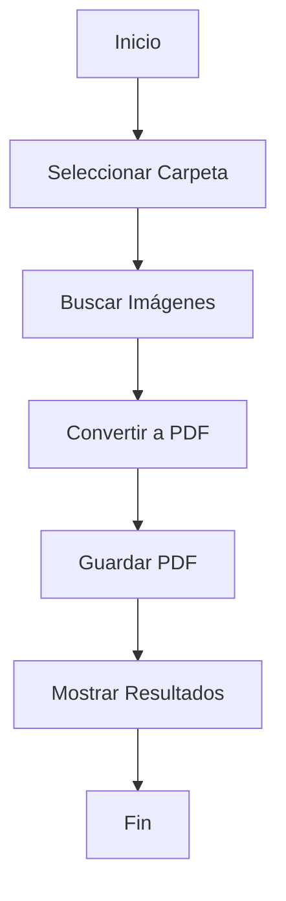

# Conversor de Imágenes a PDF

Este programa permite convertir fácilmente imágenes a formato PDF con una interfaz gráfica amigable.

## Características

- Interfaz gráfica moderna y fácil de usar
- Convierte múltiples formatos de imagen (PNG, JPG, JPEG, BMP, TIFF)
- Procesa todas las imágenes en una carpeta y sus subcarpetas
- Mantiene la estructura original de las carpetas
- Muestra el progreso y resultados de la conversión

## Requisitos

- Python 3.7 o superior
- Pillow
- customtkinter

## Instalación

1. Instala Python desde [python.org](https://www.python.org/downloads/)
2. Instala las dependencias ejecutando:
   ```
   pip install -r requirements.txt
   ```

## Uso

1. Ejecuta el archivo `imagen_a_pdf.py`
2. Haz clic en "Seleccionar Carpeta"
3. Elige la carpeta que contiene las imágenes
4. Espera a que el proceso termine
5. ¡Listo! Encontrarás los archivos PDF junto a las imágenes originales

## Formatos soportados

- PNG
- JPG/JPEG
- BMP
- TIFF

## Diagrama de flujo


