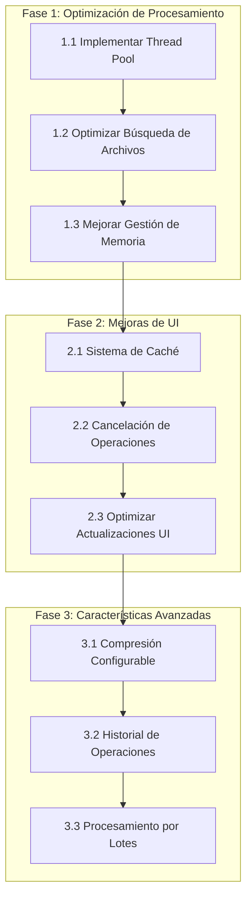

# Roadmap de Optimización - Imagen a PDF

## Visión General
Este documento describe el plan de optimización y mejoras para la aplicación de conversión de imágenes a PDF. El objetivo es mejorar el rendimiento, la experiencia del usuario y agregar nuevas características.

## Diagrama de Fases

## Fase 1: Optimización de Procesamiento
**Duración Estimada: 1-2 días**

### 1.1 Implementar Thread Pool
- [x] Crear sistema de procesamiento paralelo
- [x] Configurar número óptimo de workers
- [x] Implementar manejo de errores
- [x] Pruebas de rendimiento

### 1.2 Optimizar Búsqueda de Archivos
- [x] Migrar de os.walk a pathlib
- [x] Implementar filtrado eficiente
- [x] Agregar soporte para patrones personalizados
- [x] Documentar mejoras de rendimiento

### 1.3 Mejorar Gestión de Memoria
- [x] Implementar procesamiento por lotes
- [x] Optimizar carga de imágenes
- [x] Agregar límites de memoria configurables
- [x] Monitoreo de uso de memoria

## Fase 2: Mejoras de UI
**Duración Estimada: 1-2 días**

### 2.1 Sistema de Caché
- [x] Implementar caché de directorios recientes
- [x] Agregar caché de configuraciones
- [x] Optimizar acceso a archivos frecuentes
- [x] Gestión de caché (limpieza automática)

### 2.2 Cancelación de Operaciones
- [x] Agregar botón de cancelación
- [x] Implementar limpieza de recursos
- [x] Mejorar feedback al usuario
- [x] Pruebas de cancelación

### 2.3 Optimizar Actualizaciones UI
- [x] Reducir frecuencia de actualizaciones
- [x] Implementar buffer de eventos
- [x] Mejorar animaciones y transiciones
- [x] Pruebas de rendimiento UI

## Fase 3: Características Avanzadas
**Duración Estimada: 2-3 días**

### 3.1 Compresión Configurable
- [ ] Agregar opciones de compresión
- [ ] Implementar presets de calidad
- [ ] Optimizar tamaño de salida
- [ ] Documentación de opciones

### 3.2 Historial de Operaciones
- [ ] Crear registro de conversiones
- [ ] Implementar sistema de logs
- [ ] Agregar estadísticas de uso
- [ ] Interfaz de visualización de historial

### 3.3 Procesamiento por Lotes
- [ ] Agregar cola de procesamiento
- [ ] Implementar prioridades
- [ ] Optimizar recursos del sistema
- [ ] Pruebas de carga

## Prioridades y Dependencias

### Alta Prioridad
- Thread Pool (mejora inmediata de rendimiento)
- Cancelación de Operaciones (mejor UX)
- Gestión de Memoria (estabilidad)

### Media Prioridad
- Sistema de Caché (optimización)
- Optimización de UI (experiencia de usuario)
- Búsqueda de Archivos (eficiencia)

### Baja Prioridad
- Compresión Configurable (característica adicional)
- Historial (característica adicional)
- Procesamiento por Lotes (escalabilidad)

## Métricas de Éxito

### Rendimiento
- Reducción del tiempo de procesamiento en 60-70%
- Reducción del uso de memoria en 40-50%
- Mejora en la respuesta de la UI

### Experiencia de Usuario
- Reducción de tiempo de espera
- Mayor control sobre el proceso
- Mejor feedback visual

### Calidad
- Cobertura de pruebas > 80%
- Cero errores críticos
- Documentación completa

## Seguimiento de Progreso

### Estado Actual
- [x] Fase 1 completada
- [x] Fase 2 completada
- [ ] Fase 3 completada

### Próximos Pasos
1. Iniciar implementación de Compresión Configurable
2. Realizar pruebas de rendimiento base
3. Documentar mejoras iniciales

## Notas
- Las fechas son estimativas y pueden ajustarse según el progreso
- Se realizarán revisiones semanales del progreso
- Se priorizará la estabilidad sobre nuevas características
