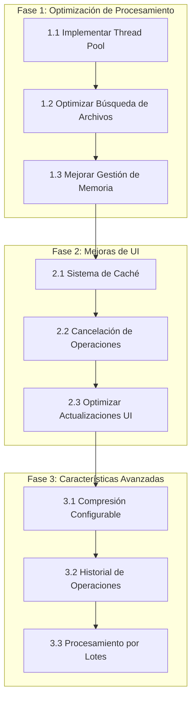

# Roadmap de Optimización - Imagen a PDF

## Visión General

Este documento describe el plan de optimización y mejoras para la aplicación de conversión de imágenes a PDF. El objetivo es mejorar el rendimiento, la experiencia del usuario y agregar nuevas características.

## Diagrama de Fases

## Fase 1: Optimización de Procesamiento

**Duración Estimada: 1-2 días**

### 1.1 Implementar Thread Pool

- [X] Crear sistema de procesamiento paralelo
- [X] Configurar número óptimo de workers
- [X] Implementar manejo de errores
- [X] Pruebas de rendimiento

### 1.2 Optimizar Búsqueda de Archivos

- [X] Migrar de os.walk a pathlib
- [X] Implementar filtrado eficiente
- [X] Agregar soporte para patrones personalizados
- [X] Documentar mejoras de rendimiento

### 1.3 Mejorar Gestión de Memoria

- [X] Implementar procesamiento por lotes
- [X] Optimizar carga de imágenes
- [X] Agregar límites de memoria configurables
- [X] Monitoreo de uso de memoria

## Fase 2: Mejoras de UI

**Duración Estimada: 1-2 días**

### 2.1 Sistema de Caché

- [X] Implementar caché de directorios recientes
- [X] Agregar caché de configuraciones
- [X] Optimizar acceso a archivos frecuentes
- [X] Gestión de caché (limpieza automática)

### 2.2 Cancelación de Operaciones

- [X] Agregar botón de cancelación
- [X] Implementar limpieza de recursos
- [X] Mejorar feedback al usuario
- [X] Pruebas de cancelación

### 2.3 Optimizar Actualizaciones UI

- [X] Reducir frecuencia de actualizaciones
- [X] Implementar buffer de eventos
- [X] Mejorar animaciones y transiciones
- [X] Pruebas de rendimiento UI

### 2.4 Implementar Componentes reutilizables

- [ ] Crear componente de Título de Aplicación que se utilice globalmente.
- [ ] Actualizar el footer para que sea utilizado globalmente
- [ ] Crear componente de barra de progreso reutilizable
- [ ] Desarrollar componente de selección de archivos común

## Fase 3: Características Avanzadas

**Duración Estimada: 2-3 días**

### 3.1 Compresión Configurable

- [ ] Agregar opciones de compresión
- [ ] Implementar presets de calidad
- [ ] Optimizar tamaño de salida
- [ ] Documentación de opciones

### 3.2 Procesamiento por Lotes

- [ ] Agregar cola de procesamiento
- [ ] Implementar prioridades
- [ ] Optimizar recursos del sistema
- [ ] Pruebas de carga

### 3.3 Historial de Operaciones

- [ ] Crear registro de conversiones
- [ ] Implementar sistema de logs
- [ ] Agregar estadísticas de uso
- [ ] Interfaz de visualización de historial

## Prioridades y Dependencias

### Alta Prioridad

- Thread Pool (mejora inmediata de rendimiento)
- Cancelación de Operaciones (mejor UX)
- Gestión de Memoria (estabilidad)

### Media Prioridad

- Sistema de Caché (optimización)
- Optimización de UI (experiencia de usuario)
- Búsqueda de Archivos (eficiencia)

### Baja Prioridad

- Compresión Configurable (característica adicional)
- Historial (característica adicional)
- Procesamiento por Lotes (escalabilidad)

## Métricas de Éxito

### Rendimiento

- Reducción del tiempo de procesamiento en 60-70%
- Reducción del uso de memoria en 40-50%
- Mejora en la respuesta de la UI

### Experiencia de Usuario

- Reducción de tiempo de espera
- Mayor control sobre el proceso
- Mejor feedback visual

### Calidad

- Cobertura de pruebas > 80%
- Cero errores críticos
- Documentación completa

## Seguimiento de Progreso

### Estado Actual

- [X] Fase 1 completada
- [X] Fase 2 completada
- [ ] Fase 3 completada

### Próximos Pasos

1. Iniciar implementación de Compresión Configurable
2. Realizar pruebas de rendimiento base
3. Documentar mejoras iniciales

## Notas

- Las fechas son estimativas y pueden ajustarse según el progreso
- Se realizarán revisiones semanales del progreso
- Se priorizará la estabilidad sobre nuevas características

## Roadmap de Desarrollo

### Versión Actual (1.2.0)

- ✅ Implementación de la normalización de texto mejorada
  - Formato consistente: `ID - NOMBRES APELLIDOS`
  - Limpieza automática de IDs
  - Manejo de casos especiales y espacios
  - Pruebas unitarias completas

### Próximas Características

- [ ] Mejoras en la interfaz de usuario
  - [ ] Vista previa de la normalización de nombres
  - [ ] Opción para editar nombres manualmente
  - [ ] Historial de nombres procesados

### Futuras Mejoras

- [ ] Soporte para más formatos de imagen
- [ ] Compresión de PDFs configurable
- [ ] Modo batch para procesamiento masivo
- [ ] Integración con servicios en la nube

### Mejoras Técnicas

- [ ] Optimización del rendimiento
- [ ] Mejora en el manejo de memoria
- [ ] Más pruebas automatizadas
- [ ] Documentación técnica completa
