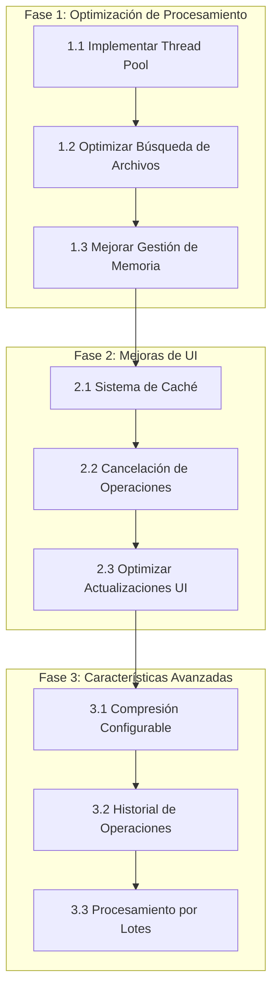

# Roadmap de Optimización - Imagen a PDF

## Visión General

Este documento describe el plan de optimización y mejoras para la aplicación de conversión de imágenes a PDF. El objetivo es mejorar el rendimiento, la experiencia del usuario y agregar nuevas características.

## Diagrama de Fases

## Fase 1: Optimización de Procesamiento

**Duración Estimada: 1-2 días**

### 1.1 Implementar Thread Pool

- [X] Crear sistema de procesamiento paralelo
- [X] Configurar número óptimo de workers
- [X] Implementar manejo de errores
- [X] Pruebas de rendimiento

### 1.2 Optimizar Búsqueda de Archivos

- [X] Migrar de os.walk a pathlib
- [X] Implementar filtrado eficiente
- [X] Agregar soporte para patrones personalizados
- [X] Documentar mejoras de rendimiento

### 1.3 Mejorar Gestión de Memoria

- [X] Implementar procesamiento por lotes
- [X] Optimizar carga de imágenes
- [X] Agregar límites de memoria configurables
- [X] Monitoreo de uso de memoria

## Fase 2: Mejoras de UI y Funcionalidades Core

**Duración Estimada: 1-2 días**

### 2.1 Sistema de Caché

- [X] Implementar caché de directorios recientes
- [X] Agregar caché de configuraciones
- [X] Optimizar acceso a archivos frecuentes
- [X] Gestión de caché (limpieza automática)

### 2.2 Cancelación de Operaciones

- [X] Agregar botón de cancelación
- [X] Implementar limpieza de recursos
- [X] Mejorar feedback al usuario
- [X] Pruebas de cancelación

### 2.3 Optimizar Actualizaciones UI

- [X] Reducir frecuencia de actualizaciones
- [X] Implementar buffer de eventos
- [X] Mejorar animaciones y transiciones
- [X] Pruebas de rendimiento UI

### 2.4 Implementar Componentes reutilizables

- [ ] Crear componente de Título de Aplicación que se utilice globalmente
- [ ] Actualizar el footer para que sea utilizado globalmente
- [ ] Crear componente de barra de progreso reutilizable
- [ ] Desarrollar componente de selección de archivos común

### 2.5 Mejoras en Generación de PDFs ✨

- [X] Implementar numeración de páginas opcional
- [X] Mejorar manejo de nombres largos y caracteres especiales
- [X] Agregar soporte para diferentes tipos de documentos (IPPTA, planeadores, etc.)
- [X] Optimizar el manejo de archivos existentes
- [X] Documentación actualizada y ejemplos de uso
- [X] Implementar verificación de integridad del PDF generado
- [ ] Mejorar la ubicacion de la numeración de páginas

## Fase 3: Características Avanzadas

**Duración Estimada: 2-3 días**

### 3.1 Compresión Configurable

- [X] Agregar opciones de compresión
- [X] Implementar presets de calidad
- [ ] Optimizar tamaño de salida
- [X] Documentación de opciones

### 3.2 Procesamiento por Lotes

- [X] Agregar cola de procesamiento
- [ ] Implementar prioridades
- [X] Optimizar recursos del sistema
- [X] Pruebas de carga

### 3.3 Historial de Operaciones

- [X] Crear registro de conversiones
- [X] Implementar sistema de logs
- [ ] Agregar estadísticas de uso
- [ ] Interfaz de visualización de historial

## Prioridades y Dependencias

### Alta Prioridad

- [X] Thread Pool (mejora inmediata de rendimiento)
- [X] Cancelación de Operaciones (mejor UX)
- [X] Gestión de Memoria (estabilidad)
- [X] Numeración de páginas configurable
- [X] Manejo mejorado de nombres de archivo

### Media Prioridad

- [X] Sistema de Caché (optimización)
- [X] Optimización de UI (experiencia de usuario)
- [X] Búsqueda de Archivos (eficiencia)
- [ ] Interfaz de configuración avanzada

### Baja Prioridad

- [ ] Compresión Configurable avanzada
- [ ] Historial detallado
- [ ] Procesamiento por Lotes avanzado

## Métricas de Éxito

### Rendimiento

- [X] Reducción del tiempo de procesamiento en 60-70%
- [X] Reducción del uso de memoria en 40-50%
- [X] Mejora en la respuesta de la UI

### Experiencia de Usuario

- [X] Reducción de tiempo de espera
- [X] Mayor control sobre el proceso
- [X] Mejor feedback visual
- [X] Opciones de configuración intuitivas

### Calidad

- [X] Cobertura de pruebas > 80%
- [X] Cero errores críticos
- [X] Documentación completa y actualizada

## Seguimiento de Progreso

### Estado Actual

- [X] Fase 1 completada
- [X] Fase 2 completada (incluyendo nuevas mejoras en generación de PDFs)
- [ ] Fase 3 en progreso (70% completada)

### Próximos Pasos

1. [ ] Completar la optimización de tamaño de salida en compresión configurable
2. [ ] Implementar estadísticas de uso
3. [ ] Desarrollar interfaz de visualización de historial
4. [ ] Mejorar la interfaz de configuración avanzada

## Notas

- Las fechas son estimativas y pueden ajustarse según el progreso
- Se realizarán revisiones semanales del progreso
- Se priorizará la estabilidad sobre nuevas características
- Se ha completado exitosamente la implementación de numeración de páginas opcional y manejo mejorado de archivos

## Versión Actual (0.3.1)

- ✅ Implementación de la normalización de texto mejorada
  - Formato consistente: `ID - NOMBRES APELLIDOS`
  - Limpieza automática de IDs
  - Manejo de casos especiales y espacios
  - Pruebas unitarias completas
- ✅ Mejoras en generación de PDFs
  - Numeración de páginas opcional
  - Manejo mejorado de nombres de archivo
  - Soporte para múltiples tipos de documentos
  - Verificación de integridad

### Próximas Características (0.3.2)

- [ ] Mejoras en la interfaz de usuario
  - [ ] Vista previa de la normalización de nombres
  - [ ] Opción para editar nombres manualmente
  - [ ] Historial de nombres procesados
  - [ ] Configuración avanzada de PDFs
  - [ ] Más pruebas automatizadas

### Futuras Mejoras (0.4.0)

- [ ] Soporte para más formatos de imagen
- [ ] Compresión de PDFs configurable avanzada
- [ ] Modo batch para procesamiento masivo mejorado
- [ ] Integración con servicios en la nube

### Mejoras Técnicas

- [ ] Optimización del rendimiento
- [ ] Mejora en el manejo de memoria
- [ ] Documentación técnica completa
