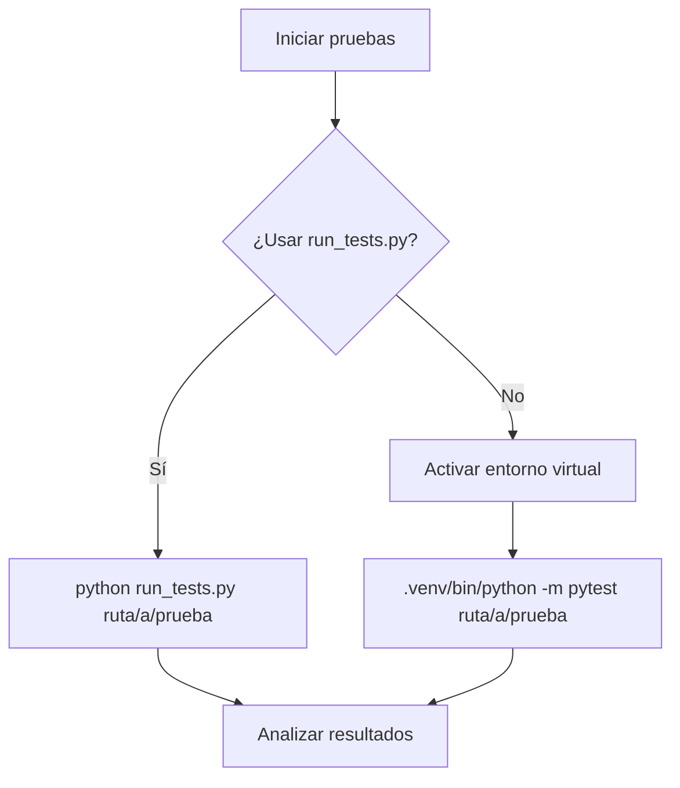

# Guía de Pruebas Unitarias

## Descripción
Esta guía explica cómo ejecutar correctamente las pruebas unitarias en el proyecto Herramientas ProMiTIERRA y ayuda a solucionar problemas comunes. El proyecto utiliza pytest como framework principal de pruebas.

## Contenido Principal

### Configuración del Entorno de Pruebas

El proyecto utiliza un entorno virtual (`.venv`) y tiene configuraciones específicas para pytest en el archivo `pytest.ini`:

```ini
[pytest]
testpaths = tests
python_files = test_*.py
python_classes = Test*
python_functions = test_*

# Configuración de cobertura
addopts = 
    --cov=src
    --cov-report=term-missing
    --cov-report=xml
    --cov-report=html
    --verbose
    -ra
    --strict-markers

# Marcadores personalizados
markers =
    unit: pruebas unitarias (predeterminado)
    integration: pruebas de integración
    slow: pruebas que toman más tiempo
    gui: pruebas que requieren interfaz gráfica
    performance: pruebas de rendimiento y benchmarking
```

### Estructura de Pruebas

```
tests/
├── unit/             # Pruebas unitarias
│   ├── test_helpers.py
│   └── ...
├── integration/      # Pruebas de integración
└── ...
```

### Ejecución de Pruebas

#### Método Recomendado: Usando run_tests.py

La manera más confiable de ejecutar pruebas es utilizando el script `run_tests.py`, que maneja correctamente el entorno virtual y las configuraciones:

```bash
# Ejecutar todas las pruebas
python run_tests.py

# Ejecutar un archivo específico
python run_tests.py tests/unit/test_helpers.py

# Ejecutar un directorio
python run_tests.py tests/unit/
```

#### Alternativas (no recomendadas)

No se recomienda usar directamente el comando pytest debido a posibles conflictos con el entorno virtual:

```bash
# ⚠️ No recomendado - Puede causar errores
pytest tests/unit/test_helpers.py -v
```

### Solución de Problemas Comunes

#### Error: "No module named pytest"

**Problema**: El comando muestra "No module named pytest" aunque pytest esté instalado en el entorno virtual.

**Solución**: 
1. Asegúrate de que el entorno virtual está activado (`source .venv/bin/activate`)
2. Utiliza el script `run_tests.py` que está configurado para usar el ejecutable Python correcto
3. Si necesitas usar pytest directamente, especifica la ruta completa: `.venv/bin/python -m pytest`

#### Error: "unrecognized arguments: --cov=src"

**Problema**: Aparece un error relacionado con argumentos de cobertura definidos en `pytest.ini`.

**Solución**: 
1. Usa `run_tests.py` que maneja correctamente estas configuraciones
2. Si necesitas ejecutar pytest directamente, anula las opciones con: `--override-ini="addopts="`

#### Diagrama de Flujo de Ejecución



### Ejemplos Prácticos

#### Ejecutar todas las pruebas unitarias con cobertura
```bash
python run_tests.py tests/unit/
```

#### Ejemplo de salida exitosa
```
=================================== test session starts ===================================
collected 4 items                                                                         

tests/unit/test_helpers.py::TestHelpers::test_actualizar_progreso PASSED            [ 25%]
tests/unit/test_helpers.py::TestHelpers::test_agregar_detalle PASSED                [ 50%]
tests/unit/test_helpers.py::TestHelpers::test_generar_nombre_zip PASSED             [ 75%]
tests/unit/test_helpers.py::TestHelpers::test_validar_directorio PASSED             [100%]

---------- coverage: platform linux, python 3.10.11-final-0 ----------
Name                       Stmts   Miss  Cover   Missing
--------------------------------------------------------
src/utils/helpers.py         36      5    86%   25, 51, 60, 69, 78
--------------------------------------------------------
TOTAL                      2109   2059     2%

==================================== 4 passed in 1.51s ====================================
```

## Referencias
- [Documentación oficial de pytest](https://docs.pytest.org/)
- [Documentación de pytest-cov](https://pytest-cov.readthedocs.io/)
- [Buenas prácticas para pruebas unitarias en Python](https://docs.python-guide.org/writing/tests/) 