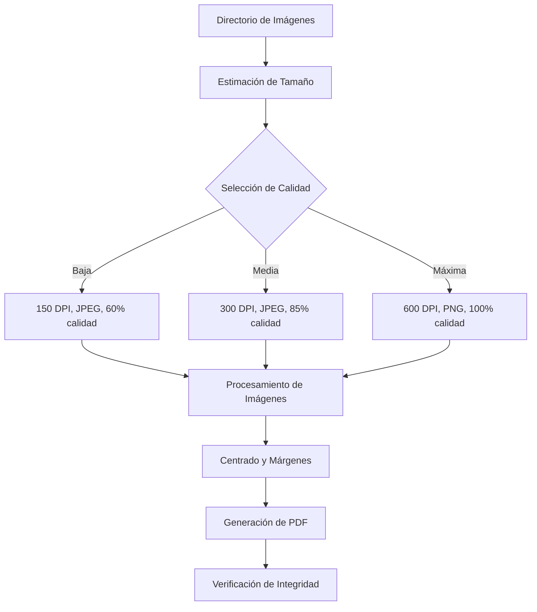

# Generación de PDFs a partir de Imágenes

## Descripción

Esta herramienta permite convertir un conjunto de imágenes en un documento PDF formateado profesionalmente. El script garantiza márgenes precisos, mantiene las proporciones de las imágenes, las centra adecuadamente y ofrece varias opciones de configuración como la numeración de páginas y diferentes niveles de calidad con estimación de tamaño.

## Características Principales

- **Orientación Configurable**: Por defecto, todas las imágenes se presentan en formato horizontal, rotando automáticamente las que están en vertical.
- **Márgenes Exactos**: Garantiza márgenes de 1 cm en todos los lados (superior, inferior, izquierdo y derecho).
- **Centrado Automático**: Posiciona las imágenes perfectamente centradas en cada página.
- **Preservación de Proporciones**: Mantiene la relación de aspecto original de las imágenes.
- **Numeración de Páginas Opcional**: Permite activar o desactivar la numeración en la esquina externa de cada página.
- **Niveles de Calidad**: Permite elegir entre tres niveles de calidad predefinidos:
  - **Baja**: Optimizado para archivos pequeños (150 DPI, formato JPEG)
  - **Media**: Equilibrio entre calidad y tamaño (300 DPI, formato JPEG)
  - **Máxima**: Máxima calidad visual (600 DPI, formato PNG sin pérdida)
- **Estimación de Tamaño**: Muestra una estimación del tamaño del PDF resultante antes de generarlo.
- **Verificación de Integridad**: Verifica que el PDF generado sea válido y legible.

## Flujo de Trabajo



## Uso del Script

El script se puede ejecutar desde la línea de comandos con varias opciones:

### Sintaxis Básica

```bash
python src/scripts/generar_pdf_imagenes.py "ruta/al/directorio/de/imagenes" [opciones]
```

### Parámetros Obligatorios

- `ruta/al/directorio/de/imagenes`: Directorio que contiene las imágenes a procesar.

### Opciones

- `-o, --output RUTA`: Ruta de salida personalizada para el PDF (opcional). Si no se especifica, se guarda en el directorio de entrada con el nombre "CONSOLIDADO_[nombre_directorio].pdf".
- `-d, --debug`: Activa el modo de depuración para información detallada del proceso.
- `--no-page-numbers`: Desactiva la numeración de páginas en el documento.
- `--calidad {baja,media,maxima}`: Selecciona el nivel de calidad del PDF generado (por defecto: "media").
- `--solo-estimar`: Solo estima el tamaño del PDF sin generarlo, útil para decidir qué nivel de calidad usar.

## Ejemplos de Uso

### Uso Básico (Calidad Media)

```bash
python src/scripts/generar_pdf_imagenes.py "C:/Directorio/Imagenes"
```

### Generar PDF con Calidad Máxima

```bash
python src/scripts/generar_pdf_imagenes.py "C:/Directorio/Imagenes" --calidad maxima
```

### Generar PDF Ligero (Calidad Baja)

```bash
python src/scripts/generar_pdf_imagenes.py "C:/Directorio/Imagenes" --calidad baja
```

### Solo Estimar el Tamaño sin Generar el PDF

```bash
python src/scripts/generar_pdf_imagenes.py "C:/Directorio/Imagenes" --calidad maxima --solo-estimar
```

### Especificar Ruta de Salida y Desactivar Numeración

```bash
python src/scripts/generar_pdf_imagenes.py "C:/Directorio/Imagenes" -o "C:/Salida/resultado.pdf" --no-page-numbers
```

## Comparativa de Calidades

| Nivel de Calidad | DPI | Formato | Compresión | Tamaño Aproximado* | Uso Recomendado |
|------------------|-----|---------|------------|-------------------|-----------------|
| Baja | 150 | JPEG | 60% | 15% del original | Archivos para visualización en pantalla, envío por correo |
| Media | 300 | JPEG | 85% | 40% del original | Uso general, impresión estándar |
| Máxima | 600 | PNG | Sin pérdida | 80% del original | Impresión profesional, archivos para conservación a largo plazo |

*El tamaño aproximado se calcula como porcentaje del tamaño total de las imágenes originales.

## Consideraciones Técnicas

- El script admite formatos de imagen como PNG, JPG, JPEG, TIF, TIFF y BMP.
- Las imágenes se procesan en orden alfabético según su nombre de archivo.
- Se crea un directorio temporal para procesar las imágenes, que se elimina automáticamente al finalizar.
- Las imágenes verticales se rotan automáticamente para mantener la orientación horizontal del documento.
- La estimación de tamaño es aproximada y puede variar según el contenido específico de las imágenes.

## Casos de Uso

- Digitalización de documentos y fotografías para su almacenamiento.
- Consolidación de múltiples imágenes escaneadas en un solo documento.
- Creación de catálogos o portfolios de imágenes con formato profesional.
- Preparación de documentos para impresión o distribución digital. 